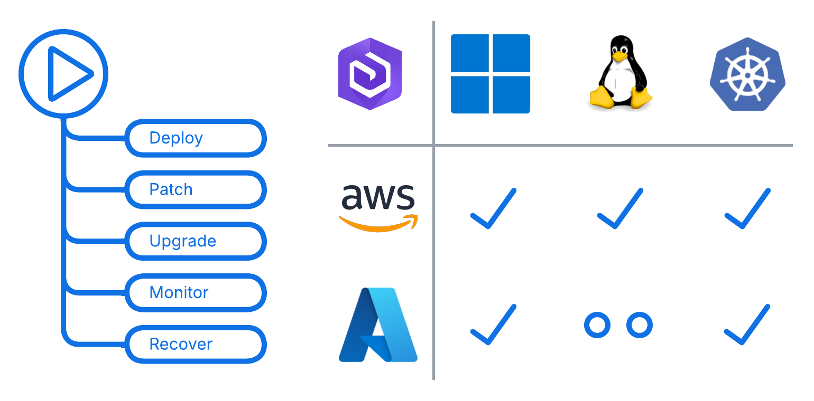

# ArcGIS Automation using GitHub Actions

The template repository provides [GitHub Actions](https://docs.github.com/en/actions) workflows that automate deployment and operation of [ArcGIS Enterprise](https://enterprise.arcgis.com) following Infrastructure as Code methodologies, foundational system patterns, and best practices recommended for enterprise IT systems.

&nbsp;

## Features

For the supported ArcGIS Enterprise deployment options the workflows provide:

* Automation of initial deployment, updates, upgrades, and disaster recovery operations
* Built-in observability and monitoring subsystems
* Integration with existing network and security infrastructure
* Machine image building subsystems
* Standardized approach to security assessments and authorizations
* Tracking and managing changes to both application and infrastructure configurations
* Transparent and modular design that is easy to understand, customize, or extend
* Version control of infrastructure and application configurations

The workflows leverage popular DevOps tools, including Terraform, Ansible, and Packer, to automate provisioning infrastructure and application configuration management.

## Instructions

The workflows designed to be used together to achieve a specific goal are grouped into *templates*.

See the walkthroughs in the wiki pages for detailed instructions on how to use the templates:

* The [Getting Started walkthrough](https://github.com/Esri/arcgis-gitops/wiki/Getting-Started) will guide you through the process of deploying, disaster recovery, and patching of a highly available ArcGIS Server site in Amazon Web Services public cloud using GitHub Actions.
* The [ArcGIS Enterprise on Kubernetes in AKS walkthrough](https://github.com/Esri/arcgis-gitops/wiki/ArcGIS-Enterprise-on-Kubernetes-in-AKS) will guide you through the process of deploying ArcGIS Enterprise on Kubernetes in Microsoft Azure Kubernetes Service (AKS) using GitHub Actions.

Refer to the READMEs of the cloud platform templates for specific usage instructions:

* [Templates for ArcGIS Enterprise on AWS](aws/README.md)
* [Templates for ArcGIS Enterprise on Microsoft Azure](azure/README.md)

## Issues

Find a bug or want to request a new feature? Please let us know by submitting an issue.

## Contributing

Esri welcomes contributions from anyone and everyone. Please see our [guidelines for contributing](https://github.com/esri/contributing).

## Licensing

Copyright 2024 Esri

Licensed under the Apache License, Version 2.0 (the "License");
You may not use this file except in compliance with the License.
You may obtain a copy of the License at
   http://www.apache.org/licenses/LICENSE-2.0

Unless required by applicable law or agreed to in writing, software
distributed under the License is distributed on an "AS IS" BASIS,
WITHOUT WARRANTIES OR CONDITIONS OF ANY KIND, either express or implied.
See the License for the specific language governing permissions and
limitations under the License.

A copy of the license is available in the repository's [LICENSE](https://github.com/arcgis/arcgis-gitops/blob/main/License.txt?raw=true) file.
  
