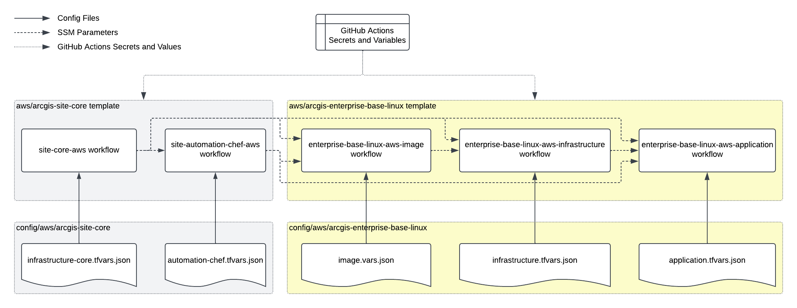

# Base ArcGIS Enterprise on Linux Deployment in AWS

The template provides GitHub Actions workflows for [base ArcGIS Enterprise deployment](https://enterprise.arcgis.com/en/get-started/latest/linux/base-arcgis-enterprise-deployment.htm) operations on Linux platforms.

Supported ArcGIS Enterprise versions:

* 11.4

Before running the template workflows:

1. Configure the GitHub repository settings as described in the [Instructions](../README.md#instructions) section.
2. Create core AWS resources and Chef automation resources for ArcGIS Enterprise site using [arcgis-site-core](../arcgis-site-core/README.md) template.

To enable the template's workflows, copy the .yaml files from the template's `workflows` directory to `/.github/workflows` directory in `main` branch, commit the changes, and push the branch to GitHub.

> Refer to READMEs of the Terraform modules and Packer templates for descriptions of the configuration properties.

## Initial Deployment

Initial deployment of base ArcGIS Enterprise includes building images, provisioning AWS resources, configuring the applications, and testing the deployment web services.

### 1. Build Images

GitHub Actions workflow **enterprise-base-linux-aws-image** creates EC2 AMIs for base ArcGIS Enterprise deployment.

The workflow uses: [image](image/README.md) Packer template with [image.vars.json](../../config/aws/arcgis-enterprise-base-linux/image.vars.json) config file.

Required IAM policies:

* ArcGISEnterpriseImage

Instructions:

1. Set "arcgis_data_store_patches", "arcgis_portal_patches", "arcgis_server_patches", and "arcgis_web_adaptor_patches" properties to the lists of patch file names that must be installed on the images.
2. Commit the changes to a Git branch and push the branch to GitHub.
3. Run enterprise-base-linux-aws-image workflow using the branch.

> In the configuration files, "os" and "arcgis_version" properties values for the same deployment must match across all the configuration files of the deployment.

### 2. Provision AWS Resources

GitHub Actions workflow **enterprise-base-linux-aws-infrastructure** creates AWS resources for base ArcGIS Enterprise deployment.

The workflow uses [infrastructure](infrastructure/README.md) Terraform template with [infrastructure.tfvars.json](../../config/aws/arcgis-enterprise-base-linux/infrastructure.tfvars.json) config file.

Required IAM policies:

* TerraformBackend
* ArcGISEnterpriseInfrastructure

Workflow Inputs:

* terraform_command - Terraform command (apply|plan)

Workflow Outputs:

* alb_dns_name - DNS name of the application load balancer

Instructions:

1. Create an EC2 key pair in the selected AWS region and set "key_name" property in the config file to the key pair name. Save the private key in a secure location.
2. Provision or import SSL certificate for the base ArcGIS Enterprise domain name into AWS Certificate Manager service in the selected AWS region and set "ssl_certificate_arn" property to the certificate ARN.
3. Set "deployment_fqdn" property to the base ArcGIS Enterprise deployment fully qualified domain name.
4. If required, change "instance_type" and "root_volume_size" properties to the required [EC2 instance type](https://aws.amazon.com/ec2/instance-types/) and root EBS volume size (in GB).
5. Commit the changes to the Git branch and push the branch to GitHub.
6. Run enterprise-base-linux-aws-infrastructure workflow using the branch.
7. Retrieve the DNS name of the load balancer created by the workflow and create a CNAME record for it within the DNS server of the base ArcGIS Enterprise domain name.

> Job outputs are not shown in the properties of completed GitHub Actions run. To retrieve the outputs, check the run logs of "Terraform Apply" step.

> When updating the infrastructure, first run the workflow with terraform_command=plan before running it with terraform_command=apply and check the logs to make sure that Terraform does not destroy and recreate critical AWS resources such as EC2 instances.

### 3. Configure Applications

GitHub Actions workflow **enterprise-base-linux-aws-application** configures or upgrades base ArcGIS Enterprise on EC2 instances.

The workflow uses [application](application/README.md) Terraform template with [application.tfvars.json](../../config/aws/arcgis-enterprise-base-linux/application.tfvars.json) config file.

Required IAM policies:

* TerraformBackend
* ArcGISEnterpriseApplication

Inputs:

* terraform_command - Terraform command (apply|plan)

Outputs:

* arcgis_portal_url - Portal for ArcGIS URL

Instructions:

1. Add Portal for ArcGIS and ArcGIS Server authorization files for the ArcGIS Enterprise version to `config/authorization/<ArcGIS version>` directory of the repository and set "portal_authorization_file_path" and "server_authorization_file_path" properties to the file paths.
2. Set "deployment_fqdn" property to the base ArcGIS Enterprise deployment fully qualified domain name.
3. Set "admin_username", "admin_password", "admin_full_name", "admin_description", "admin_email", "security_question", and "security_question_answer" to the initial ArcGIS Enterprise administrator account properties.
4. (Optionally) Add SSL certificates for the base ArcGIS Enterprise domain name and trusted root certificates to `config/certificates` directory and set "keystore_file_path" and "root_cert_file_path" properties to the file paths. Set "keystore_file_password" property to password of the keystore file.
5. Commit the changes to the Git branch and push the branch to GitHub.
6. Run enterprise-base-linux-aws-application workflow using the branch.

> '~/config/' paths is linked to the repository's /config directory. It's recommended to use /config directory for the configuration files.

### 4. Test Base ArcGIS Enterprise Deployment

GitHub Actions workflow **enterprise-base-linux-aws-test** tests base ArcGIS Enterprise deployment.

The workflow uses test-publish-csv script from ArcGIS Enterprise Admin CLI to publish a CSV file to the Portal for ArcGIS URL. The portal domain name and admin credentials are retrieved from application.tfvars.json properties file.

Instructions:

1. Run enterprise-base-linux-aws-test workflow using the branch.

## Backups and Disaster Recovery

The template supports application-level base ArcGIS Enterprise backup and restore operations using [WebGISDR](https://enterprise.arcgis.com/en/portal/latest/administer/linux/create-web-gis-backup.htm) tool.

### Create Backups

GitHub Actions workflow **enterprise-base-linux-aws-backup** creates base ArcGIS Enterprise backups using WebGISDR utility.

The workflow uses [backup](backup/README.md) Terraform template with [backup.tfvars.json](../../config/aws/arcgis-enterprise-base-linux/backup.tfvars.json) config file.

Required IAM policies:

* TerraformBackend
* ArcGISEnterpriseApplication

Instructions:

1. Set "admin_username" and "admin_password" properties to the portal administrator user name and password respectively.
2. Commit the changes to the Git branch and push the branch to GitHub.
3. Run enterprise-base-linux-aws-backup workflow using the branch.

To meet the required recovery point objective (RPO), schedule runs of enterprise-base-linux-aws-backup workflow by configuring 'schedule' event in enterprise-base-linux-aws-backup.yaml file. When the backup workflow is triggered manually, the backup-restore mode is specified by the workflow inputs. However, when the workflow is triggered on schedule, the backup-restore mode is retrieved from the backup.tfvars.json config file. Note that scheduled workflows run on the latest commit on the `main` (or default) branch.

> Base ArcGIS Enterprise deployments in a site use the same S3 bucket for backups. Run backups only for the active deployment branch.

### Restore from Backups

GitHub Actions workflow **enterprise-base-linux-aws-restore** restores base ArcGIS Enterprise from backup using WebGISDR utility.

The workflow uses [restore](restore/README.md) Terraform template with [restore.tfvars.json](../../config/aws/arcgis-enterprise-base-linux/restore.tfvars.json) config file.

Required IAM policies:

* TerraformBackend
* ArcGISEnterpriseApplication

Instructions:

1. Set "admin_username" and "admin_password" properties to the portal administrator user name and password respectively.
2. Commit the changes to the Git branch and push the branch to GitHub.
3. Run enterprise-base-linux-aws-restore workflow using the branch.

### Create Snapshots and Restore from Snapshots

GitHub Actions workflow **enterprise-base-linux-aws-snapshot** creates a system-level backup by creating AMIs from all EC2 instances of base ArcGIS Enterprise deployment. The workflow the workflow retrieves site and deployment IDs from [image.vars.json](../../config/aws/arcgis-enterprise-base-linux/image.vars.json) config file and runs snapshot_deployment Python script. The workflow requires ArcGISEnterpriseImage IAM policy.

The workflows overwrites the AMI IDs in SSM Parameter Store written there by enterprise-base-linux-aws-image workflow. When necessary, the deployment can be rolled back to state captured in the snapshot by running enterprise-base-linux-aws-infrastructure workflow.

> Running enterprise-base-linux-aws-snapshot workflow causes a short downtime because it reboots the EC2 instances.

> The snapshot captures only the data on the EC2 instances that does not include the content of other storage services, such as S3 buckets used to store Portal for ArcGIS content and EFS filesystems used by ArcGIS Server config store.

Since creating snapshots involves downtime and integrity of the data cannot be guaranteed if data in the storage services was updated after the snapshot creation, snapshots are not recommended for use as backups for active deployments. Snapshots should be created during planned downtime, after deactivating the deployment, and before applying system and application patches or other system-level updates.

> The snapshot creation time depends on the size and throughput of the root EBS volumes of the EC2 instances.

## In-Place Updates and Upgrades

GitHub Actions workflow enterprise-base-linux-aws-application supports upgrade mode used to in-place patch or upgrade the base ArcGIS Enterprise applications on the EC2 instances. In the upgrade mode, the workflow copies the required patches and setups to the private repository S3 bucket and downloads them to the EC2 instances. If the ArcGIS Enterprise version was changed, it installs the new version of the ArcGIS Enterprise applications and re-configures the applications.

Instructions:

1. Set "arcgis_data_store_patches", "arcgis_portal_patches", "arcgis_server_patches", and "arcgis_web_adaptor_patches" properties in application.tfvars.json file to the lists of patch file names that must be installed on the EC2 instances.
2. Add Portal for ArcGIS and ArcGIS Server authorization files for the new ArcGIS Enterprise version to `config/authorization/<ArcGIS version>` directory of the repository and set "portal_authorization_file_path" and "server_authorization_file_path" properties in application.tfvars.json file to the file paths.
3. Change "is_upgrade" property in application.tfvars.json file to `true`.
4. Commit the changes to the Git branch and push the branch to GitHub.
5. Run enterprise-base-linux-aws-application workflow using the branch.

## Destroying Deployments

GitHub Actions workflow **enterprise-base-linux-aws-destroy** destroys AWS resources created by enterprise-base-linux-aws-infrastructure and enterprise-base-linux-aws-application workflows.

The workflow uses [infrastructure](infrastructure/README.md) and [application](application/README.md) Terraform templates with [infrastructure.tfvars.json](../../config/aws/arcgis-enterprise-base-linux/infrastructure.tfvars.json) and [application.tfvars.json](../../config/aws/arcgis-enterprise-base-linux/application.tfvars.json) config files.

Required IAM policies:

* TerraformBackend
* ArcGISEnterpriseDestroy

Instructions:

1. Run enterprise-base-linux-aws-destroy workflow using the branch.

> enterprise-base-linux-aws-destroy workflow does not delete the deployment's backups.

## Disconnected Environments

To prevent deployments from accessing the Internet, use "internal" subnets for EC2 instances. The internal subnets do not have public IP addresses and are routed only to VPC endpoints of certain AWS services in specific AWS region.

The disconnected deployments cannot access the system and application internet services such as ArcGIS Online, My Esri, Esri license server, package repositories, pollination services, and time services.

The application image builds run in "private" subnets that can access the internet. The image build installs SSM Agents, CloudWatch agents, AWS CLI, and system packages required by the applications. The application update and upgrade workflows use S3 VPC endpoint to access the private repository S3 bucket to get all the required files.

The disconnected deployments must use authorization files that do not require internet access to the Esri license server, such as Esri Secure License File (ESLF) or ECP file (.ecp).  
