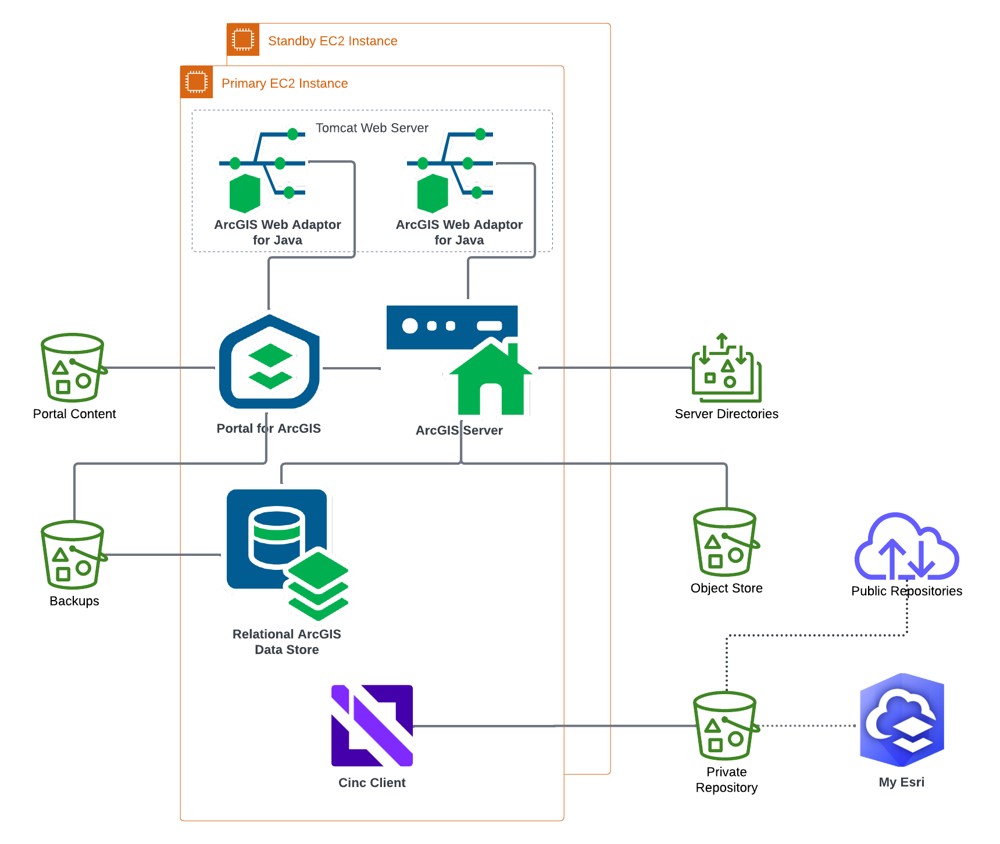

<!-- BEGIN_TF_DOCS -->
# Application Terraform Module for Base ArcGIS Enterprise on Linux

The Terraform module configures or upgrades applications of highly available base ArcGIS Enterprise deployment on Linux platform.

First, the module bootstraps the deployment by installing Chef Client and Chef Cookbooks for ArcGIS on all EC2 instances of the deployment.

If "is_upgrade" input variable is set to `true`, the module:

* Unregisters ArcGIS Server's Web Adaptor on standby EC2 instance
* Copies the installation media for the ArcGIS Enterprise version specified by arcgis_version input variable to the private repository S3 bucket
* Downloads the installation media from the private repository S3 bucket to primary and standby EC2 instances
* Installs/upgrades  ArcGIS Enterprise software on primary and standby EC2 instances
* Installs the software patches on primary and standby EC2 instances

Then the module:

* Copies the ArcGIS Server and Portal for ArcGIS authorization files to the private repository S3 bucket
* If specified, copies keystore and root certificate files to the private repository S3 bucket
* Downloads the ArcGIS Server and Portal for ArcGIS authorization files from the private repository S3 bucket to primary and standby EC2 instances
* If specified, downloads the keystore and root certificate files from the private repository S3 bucket to primary and standby EC2 instances
* Creates the required directories in the NFS mount
* Configures base ArcGIS Enterprise on primary EC2 instance
* Configures base ArcGIS Enterprise on standby EC2 instance, if any
* Deletes the downloaded setup archives, the extracted setups, and other temporary files from primary and standby EC2 instances
* Subscribes the primary ArcGIS Enterprise administrator e-mail address to the SNS topic of the monitoring subsystem

Starting with ArcGIS Enterprise 12.0, if the config_store_type input variable is set to AMAZON,
the module configures ArcGIS Server to store server directories in an S3 bucket and
the configuration store in a DynamoDB table, rather than on the EFS file system.

## Requirements

The AWS resources for the deployment must be provisioned by Infrastructure terraform module for base ArcGIS Enterprise on Linux.

On the machine where Terraform is executed:

* Python 3.8 or later with [AWS SDK for Python (Boto3)](https://aws.amazon.com/sdk-for-python/) package must be installed
* Path to aws/scripts directory must be added to PYTHONPATH
* The working directory must be set to the arcgis-enterprise-base-linux/application module path
* AWS credentials must be configured

My Esri user name and password must be specified either using environment variables ARCGIS_ONLINE_USERNAME and ARCGIS_ONLINE_PASSWORD or the input variables.

## SSM Parameters

The module reads the following SSM parameters:

| SSM parameter name | Description |
|--------------------|-------------|
| /arcgis/${var.site_id}/${var.deployment_id}/backup/plan-id | Backup plan ID for the deployment |
| /arcgis/${var.site_id}/${var.deployment_id}/content-s3-bucket | S3 bucket for the portal content |
| /arcgis/${var.site_id}/${var.deployment_id}/deployment-fqdn | Fully qualified domain name of the deployment |
| /arcgis/${var.site_id}/${var.deployment_id}/object-store-s3-bucket | S3 bucket for the object store |
| /arcgis/${var.site_id}/${var.deployment_id}/portal-web-context | Portal for ArcGIS web context |
| /arcgis/${var.site_id}/${var.deployment_id}/server-web-context | ArcGIS Server web context |
| /arcgis/${var.site_id}/${var.deployment_id}/sns-topic-arn | SNS topic ARN of the monitoring subsystem |
| /arcgis/${var.site_id}/chef-client-url/${var.os} | Chef Client URL |
| /arcgis/${var.site_id}/cookbooks-url | Chef cookbooks URL |
| /arcgis/${var.site_id}/iam/backup-role-arn | ARN of IAM role used by AWS Backup service |
| /arcgis/${var.site_id}/s3/backup | S3 bucket for the backup |
| /arcgis/${var.site_id}/s3/logs | S3 bucket for SSM command output |
| /arcgis/${var.site_id}/s3/repository | S3 bucket for the private repository |

## Providers

| Name | Version |
|------|---------|
| aws | ~> 6.10 |

## Modules

| Name | Source | Version |
|------|--------|---------|
| arcgis_enterprise_files | ../../modules/run_chef | n/a |
| arcgis_enterprise_fileserver | ../../modules/run_chef | n/a |
| arcgis_enterprise_patch | ../../modules/run_chef | n/a |
| arcgis_enterprise_primary | ../../modules/run_chef | n/a |
| arcgis_enterprise_standby | ../../modules/run_chef | n/a |
| arcgis_enterprise_upgrade | ../../modules/run_chef | n/a |
| authorization_files | ../../modules/run_chef | n/a |
| backup | ../../modules/backup | n/a |
| begin_upgrade_standby | ../../modules/run_chef | n/a |
| bootstrap_deployment | ../../modules/bootstrap | n/a |
| clean_up | ../../modules/clean_up | n/a |
| keystore_file | ../../modules/run_chef | n/a |
| root_cert | ../../modules/run_chef | n/a |
| s3_copy_files | ../../modules/s3_copy_files | n/a |
| site_core_info | ../../modules/site_core_info | n/a |

## Resources

| Name | Type |
|------|------|
| [aws_ec2_tag.arcgis_version](https://registry.terraform.io/providers/hashicorp/aws/latest/docs/resources/ec2_tag) | resource |
| [aws_s3_object.keystore_file](https://registry.terraform.io/providers/hashicorp/aws/latest/docs/resources/s3_object) | resource |
| [aws_s3_object.portal_authorization_file](https://registry.terraform.io/providers/hashicorp/aws/latest/docs/resources/s3_object) | resource |
| [aws_s3_object.root_cert_file](https://registry.terraform.io/providers/hashicorp/aws/latest/docs/resources/s3_object) | resource |
| [aws_s3_object.server_authorization_file](https://registry.terraform.io/providers/hashicorp/aws/latest/docs/resources/s3_object) | resource |
| [aws_sns_topic_subscription.infrastructure_alarms](https://registry.terraform.io/providers/hashicorp/aws/latest/docs/resources/sns_topic_subscription) | resource |
| [aws_instances.deployment](https://registry.terraform.io/providers/hashicorp/aws/latest/docs/data-sources/instances) | data source |
| [aws_instances.standby](https://registry.terraform.io/providers/hashicorp/aws/latest/docs/data-sources/instances) | data source |
| [aws_region.current](https://registry.terraform.io/providers/hashicorp/aws/latest/docs/data-sources/region) | data source |
| [aws_ssm_parameter.deployment_fqdn](https://registry.terraform.io/providers/hashicorp/aws/latest/docs/data-sources/ssm_parameter) | data source |
| [aws_ssm_parameter.object_store](https://registry.terraform.io/providers/hashicorp/aws/latest/docs/data-sources/ssm_parameter) | data source |
| [aws_ssm_parameter.portal_web_context](https://registry.terraform.io/providers/hashicorp/aws/latest/docs/data-sources/ssm_parameter) | data source |
| [aws_ssm_parameter.s3_content](https://registry.terraform.io/providers/hashicorp/aws/latest/docs/data-sources/ssm_parameter) | data source |
| [aws_ssm_parameter.server_web_context](https://registry.terraform.io/providers/hashicorp/aws/latest/docs/data-sources/ssm_parameter) | data source |
| [aws_ssm_parameter.sns_topic](https://registry.terraform.io/providers/hashicorp/aws/latest/docs/data-sources/ssm_parameter) | data source |

## Inputs

| Name | Description | Type | Default | Required |
|------|-------------|------|---------|:--------:|
| admin_description | Primary ArcGIS Enterprise administrator description | `string` | `"Initial account administrator"` | no |
| admin_email | Primary ArcGIS Enterprise administrator e-mail address | `string` | n/a | yes |
| admin_full_name | Primary ArcGIS Enterprise administrator full name | `string` | `"Administrator"` | no |
| admin_password | Primary ArcGIS Enterprise administrator user password | `string` | n/a | yes |
| admin_username | Primary ArcGIS Enterprise administrator user name | `string` | `"siteadmin"` | no |
| arcgis_data_store_patches | File names of ArcGIS Data Store patches to install. | `list(string)` | `[]` | no |
| arcgis_portal_patches | File names of Portal for ArcGIS patches to install. | `list(string)` | `[]` | no |
| arcgis_server_patches | File names of ArcGIS Server patches to install. | `list(string)` | `[]` | no |
| arcgis_version | ArcGIS Enterprise version | `string` | `"12.0"` | no |
| arcgis_web_adaptor_patches | File names of ArcGIS Web Adaptor patches to install. | `list(string)` | `[]` | no |
| aws_region | AWS region Id | `string` | n/a | yes |
| config_store_type | ArcGIS Server configuration store type | `string` | `"FILESYSTEM"` | no |
| deployment_id | Deployment Id | `string` | `"enterprise-base-linux"` | no |
| is_upgrade | Flag to indicate if this is an upgrade deployment | `bool` | `false` | no |
| keystore_file_password | Password for keystore file with SSL certificate used by HTTPS listeners | `string` | `""` | no |
| keystore_file_path | Local path of keystore file in PKCS12 format with SSL certificate used by HTTPS listeners | `string` | `null` | no |
| log_level | ArcGIS Enterprise applications log level | `string` | `"WARNING"` | no |
| os | Operating system id (rhel9\|ubuntu22\|ubuntu24) | `string` | `"rhel9"` | no |
| portal_authorization_file_path | Local path of Portal for ArcGIS authorization file | `string` | n/a | yes |
| portal_user_license_type_id | Portal for ArcGIS administrator user license type Id | `string` | `""` | no |
| root_cert_file_path | Local path of root certificate file in PEM format used by ArcGIS Server and Portal for ArcGIS | `string` | `null` | no |
| run_as_user | User name for the account used to run ArcGIS Server, Portal for ArcGIS, and ArcGIS Data Store. | `string` | `"arcgis"` | no |
| security_question_answer | Primary ArcGIS Enterprise administrator security question answer | `string` | n/a | yes |
| security_question_index | Primary ArcGIS Enterprise administrator security question index | `number` | `1` | no |
| server_authorization_file_path | Local path of ArcGIS Server authorization file | `string` | n/a | yes |
| server_authorization_options | Additional ArcGIS Server software authorization command line options | `string` | `""` | no |
| site_id | ArcGIS Enterprise site Id | `string` | `"arcgis"` | no |

## Outputs

| Name | Description |
|------|-------------|
| arcgis_portal_url | Portal for ArcGIS URL |
| arcgis_server_url | ArcGIS Server URL |
<!-- END_TF_DOCS -->