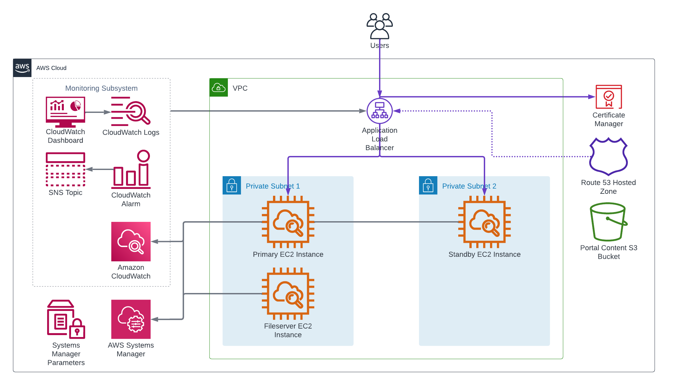

<!-- BEGIN_TF_DOCS -->
# Infrastructure Terraform Module for base ArcGIS Enterprise on Windows

The Terraform module creates AWS resources for base ArcGIS Enterprise deployment on Windows platform.

The module launches two (or one, if "is_ha" input variable is set to false) SSM-managed EC2 instances in the private VPC subnets or subnets specified by "subnet_ids" input variable.
The EC2 instances are launched from images retrieved from "/arcgis/${var.site_id}/images/${var.deployment_id}/{instance role}" SSM parameters.
The images must be created by the Packer Template for Base ArcGIS Enterprise on Windows.

For the EC2 instances the module creates "A" records in the VPC Route 53 private hosted zone
to make the instances addressable using permanent DNS names.

The module creates target groups that target the EC2 instances and associates the target groups with the deployment's load balancer listeners.

> Note that the EC2 instance will be terminated and recreated if the infrastructure terraform module is applied again after the SSM parameter value was modified by a new image build.

For the portal content and object store the module creates S3 bucket and stores their names in SSM parameters.

The deployment's Monitoring Subsystem consists of:

* A CloudWatch log group
* CloudWatch agent on the EC2 instances that sends the system and Chef run logs to the log group as well as memory and disk utilization on the EC2 instances.
* A CloudWatch dashboard that displays the CloudWatch metrics and logs of the deployment.

The module also creates an AWS backup plan for the deployment that backs up all the EC2 instances and S3 buckets in the site's backup vault.
All the created AWS resources are tagged with ArcGISSiteId and ArcGISDeploymentId tags.

## Requirements

On the machine where Terraform is executed:

* Python 3.8 or later with [AWS SDK for Python (Boto3)](https://aws.amazon.com/sdk-for-python/) package must be installed
* Path to aws/scripts directory must be added to PYTHONPATH
* AWS credentials must be configured

## Troubleshooting

Use Session Manager connection in AWS Console for SSH access to the EC2 instances.

## SSM Parameters

The module reads the following SSM parameters:

| SSM parameter name | Description |
|--------------------|-------------|
| /arcgis/${var.site_id}/${var.ingress_deployment_id}/alb/security-group-id | Security group ID of the application load balancer |
| /arcgis/${var.site_id}/${var.ingress_deployment_id}/deployment-fqdn | Fully qualified domain name of the site ingress |
| /arcgis/${var.site_id}/${var.ingress_deployment_id}/alb/arn | ARN of the application load balancer |
| /arcgis/${var.site_id}/backup/vault-name | Name of the AWS Backup vault |
| /arcgis/${var.site_id}/iam/backup-role-arn | ARN of IAM role used by AWS Backup service |
| /arcgis/${var.site_id}/iam/instance-profile-name | IAM instance profile name |
| /arcgis/${var.site_id}/images/${var.deployment_id}/primary | Primary EC2 instance AMI ID |
| /arcgis/${var.site_id}/images/${var.deployment_id}/standby | Standby EC2 instance AMI ID |
| /arcgis/${var.site_id}/s3/logs | S3 bucket for SSM commands output |
| /arcgis/${var.site_id}/vpc/hosted-zone-id | VPC hosted zone ID |
| /arcgis/${var.site_id}/vpc/id | VPC ID |
| /arcgis/${var.site_id}/vpc/subnets | IDs of VPC subnets |

The module writes the following SSM parameters:

| SSM parameter name | Description |
|--------------------|-------------|
| /arcgis/${var.site_id}/${var.deployment_id}/backup-plan-id | Backup plan ID for the deployment |
| /arcgis/${var.site_id}/${var.deployment_id}/content-s3-bucket | Portal for ArcGIS content store S3 bucket |
| /arcgis/${var.site_id}/${var.deployment_id}/deployment-fqdn | Fully qualified domain name of the deployment |
| /arcgis/${var.site_id}/${var.deployment_id}/deployment-url | Portal for ArcGIS URL of the deployment |
| /arcgis/${var.site_id}/${var.deployment_id}/object-store-s3-bucket | Object store S3 bucket |
| /arcgis/${var.site_id}/${var.deployment_id}/security-group-id | Deployment security group ID |
| /arcgis/${var.site_id}/${var.deployment_id}/server-web-context | ArcGIS Server web context |
| /arcgis/${var.site_id}/${var.deployment_id}/portal-web-context | Portal for ArcGIS web context |

## Providers

| Name | Version |
|------|---------|
| aws | ~> 6.10 |

## Modules

| Name | Source | Version |
|------|--------|---------|
| cw_agent | ../../modules/cw_agent | n/a |
| dashboard | ../../modules/dashboard | n/a |
| portal_https_alb_target | ../../modules/alb_target_group | n/a |
| security_group | ../../modules/security_group | n/a |
| server_https_alb_target | ../../modules/alb_target_group | n/a |
| site_core_info | ../../modules/site_core_info | n/a |

## Resources

| Name | Type |
|------|------|
| [aws_backup_plan.deployment_backup](https://registry.terraform.io/providers/hashicorp/aws/latest/docs/resources/backup_plan) | resource |
| [aws_backup_selection.infrastructure](https://registry.terraform.io/providers/hashicorp/aws/latest/docs/resources/backup_selection) | resource |
| [aws_instance.primary](https://registry.terraform.io/providers/hashicorp/aws/latest/docs/resources/instance) | resource |
| [aws_instance.standby](https://registry.terraform.io/providers/hashicorp/aws/latest/docs/resources/instance) | resource |
| [aws_network_interface.primary](https://registry.terraform.io/providers/hashicorp/aws/latest/docs/resources/network_interface) | resource |
| [aws_network_interface.standby](https://registry.terraform.io/providers/hashicorp/aws/latest/docs/resources/network_interface) | resource |
| [aws_route53_record.primary](https://registry.terraform.io/providers/hashicorp/aws/latest/docs/resources/route53_record) | resource |
| [aws_route53_record.standby](https://registry.terraform.io/providers/hashicorp/aws/latest/docs/resources/route53_record) | resource |
| [aws_s3_bucket.object_store](https://registry.terraform.io/providers/hashicorp/aws/latest/docs/resources/s3_bucket) | resource |
| [aws_s3_bucket.portal_content](https://registry.terraform.io/providers/hashicorp/aws/latest/docs/resources/s3_bucket) | resource |
| [aws_s3_bucket_ownership_controls.object_store](https://registry.terraform.io/providers/hashicorp/aws/latest/docs/resources/s3_bucket_ownership_controls) | resource |
| [aws_s3_bucket_ownership_controls.portal_content](https://registry.terraform.io/providers/hashicorp/aws/latest/docs/resources/s3_bucket_ownership_controls) | resource |
| [aws_s3_bucket_versioning.object_store](https://registry.terraform.io/providers/hashicorp/aws/latest/docs/resources/s3_bucket_versioning) | resource |
| [aws_s3_bucket_versioning.portal_content](https://registry.terraform.io/providers/hashicorp/aws/latest/docs/resources/s3_bucket_versioning) | resource |
| [aws_ssm_parameter.backup_plan_id](https://registry.terraform.io/providers/hashicorp/aws/latest/docs/resources/ssm_parameter) | resource |
| [aws_ssm_parameter.deployment_fqdn](https://registry.terraform.io/providers/hashicorp/aws/latest/docs/resources/ssm_parameter) | resource |
| [aws_ssm_parameter.deployment_url](https://registry.terraform.io/providers/hashicorp/aws/latest/docs/resources/ssm_parameter) | resource |
| [aws_ssm_parameter.object_store_s3_bucket](https://registry.terraform.io/providers/hashicorp/aws/latest/docs/resources/ssm_parameter) | resource |
| [aws_ssm_parameter.portal_content_s3_bucket](https://registry.terraform.io/providers/hashicorp/aws/latest/docs/resources/ssm_parameter) | resource |
| [aws_ssm_parameter.portal_web_context](https://registry.terraform.io/providers/hashicorp/aws/latest/docs/resources/ssm_parameter) | resource |
| [aws_ssm_parameter.security_group_id](https://registry.terraform.io/providers/hashicorp/aws/latest/docs/resources/ssm_parameter) | resource |
| [aws_ssm_parameter.server_web_context](https://registry.terraform.io/providers/hashicorp/aws/latest/docs/resources/ssm_parameter) | resource |
| [aws_ami.ami](https://registry.terraform.io/providers/hashicorp/aws/latest/docs/data-sources/ami) | data source |
| [aws_ssm_parameter.alb_arn](https://registry.terraform.io/providers/hashicorp/aws/latest/docs/data-sources/ssm_parameter) | data source |
| [aws_ssm_parameter.alb_deployment_fqdn](https://registry.terraform.io/providers/hashicorp/aws/latest/docs/data-sources/ssm_parameter) | data source |
| [aws_ssm_parameter.alb_security_group_id](https://registry.terraform.io/providers/hashicorp/aws/latest/docs/data-sources/ssm_parameter) | data source |
| [aws_ssm_parameter.backup_role_arn](https://registry.terraform.io/providers/hashicorp/aws/latest/docs/data-sources/ssm_parameter) | data source |
| [aws_ssm_parameter.backup_vault_name](https://registry.terraform.io/providers/hashicorp/aws/latest/docs/data-sources/ssm_parameter) | data source |
| [aws_ssm_parameter.primary_ami](https://registry.terraform.io/providers/hashicorp/aws/latest/docs/data-sources/ssm_parameter) | data source |
| [aws_ssm_parameter.standby_ami](https://registry.terraform.io/providers/hashicorp/aws/latest/docs/data-sources/ssm_parameter) | data source |

## Inputs

| Name | Description | Type | Default | Required |
|------|-------------|------|---------|:--------:|
| aws_region | AWS region Id | `string` | n/a | yes |
| backup_retention | Number of days to retain backups | `number` | `14` | no |
| backup_schedule | Backup schedule in cron format | `string` | `"cron(0 0 * * ? *)"` | no |
| deployment_id | ArcGIS Enterprise deployment Id | `string` | `"enterprise-base-windows"` | no |
| ingress_deployment_id | ArcGIS Enterprise ingress deployment Id | `string` | `"enterprise-ingress"` | no |
| instance_type | EC2 instance type | `string` | `"m7i.2xlarge"` | no |
| is_ha | If true, the deployment is in high availability mode | `bool` | `true` | no |
| key_name | EC2 key pair name | `string` | n/a | yes |
| portal_web_context | Portal for ArcGIS web context | `string` | `"portal"` | no |
| root_volume_iops | Root EBS volume IOPS of primary and standby EC2 instances | `number` | `3000` | no |
| root_volume_size | Root EBS volume size in GB of primary and standby EC2 instances | `number` | `1024` | no |
| root_volume_throughput | Root EBS volume throughput in MB/s of primary and standby EC2 instances | `number` | `125` | no |
| server_web_context | ArcGIS Server web context | `string` | `"server"` | no |
| site_id | ArcGIS site Id | `string` | `"arcgis"` | no |
| subnet_ids | EC2 instances subnet IDs (by default, the first two private VPC subnets are used) | `list(string)` | `[]` | no |

## Outputs

| Name | Description |
|------|-------------|
| deployment_url | Portal for ArcGIS URL of the deployment |
| security_group_id | EC2 security group Id |
<!-- END_TF_DOCS -->