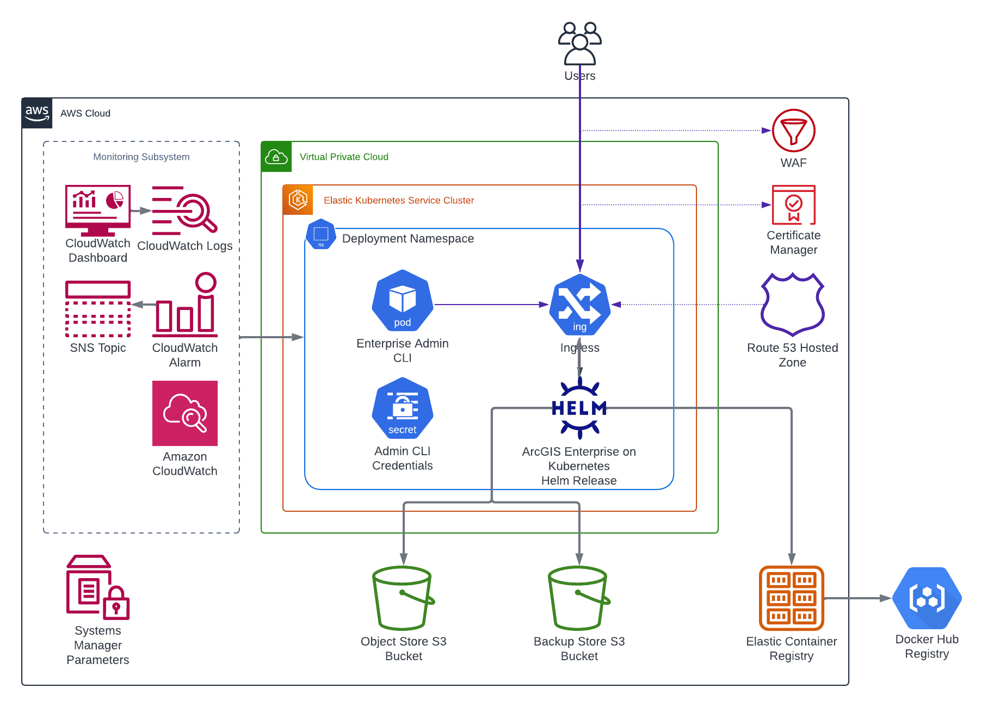

<!-- BEGIN_TF_DOCS -->
# Organization Terraform Module for ArcGIS Enterprise on Kubernetes

The module deploys ArcGIS Enterprise on Kubernetes in Amazon EKS cluster and creates an ArcGIS Enterprise organization.

  

The module uses [Helm Charts for ArcGIS Enterprise on Kubernetes](https://links.esri.com/enterprisekuberneteshelmcharts/1.2.0/deploy-guide).

The following table explains the compatibility of chart versions and ArcGIS Enterprise on Kubernetes.

Helm Chart Version | ArcGIS Enterprise version | Initial deployment using `helm install` command | Release upgrade using `helm upgrade` command | Patch update using `helm upgrade` command | Description |
--- | --- | --- | --- | --- | --- |
v1.2.0 | 11.2.0.5207 | Supported     | Supported      | Not applicable | Helm chart for deploying 11.2 or upgrading 11.1 to 11.2 |
v1.2.1 | 11.2.0.5500 | Not supported | Not applicable | Supported      | Helm chart to apply the 11.2 Help Language Pack Update |
v1.2.2 | 11.2.0.5505 | Not supported | Not applicable | Supported      | Helm chart to apply the 11.2 Q2 2024 Base Operating System Image Update |
v1.2.3 | 11.2.0.5510 | Not supported | Not applicable | Supported      | Helm chart to apply the 11.2 Q2 2024 Bug Fix Update |
v1.3.0 | 11.3.0.5814 | Supported     | Supported      | Not applicable | Helm chart for deploying 11.3 or upgrading 11.2 to 11.3 | *

The module creates a Kubernetes pod to execute Enterprise Admin CLI commands and updates the DR settings to use the specified storage class and size for staging volume.
For ArcGIS Enterprise versions 11.2 and newer the module also creates an S3 bucket for the organization object store, registers it with the deployment,
and registers backup store using S3 bucket specified by "/arcgis/${var.site_id}/s3/backup" SSM parameter.

The deployment's Monitoring Subsystem consists of:

* An SNS topic with a subscription for the primary site administrator.
* A CloudWatch alarm that monitors the ingress ALB target group and post to the SNS topic if the number of unhealthy instances in nonzero.
* A CloudWatch dashboard that displays the CloudWatch alerts, metrics, and container logs of the deployment.

## Requirements

On the machine where Terraform is executed:

* AWS credentials must be configured.
* AWS region must be specified by AWS_DEFAULT_REGION environment variable.
* EKS cluster configuration information must be provided in ~/.kube/config file.

## Providers

| Name | Version |
|------|---------|
| aws | ~> 5.22 |
| helm | ~> 2.12 |
| kubernetes | ~> 2.26 |
| local | n/a |

## Modules

| Name | Source | Version |
|------|--------|---------|
| monitoring | ./modules/monitoring | n/a |
| register_s3_backup_store | ./modules/cli-command | n/a |
| update_dr_settings | ./modules/cli-command | n/a |

## Resources

| Name | Type |
|------|------|
| [aws_s3_bucket.object_store](https://registry.terraform.io/providers/hashicorp/aws/latest/docs/resources/s3_bucket) | resource |
| [aws_sns_topic_subscription.infrastructure_alarms](https://registry.terraform.io/providers/hashicorp/aws/latest/docs/resources/sns_topic_subscription) | resource |
| [helm_release.arcgis_enterprise](https://registry.terraform.io/providers/hashicorp/helm/latest/docs/resources/release) | resource |
| [kubernetes_pod.enterprise_admin_cli](https://registry.terraform.io/providers/hashicorp/kubernetes/latest/docs/resources/pod) | resource |
| [kubernetes_secret.admin_cli_credentials](https://registry.terraform.io/providers/hashicorp/kubernetes/latest/docs/resources/secret) | resource |
| [local_sensitive_file.cloud_config_json_file](https://registry.terraform.io/providers/hashicorp/local/latest/docs/resources/sensitive_file) | resource |
| [local_sensitive_file.license_file](https://registry.terraform.io/providers/hashicorp/local/latest/docs/resources/sensitive_file) | resource |
| [aws_caller_identity.current](https://registry.terraform.io/providers/hashicorp/aws/latest/docs/data-sources/caller_identity) | data source |
| [aws_region.current](https://registry.terraform.io/providers/hashicorp/aws/latest/docs/data-sources/region) | data source |
| [aws_ssm_parameter.s3_backup](https://registry.terraform.io/providers/hashicorp/aws/latest/docs/data-sources/ssm_parameter) | data source |

## Inputs

| Name | Description | Type | Default | Required |
|------|-------------|------|---------|:--------:|
| admin_email | ArcGIS Enterprise on Kubernetes organization administrator account email | `string` | n/a | yes |
| admin_first_name | ArcGIS Enterprise on Kubernetes organization administrator account first name | `string` | n/a | yes |
| admin_last_name | ArcGIS Enterprise on Kubernetes organization administrator account last name | `string` | n/a | yes |
| admin_password | ArcGIS Enterprise on Kubernetes organization administrator account password | `string` | n/a | yes |
| admin_username | ArcGIS Enterprise on Kubernetes organization administrator account username | `string` | `"siteadmin"` | no |
| arcgis_enterprise_context | Context path to be used in the URL for ArcGIS Enterprise on Kubernetes | `string` | `"arcgis"` | no |
| authorization_file_path | ArcGIS Enterprise on Kubernetes authorization file path | `string` | n/a | yes |
| backup_job_timeout | Backup job timeout in seconds | `number` | `7200` | no |
| cloud_config_json_file_path | ArcGIS Enterprise on Kubernetes cloud configuration JSON file path | `string` | `null` | no |
| common_verbose | Enable verbose install logging | `bool` | `false` | no |
| configure_enterprise_org | Configure ArcGIS Enterprise on Kubernetes organization | `bool` | `true` | no |
| configure_wait_time_min | Organization admin URL validation timeout in minutes | `number` | `15` | no |
| deployment_fqdn | The fully qualified domain name (FQDN) to access ArcGIS Enterprise on Kubernetes | `string` | n/a | yes |
| deployment_id | ArcGIS Enterprise deployment Id | `string` | `"arcgis-enterprise-k8s"` | no |
| enterprise_admin_cli_version | ArcGIS Enterprise Admin CLI image tag | `string` | `"0.1.0"` | no |
| helm_charts_version | Helm Charts for ArcGIS Enterprise on Kubernetes version | `string` | `"1.3.0"` | no |
| image_repository_prefix | Prefix of images in ECR repositories | `string` | `"docker-hub/esridocker"` | no |
| k8s_cluster_domain | Kubernetes cluster domain | `string` | `"cluster.local"` | no |
| license_type_id | User type ID for the primary administrator account | `string` | `"creatorUT"` | no |
| log_retention_max_days | Number of days logs will be retained by the organization | `number` | `60` | no |
| log_setting | ArcGIS Enterprise on Kubernetes log level | `string` | `"INFO"` | no |
| mandatory_update_target_id | Patch ID of required update | `string` | `""` | no |
| security_question_answer | ArcGIS Enterprise on Kubernetes organization administrator account security question answer | `string` | n/a | yes |
| security_question_index | ArcGIS Enterprise on Kubernetes organization administrator account security question index | `number` | `1` | no |
| site_id | ArcGIS Enterprise site Id | `string` | `"arcgis-enterprise"` | no |
| staging_volume_class | Staging volume storage class | `string` | `"gp3"` | no |
| staging_volume_size | Staging volume size | `string` | `"64Gi"` | no |
| storage | Storage properties for the data stores | ```map(object({ type = string size = string class = string label1 = string label2 = string }))``` | ```{ "grafana": { "class": "gp3", "label1": "", "label2": "", "size": "16Gi", "type": "DYNAMIC" }, "indexer": { "class": "gp3", "label1": "", "label2": "", "size": "16Gi", "type": "DYNAMIC" }, "memory": { "class": "gp3", "label1": "", "label2": "", "size": "16Gi", "type": "DYNAMIC" }, "object": { "class": "gp3", "label1": "", "label2": "", "size": "32Gi", "type": "DYNAMIC" }, "prometheus": { "class": "gp3", "label1": "", "label2": "", "size": "30Gi", "type": "DYNAMIC" }, "queue": { "class": "gp3", "label1": "", "label2": "", "size": "16Gi", "type": "DYNAMIC" }, "relational": { "class": "gp3", "label1": "", "label2": "", "size": "16Gi", "type": "DYNAMIC" }, "sharing": { "class": "gp3", "label1": "", "label2": "", "size": "16Gi", "type": "DYNAMIC" } }``` | no |
| system_arch_profile | ArcGIS Enterprise on Kubernetes architecture profile | `string` | `"standard-availability"` | no |
| upgrade_token | ArcGIS Enterprise organization administrator account token | `string` | `"add_token_here"` | no |

## Outputs

| Name | Description |
|------|-------------|
| arcgis_enterprise_manager_url | ArcGIS Enterprise Manager URL |
| arcgis_enterprise_portal_url | ArcGIS Enterprise Portal URL |
<!-- END_TF_DOCS -->