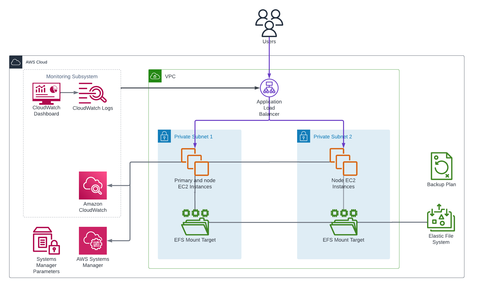

<!-- BEGIN_TF_DOCS -->
# Infrastructure Terraform Module for ArcGIS Notebook Server on Linux

The Terraform module provisions AWS resources for ArcGIS Notebook Server deployment on Linux platform.

  

The module launches a primary instance and N node instances (configurable via node_count)
SSM-managed EC2 instances in the private VPC subnets or subnets specified by subnet_ids input variable.
The instances are launched from images retrieved from '/arcgis/${var.site_id}/images/${var.deployment_id}/{instance role}' SSM parameters.
The images must be created by the Packer Template for ArcGIS Notebook Server on Linux AMI.

For the primary EC2 instance the module creates "A" record in the VPC Route 53 private hosted zone
to make the instance addressable using a permanent DNS name.

> Note that the EC2 instance will be terminated and recreated if the infrastructure terraform module
  is applied again after the SSM parameter value was modified by a new image build.

A highly available EFS file system is created and mounted to the EC2 instances.

The module creates target groups that target the EC2 instances and associates
the target groups with the deployment's load balancer listeners.

The deployment's Monitoring Subsystem consists of:

* A CloudWatch log group
* CloudWatch agent on the EC2 instances that sends the system logs to the log group
  as well as metrics for resource utilization on the EC2 instances.
* A CloudWatch dashboard that displays the CloudWatch metrics and logs of the deployment.

The module also creates an AWS backup plan for the deployment that backs up all
the EC2 instances and EFS file system in the site's backup vault.

All the created AWS resources are tagged with ArcGISSiteId and ArcGISDeploymentId tags.

## Requirements

On the machine where Terraform is executed:

* Python 3.8 or later with [AWS SDK for Python (Boto3)](https://aws.amazon.com/sdk-for-python/) package must be installed.
* Path to aws/scripts directory must be added to PYTHONPATH.
* AWS credentials must be configured.

## Troubleshooting

Use Session Manager connection in AWS Console for SSH access to the EC2 instances.

## SSM Parameters

The module reads the following SSM parameters:

| SSM parameter name | Description |
|--------------------|-------------|
| /arcgis/${var.site_id}/${var.ingress_deployment_id}/alb/arn | ALB ARN |
| /arcgis/${var.site_id}/${var.ingress_deployment_id}/alb/security-group-id | ALB security group ID |
| /arcgis/${var.site_id}/${var.ingress_deployment_id}/deployment-fqdn | Fully qualified domain name of the ALB deployment |
| /arcgis/${var.site_id}/${var.portal_deployment_id}/deployment-url | Portal for ArcGIS URL |
| /arcgis/${var.site_id}/backup/vault-name | Name of the AWS Backup vault |
| /arcgis/${var.site_id}/iam/backup-role-arn | ARN of IAM role used by AWS Backup service |
| /arcgis/${var.site_id}/iam/instance-profile-name | IAM instance profile name |
| /arcgis/${var.site_id}/images/${var.deployment_id}/node | Node EC2 instances AMI ID |
| /arcgis/${var.site_id}/images/${var.deployment_id}/primary | Primary EC2 instance AMI ID |
| /arcgis/${var.site_id}/s3/backup | S3 bucket for the backup |
| /arcgis/${var.site_id}/s3/logs | S3 bucket for SSM command output |
| /arcgis/${var.site_id}/s3/repository | S3 bucket for the private repository |
| /arcgis/${var.site_id}/vpc/hosted-zone-id | VPC hosted zone ID |
| /arcgis/${var.site_id}/vpc/id | VPC ID |
| /arcgis/${var.site_id}/vpc/subnets | IDs of VPC subnets |

The module writes the following SSM parameters:

| SSM parameter name | Description |
|--------------------|-------------|
| /arcgis/${var.site_id}/${var.deployment_id}/deployment-fqdn | Fully qualified domain name of the deployment |
| /arcgis/${var.site_id}/${var.deployment_id}/deployment-url | ArcGIS Notebook Server URL |
| /arcgis/${var.site_id}/${var.deployment_id}/notebook-server-web-context | ArcGIS Notebook Server web context |
| /arcgis/${var.site_id}/${var.deployment_id}/security-group-id | Deployment security group ID |
| /arcgis/${var.site_id}/${var.deployment_id}/portal-url | Portal for ArcGIS URL |

## Providers

| Name | Version |
|------|---------|
| aws | ~> 6.10 |

## Modules

| Name | Source | Version |
|------|--------|---------|
| cw_agent | ../../modules/cw_agent | n/a |
| dashboard | ../../modules/dashboard | n/a |
| efs_mount | ../../modules/efs_mount | n/a |
| notebook_server_https_alb_target | ../../modules/alb_target_group | n/a |
| private_server_https_alb_target | ../../modules/alb_target_group | n/a |
| security_group | ../../modules/security_group | n/a |
| site_core_info | ../../modules/site_core_info | n/a |

## Resources

| Name | Type |
|------|------|
| [aws_backup_plan.deployment_backup](https://registry.terraform.io/providers/hashicorp/aws/latest/docs/resources/backup_plan) | resource |
| [aws_backup_selection.infrastructure](https://registry.terraform.io/providers/hashicorp/aws/latest/docs/resources/backup_selection) | resource |
| [aws_efs_file_system.fileserver](https://registry.terraform.io/providers/hashicorp/aws/latest/docs/resources/efs_file_system) | resource |
| [aws_efs_mount_target.fileserver](https://registry.terraform.io/providers/hashicorp/aws/latest/docs/resources/efs_mount_target) | resource |
| [aws_instance.nodes](https://registry.terraform.io/providers/hashicorp/aws/latest/docs/resources/instance) | resource |
| [aws_instance.primary](https://registry.terraform.io/providers/hashicorp/aws/latest/docs/resources/instance) | resource |
| [aws_network_interface.nodes](https://registry.terraform.io/providers/hashicorp/aws/latest/docs/resources/network_interface) | resource |
| [aws_network_interface.primary](https://registry.terraform.io/providers/hashicorp/aws/latest/docs/resources/network_interface) | resource |
| [aws_route53_record.primary](https://registry.terraform.io/providers/hashicorp/aws/latest/docs/resources/route53_record) | resource |
| [aws_ssm_parameter.backup_plan_id](https://registry.terraform.io/providers/hashicorp/aws/latest/docs/resources/ssm_parameter) | resource |
| [aws_ssm_parameter.deployment_fqdn](https://registry.terraform.io/providers/hashicorp/aws/latest/docs/resources/ssm_parameter) | resource |
| [aws_ssm_parameter.deployment_url](https://registry.terraform.io/providers/hashicorp/aws/latest/docs/resources/ssm_parameter) | resource |
| [aws_ssm_parameter.notebook_server_web_context](https://registry.terraform.io/providers/hashicorp/aws/latest/docs/resources/ssm_parameter) | resource |
| [aws_ssm_parameter.portal_url](https://registry.terraform.io/providers/hashicorp/aws/latest/docs/resources/ssm_parameter) | resource |
| [aws_ssm_parameter.security_group_id](https://registry.terraform.io/providers/hashicorp/aws/latest/docs/resources/ssm_parameter) | resource |
| [aws_ami.ami](https://registry.terraform.io/providers/hashicorp/aws/latest/docs/data-sources/ami) | data source |
| [aws_lb.alb](https://registry.terraform.io/providers/hashicorp/aws/latest/docs/data-sources/lb) | data source |
| [aws_ssm_parameter.alb_arn](https://registry.terraform.io/providers/hashicorp/aws/latest/docs/data-sources/ssm_parameter) | data source |
| [aws_ssm_parameter.alb_deployment_fqdn](https://registry.terraform.io/providers/hashicorp/aws/latest/docs/data-sources/ssm_parameter) | data source |
| [aws_ssm_parameter.alb_security_group_id](https://registry.terraform.io/providers/hashicorp/aws/latest/docs/data-sources/ssm_parameter) | data source |
| [aws_ssm_parameter.backup_role_arn](https://registry.terraform.io/providers/hashicorp/aws/latest/docs/data-sources/ssm_parameter) | data source |
| [aws_ssm_parameter.backup_vault_name](https://registry.terraform.io/providers/hashicorp/aws/latest/docs/data-sources/ssm_parameter) | data source |
| [aws_ssm_parameter.node_ami](https://registry.terraform.io/providers/hashicorp/aws/latest/docs/data-sources/ssm_parameter) | data source |
| [aws_ssm_parameter.portal_deployment_url](https://registry.terraform.io/providers/hashicorp/aws/latest/docs/data-sources/ssm_parameter) | data source |
| [aws_ssm_parameter.primary_ami](https://registry.terraform.io/providers/hashicorp/aws/latest/docs/data-sources/ssm_parameter) | data source |

## Inputs

| Name | Description | Type | Default | Required |
|------|-------------|------|---------|:--------:|
| aws_region | AWS region Id | `string` | n/a | yes |
| backup_retention | Number of days to retain backups | `number` | `14` | no |
| backup_schedule | Backup schedule in cron format | `string` | `"cron(0 0 * * ? *)"` | no |
| deployment_id | ArcGIS Notebook Server deployment Id | `string` | `"notebook-server-linux"` | no |
| ingress_deployment_id | Ingress deployment Id | `string` | `"enterprise-ingress"` | no |
| instance_type | EC2 instance type | `string` | `"m7i.2xlarge"` | no |
| key_name | EC2 key pair name | `string` | n/a | yes |
| node_count | Number of node EC2 instances | `number` | `1` | no |
| notebook_server_web_context | ArcGIS Notebook Server web context | `string` | `"notebooks"` | no |
| portal_deployment_id | Portal for ArcGIS deployment Id | `string` | `"enterprise-base-linux"` | no |
| root_volume_iops | Root EBS volume IOPS of primary and standby EC2 instances | `number` | `16000` | no |
| root_volume_size | Root EBS volume size in GB | `number` | `1024` | no |
| root_volume_throughput | Root EBS volume throughput in MB/s of primary and standby EC2 instances | `number` | `1000` | no |
| site_id | ArcGIS Enterprise site Id | `string` | `"arcgis"` | no |
| subnet_ids | EC2 instances subnet IDs (by default, the first two private VPC subnets are used) | `list(string)` | `[]` | no |

## Outputs

| Name | Description |
|------|-------------|
| deployment_url | ArcGIS Notebook Server URL |
| security_group_id | EC2 security group Id |
<!-- END_TF_DOCS -->