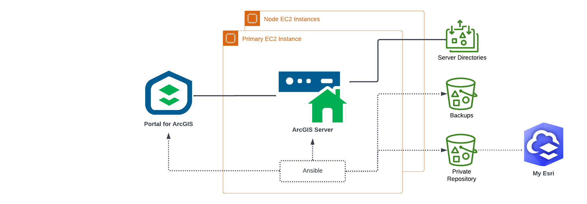

<!-- BEGIN_TF_DOCS -->
# Application Terraform Module for ArcGIS Server on Linux

The Terraform module configures or upgrades applications of highly available ArcGIS Server deployment on Linux platforms.

If is_upgrade input variable is set to true, the module:

* Copies the installation media for the ArcGIS Server version specified by arcgis_version input variable to the private repository S3 bucket
* Downloads the installation media from the private repository S3 bucket to primary and node EC2 instances
* Upgrades ArcGIS Server on primary and node EC2 instances
* Installs ArcGIS Server patches on primary and node EC2 instances
* If use_webadaptor input variable is set to true, upgrades OpenJDK, Apache Tomcat, and ArcGIS Web Adaptor on primary and node EC2 instances

Then the module:

* Creates the required directories in the NFS mount
* Copies the ArcGIS Server authorization file to the EC2 instances
* Configures ArcGIS Server on primary EC2 instance
* Configures ArcGIS Server on node EC2 instances
* If use_webadaptor input variable is set to true:
* * Configures HTTPS listener in Apache Tomcat on primary and node EC2 instances to use either the SSL certificate specified by keystore_file_path input variable or a self signed certificate if keystore_file_path is not specified
* * Registers ArcGIS Web Adaptor with ArcGIS Server on primary and node EC2 instances
* If server_role input variable is specified, federates ArcGIS Server with Portal for ArcGIS

## Requirements

The AWS resources for the deployment must be provisioned by Infrastructure terraform module for ArcGIS Server on Linux.

On the machine where Terraform is executed:

* Python 3.8 or later with [AWS SDK for Python (Boto3)](https://aws.amazon.com/sdk-for-python/) package must be installed
* Path to aws/scripts directory must be added to PYTHONPATH
* Ansible 2.16 or later must be installed
* arcgis.common, arcgis.server, and arcgis.portal Ansible collections must be installed
* The working directury must be set to the arcgis-server-linux/application module path
* AWS credentials must be configured

My Esri user name and password must be specified either using environment variables ARCGIS_ONLINE_USERNAME and ARCGIS_ONLINE_PASSWORD or the input variables.

## SSM Parameters

The module reads the following SSM parameters:

| SSM parameter name | Description |
|--------------------|-------------|
| /arcgis/${var.site_id}/${var.deployment_id}/backup/plan-id | Backup plan ID for the deployment |
| /arcgis/${var.site_id}/${var.deployment_id}/deployment-fqdn | Fully qualified domain name of the deployment |
| /arcgis/${var.site_id}/${var.deployment_id}/portal-url | Portal for ArcGIS URL (if server_role input variable is specified and portal_url is not specified) |
| /arcgis/${var.site_id}/${var.deployment_id}/server-web-context | ArcGIS Server web context |
| /arcgis/${var.site_id}/${var.deployment_id}/sns-topic-arn | SNS topic ARN of the monitoring subsystem |
| /arcgis/${var.site_id}/iam/backup-role-arn | ARN of IAM role used by AWS Backup service |
| /arcgis/${var.site_id}/s3/repository | S3 bucket for the private repository |

## Providers

| Name | Version |
|------|---------|
| aws | ~> 6.0 |

## Modules

| Name | Source | Version |
|------|--------|---------|
| arcgis_server_federation | ../../modules/ansible_playbook | n/a |
| arcgis_server_files | ../../modules/ansible_playbook | n/a |
| arcgis_server_fileserver | ../../modules/ansible_playbook | n/a |
| arcgis_server_node | ../../modules/ansible_playbook | n/a |
| arcgis_server_patch | ../../modules/ansible_playbook | n/a |
| arcgis_server_primary | ../../modules/ansible_playbook | n/a |
| arcgis_server_upgrade | ../../modules/ansible_playbook | n/a |
| arcgis_webadaptor | ../../modules/ansible_playbook | n/a |
| arcgis_webadaptor_upgrade | ../../modules/ansible_playbook | n/a |
| authorization_file | ../../modules/ansible_playbook | n/a |
| backup | ../../modules/backup | n/a |
| clean | ../../modules/ansible_playbook | n/a |
| copy_server_files | ../../modules/s3_copy_files | n/a |
| copy_webadaptor_files | ../../modules/s3_copy_files | n/a |
| download_webadaptor_files | ../../modules/ansible_playbook | n/a |
| keystore_file | ../../modules/ansible_playbook | n/a |
| openjdk_upgrade | ../../modules/ansible_playbook | n/a |
| site_core_info | ../../modules/site_core_info | n/a |
| tomcat_keystore_file | ../../modules/ansible_playbook | n/a |
| tomcat_ssl_config | ../../modules/ansible_playbook | n/a |
| tomcat_upgrade | ../../modules/ansible_playbook | n/a |
| unregister_web_adaptors | ../../modules/ansible_playbook | n/a |

## Resources

| Name | Type |
|------|------|
| [aws_sns_topic_subscription.infrastructure_alarms](https://registry.terraform.io/providers/hashicorp/aws/latest/docs/resources/sns_topic_subscription) | resource |
| [aws_instance.primary](https://registry.terraform.io/providers/hashicorp/aws/latest/docs/data-sources/instance) | data source |
| [aws_region.current](https://registry.terraform.io/providers/hashicorp/aws/latest/docs/data-sources/region) | data source |
| [aws_ssm_parameter.deployment_fqdn](https://registry.terraform.io/providers/hashicorp/aws/latest/docs/data-sources/ssm_parameter) | data source |
| [aws_ssm_parameter.portal_url](https://registry.terraform.io/providers/hashicorp/aws/latest/docs/data-sources/ssm_parameter) | data source |
| [aws_ssm_parameter.server_web_context](https://registry.terraform.io/providers/hashicorp/aws/latest/docs/data-sources/ssm_parameter) | data source |
| [aws_ssm_parameter.sns_topic](https://registry.terraform.io/providers/hashicorp/aws/latest/docs/data-sources/ssm_parameter) | data source |

## Inputs

| Name | Description | Type | Default | Required |
|------|-------------|------|---------|:--------:|
| admin_email | ArcGIS Server administrator e-mail address | `string` | n/a | yes |
| admin_password | Primary ArcGIS Server administrator user password | `string` | n/a | yes |
| admin_username | Primary ArcGIS Server administrator user name | `string` | `"siteadmin"` | no |
| arcgis_server_patches | File names of ArcGIS Server patches to install. | `list(string)` | `[]` | no |
| arcgis_version | ArcGIS Server version | `string` | `"11.5"` | no |
| aws_region | AWS region Id | `string` | n/a | yes |
| config_store_type | ArcGIS Server configuration store type | `string` | `"FILESYSTEM"` | no |
| deployment_id | Deployment Id | `string` | `"server-linux"` | no |
| is_upgrade | Flag to indicate if this is an upgrade deployment | `bool` | `false` | no |
| keystore_file_password | Password for keystore file with SSL certificate used by HTTPS listeners | `string` | `""` | no |
| keystore_file_path | Local path of keystore file in PKCS12 format with SSL certificate used by HTTPS listeners | `string` | `null` | no |
| log_level | ArcGIS Enterprise applications log level | `string` | `"WARNING"` | no |
| os | Operating system id (rhel8\|rhel9) | `string` | `"rhel9"` | no |
| portal_org_id | ArcGIS Enterprise organization Id | `string` | `null` | no |
| portal_password | Portal for ArcGIS user password | `string` | `null` | no |
| portal_url | Portal for ArcGIS URL | `string` | `null` | no |
| portal_username | Portal for ArcGIS user name | `string` | `null` | no |
| root_cert_file_path | Local path of root certificate file in PEM format used by ArcGIS Server | `string` | `null` | no |
| run_as_user | User name for the account used to run ArcGIS Server. | `string` | `"arcgis"` | no |
| server_authorization_file_path | Local path of ArcGIS Server authorization file | `string` | n/a | yes |
| server_authorization_options | Additional ArcGIS Server software authorization command line options | `string` | `""` | no |
| server_functions | Functions of the federated server | `list(string)` | `[]` | no |
| server_role | ArcGIS Server role | `string` | `""` | no |
| services_dir_enabled | Enable REST handler services directory | `bool` | `true` | no |
| site_id | ArcGIS Enterprise site Id | `string` | `"arcgis"` | no |
| system_properties | ArcGIS Server system properties | `map(any)` | `{}` | no |
| use_webadaptor | If true, ArcGIS Web Adaptor will be registered with ArcGIS Server. | `bool` | `false` | no |

## Outputs

| Name | Description |
|------|-------------|
| arcgis_server_url | ArcGIS Server URL |
<!-- END_TF_DOCS -->