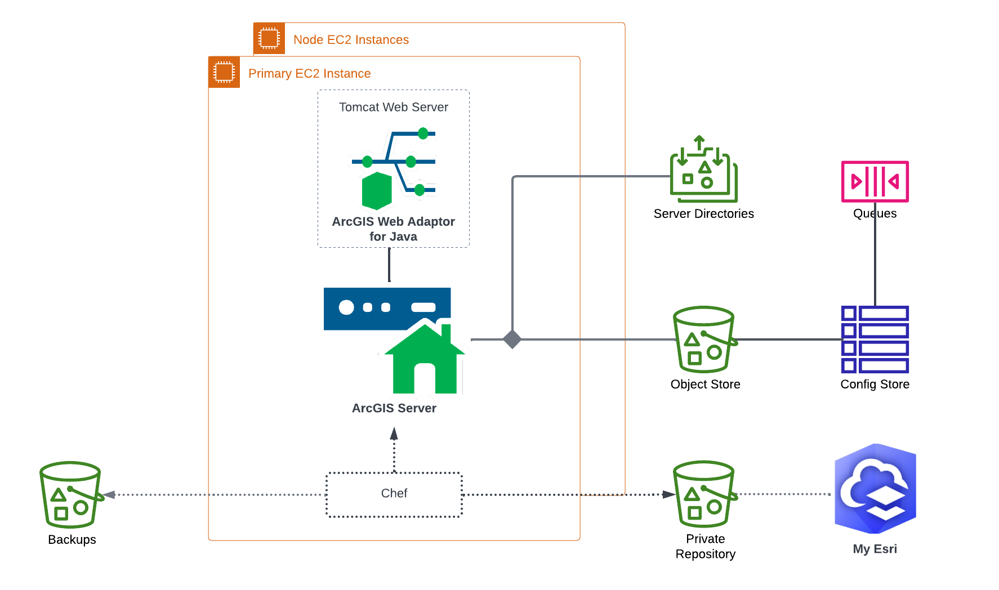

<!-- BEGIN_TF_DOCS -->
# Application Terraform Module for ArcGIS Server on Linux

The Terraform module configures or upgrades applications for an ArcGIS Server deployment on the Linux platforms.

First, the module bootstraps the deployment by installing Chef Client and Chef Cookbooks for ArcGIS on all EC2 instances of the deployment.

If is_upgrade input variable is set to true, the module:

* Copies the installation media for the ArcGIS Server version specified by arcgis_version input variable to the private repository S3 bucket
* Downloads the installation media from the private repository S3 bucket to primary and node EC2 instances
* Upgrades OpenJDK, Apache Tomcat, ArcGIS Server, and ArcGIS Web Adaptor on primary and node EC2 instances
* Installs ArcGIS Server patches on primary and node EC2 instances

Then the module:

* Creates the required directories in the NFS mount
* Copies the ArcGIS Server authorization file to the EC2 instances
* Configures ArcGIS Server and ArcGIS Web Adaptor on primary EC2 instance
* Configures ArcGIS Server and ArcGIS Web Adaptor on node EC2 instances
* If server_role input variable is specified, federates ArcGIS Server with Portal for ArcGIS

Starting with ArcGIS Server 12.0, if the config_store_type input variable is set to AMAZON,
the module configures ArcGIS Server to store server directories in an S3 bucket and
the configuration store in a DynamoDB table, rather than on the EFS file system.

## Requirements

The AWS resources for the deployment must be provisioned by Infrastructure terraform module for ArcGIS Server on Linux.

On the machine where Terraform is executed:

* Python 3.8 or later with [AWS SDK for Python (Boto3)](https://aws.amazon.com/sdk-for-python/) package must be installed
* Path to aws/scripts directory must be added to PYTHONPATH
* The working directory must be set to the arcgis-server-linux/application module path
* AWS credentials must be configured

My Esri user name and password must be specified either using environment variables ARCGIS_ONLINE_USERNAME and ARCGIS_ONLINE_PASSWORD or the input variables.

## SSM Parameters

The module reads the following SSM parameters:

| SSM parameter name | Description |
|--------------------|-------------|
| /arcgis/${var.enterprise_id}/${var.deployment_id}/backup/plan-id | Backup plan ID for the deployment |
| /arcgis/${var.enterprise_id}/${var.deployment_id}/ingress-fqdn | Fully qualified domain name of the ingress |
| /arcgis/${var.enterprise_id}/${var.deployment_id}/namespace | Namespace of the deployment used to generate unique resource names |
| /arcgis/${var.enterprise_id}/${var.deployment_id}/object-store-s3-bucket | S3 bucket for the object store |
| /arcgis/${var.enterprise_id}/${var.deployment_id}/portal-url | Portal for ArcGIS URL (if server_role input variable is specified) |
| /arcgis/${var.enterprise_id}/chef-client-url/${os} | Chef Client URL for the operating system |
| /arcgis/${var.enterprise_id}/cookbooks-url | Chef cookbooks URL |
| /arcgis/${var.enterprise_id}/iam/backup-role-arn | ARN of IAM role used by AWS Backup service |
| /arcgis/${var.enterprise_id}/images/${var.deployment_id}/os | Operating system identifier |
| /arcgis/${var.enterprise_id}/images/${var.deployment_id}/server-web-context | ArcGIS Server web context |
| /arcgis/${var.enterprise_id}/s3/backup | S3 bucket for the backup |
| /arcgis/${var.enterprise_id}/s3/logs | S3 bucket for SSM command output |
| /arcgis/${var.enterprise_id}/s3/repository | S3 bucket for the private repository |
| /arcgis/${var.enterprise_id}/vpc/hosted-zone-id | VPC hosted zone ID |
| /arcgis/${var.enterprise_id}/vpc/id | VPC ID |
| /arcgis/${var.enterprise_id}/vpc/subnets | IDs of VPC subnets |

## Providers

| Name | Version |
|------|---------|
| aws | ~> 6.10 |

## Modules

| Name | Source | Version |
|------|--------|---------|
| arcgis_server_federation | ../../modules/run_chef | n/a |
| arcgis_server_files | ../../modules/run_chef | n/a |
| arcgis_server_fileserver | ../../modules/run_chef | n/a |
| arcgis_server_node | ../../modules/run_chef | n/a |
| arcgis_server_patch | ../../modules/run_chef | n/a |
| arcgis_server_primary | ../../modules/run_chef | n/a |
| arcgis_server_upgrade | ../../modules/run_chef | n/a |
| authorization_file | ../../modules/run_chef | n/a |
| backup | ../../modules/backup | n/a |
| begin_upgrade_nodes | ../../modules/run_chef | n/a |
| bootstrap_deployment | ../../modules/bootstrap | n/a |
| clean_up | ../../modules/clean_up | n/a |
| copy_server_files | ../../modules/s3_copy_files | n/a |
| enterprise_core_info | ../../modules/enterprise_core_info | n/a |
| keystore_file | ../../modules/run_chef | n/a |
| root_cert | ../../modules/run_chef | n/a |

## Resources

| Name | Type |
|------|------|
| [aws_s3_object.keystore_file](https://registry.terraform.io/providers/hashicorp/aws/latest/docs/resources/s3_object) | resource |
| [aws_s3_object.root_cert_file](https://registry.terraform.io/providers/hashicorp/aws/latest/docs/resources/s3_object) | resource |
| [aws_s3_object.server_authorization_file](https://registry.terraform.io/providers/hashicorp/aws/latest/docs/resources/s3_object) | resource |
| [aws_instance.primary](https://registry.terraform.io/providers/hashicorp/aws/latest/docs/data-sources/instance) | data source |
| [aws_instances.nodes](https://registry.terraform.io/providers/hashicorp/aws/latest/docs/data-sources/instances) | data source |
| [aws_region.current](https://registry.terraform.io/providers/hashicorp/aws/latest/docs/data-sources/region) | data source |
| [aws_ssm_parameter.ingress_fqdn](https://registry.terraform.io/providers/hashicorp/aws/latest/docs/data-sources/ssm_parameter) | data source |
| [aws_ssm_parameter.namespace](https://registry.terraform.io/providers/hashicorp/aws/latest/docs/data-sources/ssm_parameter) | data source |
| [aws_ssm_parameter.object_store](https://registry.terraform.io/providers/hashicorp/aws/latest/docs/data-sources/ssm_parameter) | data source |
| [aws_ssm_parameter.os](https://registry.terraform.io/providers/hashicorp/aws/latest/docs/data-sources/ssm_parameter) | data source |
| [aws_ssm_parameter.portal_url](https://registry.terraform.io/providers/hashicorp/aws/latest/docs/data-sources/ssm_parameter) | data source |
| [aws_ssm_parameter.server_web_context](https://registry.terraform.io/providers/hashicorp/aws/latest/docs/data-sources/ssm_parameter) | data source |

## Inputs

| Name | Description | Type | Default | Required |
|------|-------------|------|---------|:--------:|
| admin_email | ArcGIS Server administrator e-mail address | `string` | n/a | yes |
| admin_password | Primary ArcGIS Server administrator user password | `string` | n/a | yes |
| admin_username | Primary ArcGIS Server administrator user name | `string` | `"siteadmin"` | no |
| arcgis_server_patches | File names of ArcGIS Server patches to install. | `list(string)` | `[]` | no |
| arcgis_version | ArcGIS Server version | `string` | `"12.0"` | no |
| arcgis_web_adaptor_patches | File names of ArcGIS Web Adaptor patches to install. | `list(string)` | `[]` | no |
| aws_region | AWS region ID | `string` | n/a | yes |
| config_store_type | ArcGIS Server configuration store type | `string` | `"FILESYSTEM"` | no |
| deployment_id | Deployment ID | `string` | `"server-linux"` | no |
| enterprise_id | ArcGIS Enterprise ID | `string` | `"arcgis"` | no |
| is_upgrade | Flag to indicate if this is an upgrade deployment | `bool` | `false` | no |
| log_level | ArcGIS Enterprise applications log level | `string` | `"WARNING"` | no |
| portal_org_id | ArcGIS Enterprise organization ID | `string` | `null` | no |
| portal_password | Portal for ArcGIS user password | `string` | `null` | no |
| portal_username | Portal for ArcGIS user name | `string` | `null` | no |
| root_certificate_path | Local path of root certificate file in PEM format | `string` | `null` | no |
| run_as_user | User name for the account used to run ArcGIS Server. | `string` | `"arcgis"` | no |
| server_authorization_file_path | Local path of ArcGIS Server authorization file | `string` | n/a | yes |
| server_authorization_options | Additional ArcGIS Server software authorization command line options | `string` | `""` | no |
| server_certificate_password | Password for TLS certificate in PKCS12 format installed on backend servers | `string` | `""` | no |
| server_certificate_path | Local path of TLS certificate in PKCS12 format installed on backend servers | `string` | `null` | no |
| server_functions | Functions of the federated server | `list(string)` | `[]` | no |
| server_role | ArcGIS Server role | `string` | `""` | no |
| services_dir_enabled | Enable REST handler services directory | `bool` | `true` | no |
| system_properties | ArcGIS Server system properties | `map(any)` | `{}` | no |

## Outputs

| Name | Description |
|------|-------------|
| arcgis_server_url | ArcGIS Server URL |
<!-- END_TF_DOCS -->