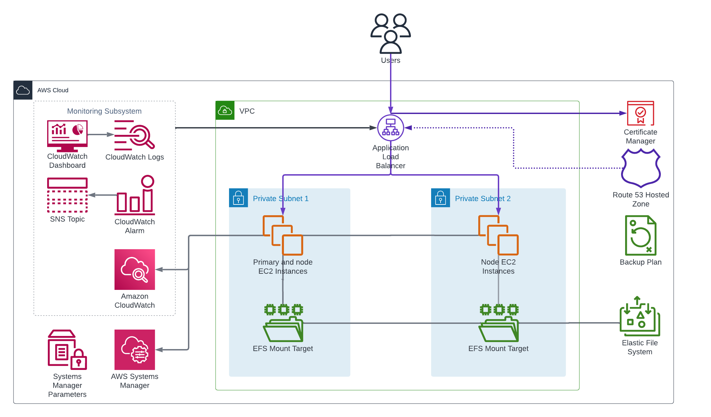

<!-- BEGIN_TF_DOCS -->
# Infrastructure Terraform Module for ArcGIS Server on Linux

The Terraform module provisions AWS resources for highly available ArcGIS Server deployment on Linux platform.

  

The module launches two SSM managed EC2 instances in the private VPC subnets or subnets specified by subnet_ids input variable.
The instances are launched from image retrieved from '/arcgis/${var.site_id}/images/${var.deployment_id}/{instance role}' SSM parameter.
The image must be created by the Packer Template for ArcGIS Server on Linux AMI.

For the primary EC2 instances the module creates "A" record in the VPC Route53 private hosted zone
to make the instance addressable using permanent DNS names.

> Note that the EC2 instance will be terminated and recreated if the infrastructure terraform module
  is applied again after the SSM parameter value was modified by a new image build.

A highly available EFS file system is created and mounted to the EC2 instances.

If alb_deployment_id input variable is null, the module creates and configure an Application Load Balancer (ALB) for the deployment.
Otherwise, the it uses the ALB from deployment specified by alb_deployment_id and ignores the values of client_cidr_blocks, deployment_fqdn, hosted_zone_id, internal_load_balancer, ssl_certificate_arn, and ssl_policy input variables.
Internet-facing load balancer is configured to use two of the public VPC subnets, while internal load balancer uses the private subnets.

For the ALB the module creates target groups that target the EC2 instances. The target group for port 443 is always created. While the target group for port 6443 is created only if use_webadaptor input variable is set to false.

By default the HTTPS listener on port 443 is forwarded to instance port 6443. Set the use_webadaptor input variable to true, to use port 443.

The deployment's Monitoring Subsystem consists of:

* An SNS topic and a CloudWatch alarms that monitor the target groups and post to the SNS topic if the number of unhealthy instances in nonzero.
* A CloudWatch log group
* CloudWatch agent on the EC2 instances that sends the system logs to the log group as well as metrics fo resource utilization on the EC2 instances.
* A CloudWatch dashboard that displays the CloudWatch alerts, metrics, and logs of the deployment.

All the created AWS resources are tagged with ArcGISSiteId and ArcGISDeploymentId tags.

## Requirements

On the machine where Terraform is executed:

* Python 3.8 or later with [AWS SDK for Python (Boto3)](https://aws.amazon.com/sdk-for-python/) package must be installed.
* Path to aws/scripts directory must be added to PYTHONPATH.
* AWS credentials must be configured.

If alb_deployment_id is not set:

* Before creating the infrastructure, an SSL certificate for the ArcGIS Server deployment FQDN
  must be imported into or issued by AWS Certificate Manager service in the AWS account. The certificate's
  ARN specified by "ssl_certificate_arn" input variable will be used to configure HTTPS listeners of the load balancer.
* After creating the infrastructure, the deployment FQDN must be pointed to the DNS name of Application Load Balancer
  exported by "alb_dns_name" output value of the module.

## Troubleshooting

Use Session Manager connection in AWS Console for SSH access to the EC2 instances.

The SSM commands output stored in the logs S3 bucket is copied in the Terraform stdout.

## SSM Parameters

The module uses the following SSM parameters:

| SSM parameter name | Description |
|--------------------|-------------|
| /arcgis/${var.site_id}/${var.alb_deployment_id}/alb/arn | ALB ARN (if alb_deployment_id is specified) |
| /arcgis/${var.site_id}/${var.alb_deployment_id}/alb/security-group-id | ALB security group Id (if alb_deployment_id is specified) |
| /arcgis/${var.site_id}/iam/instance-profile-name | IAM instance profile name |
| /arcgis/${var.site_id}/images/${var.deployment_id}/primary | Primary EC2 instance AMI Id |
| /arcgis/${var.site_id}/images/${var.deployment_id}/node | Node EC2 instances AMI Id |
| /arcgis/${var.site_id}/s3/logs | S3 bucket for SSM commands output |
| /arcgis/${var.site_id}/vpc/subnets | Ids of VPC subnets |
| /arcgis/${var.site_id}/vpc/hosted-zone-id | VPC hosted zone Id |
| /arcgis/${var.site_id}/vpc/id | VPC Id |

The module creates the following SSM parameters:

| SSM parameter name | Description |
|--------------------|-------------|
| /arcgis/${var.site_id}/${var.deployment_id}/security-group-id | Deployment security group Id |
| /arcgis/${var.site_id}/${var.deployment_id}/sns-topic-arn | ARN of SNS topic for deployment alarms |
| /arcgis/${var.site_id}/${var.deployment_id}/alb/arn | ARN of the application load balancer (if alb_deployment_id is not specified) |
| /arcgis/${var.site_id}/${var.deployment_id}/alb/dns-name | DNS name of the application load balancer (if alb_deployment_id is not specified) |
| /arcgis/${var.site_id}/${var.deployment_id}/alb/security-group-id | Security group Id of the application load balancer (if alb_deployment_id is not specified) |

## Providers

| Name | Version |
|------|---------|
| aws | ~> 5.48 |

## Modules

| Name | Source | Version |
|------|--------|---------|
| alb | ../../modules/alb | n/a |
| cw_agent | ../../modules/cw_agent | n/a |
| dashboard | ../../modules/dashboard | n/a |
| nfs_mount | ../../modules/ansible_playbook | n/a |
| private_server_https_alb_target | ../../modules/alb_target_group | n/a |
| security_group | ../../modules/security_group | n/a |
| server_https_alb_target | ../../modules/alb_target_group | n/a |
| site_core_info | ../../modules/site_core_info | n/a |

## Resources

| Name | Type |
|------|------|
| [aws_efs_file_system.fileserver](https://registry.terraform.io/providers/hashicorp/aws/latest/docs/resources/efs_file_system) | resource |
| [aws_efs_mount_target.fileserver](https://registry.terraform.io/providers/hashicorp/aws/latest/docs/resources/efs_mount_target) | resource |
| [aws_instance.nodes](https://registry.terraform.io/providers/hashicorp/aws/latest/docs/resources/instance) | resource |
| [aws_instance.primary](https://registry.terraform.io/providers/hashicorp/aws/latest/docs/resources/instance) | resource |
| [aws_route53_record.primary](https://registry.terraform.io/providers/hashicorp/aws/latest/docs/resources/route53_record) | resource |
| [aws_ssm_parameter.security_group_id](https://registry.terraform.io/providers/hashicorp/aws/latest/docs/resources/ssm_parameter) | resource |
| [aws_ami.ami](https://registry.terraform.io/providers/hashicorp/aws/latest/docs/data-sources/ami) | data source |
| [aws_lb.alb](https://registry.terraform.io/providers/hashicorp/aws/latest/docs/data-sources/lb) | data source |
| [aws_ssm_parameter.alb_arn](https://registry.terraform.io/providers/hashicorp/aws/latest/docs/data-sources/ssm_parameter) | data source |
| [aws_ssm_parameter.alb_security_group_id](https://registry.terraform.io/providers/hashicorp/aws/latest/docs/data-sources/ssm_parameter) | data source |
| [aws_ssm_parameter.node_ami](https://registry.terraform.io/providers/hashicorp/aws/latest/docs/data-sources/ssm_parameter) | data source |
| [aws_ssm_parameter.primary_ami](https://registry.terraform.io/providers/hashicorp/aws/latest/docs/data-sources/ssm_parameter) | data source |

## Inputs

| Name | Description | Type | Default | Required |
|------|-------------|------|---------|:--------:|
| alb_deployment_id | Base ArcGIS Enterprise deployment Id | `string` | `null` | no |
| aws_region | AWS region Id | `string` | n/a | yes |
| client_cidr_blocks | Client CIDR blocks | `list(string)` | ```[ "0.0.0.0/0" ]``` | no |
| deployment_fqdn | Fully qualified domain name of the ArcGIS Server deployment | `string` | `null` | no |
| deployment_id | ArcGIS Server deployment Id | `string` | `"server"` | no |
| instance_type | EC2 instance type | `string` | `"m6i.2xlarge"` | no |
| internal_load_balancer | If true, the load balancer scheme is set to 'internal' | `bool` | `false` | no |
| key_name | EC2 key pair name | `string` | n/a | yes |
| node_count | Number of node EC2 instances | `number` | `1` | no |
| root_volume_iops | Root EBS volume IOPS of primary and standby EC2 instances | `number` | `3000` | no |
| root_volume_size | Root EBS volume size in GB | `number` | `1024` | no |
| root_volume_throughput | Root EBS volume throughput in MB/s of primary and standby EC2 instances | `number` | `125` | no |
| server_web_context | ArcGIS Server web context | `string` | `"arcgis"` | no |
| site_id | ArcGIS Enterprise site Id | `string` | `"arcgis"` | no |
| ssl_certificate_arn | SSL certificate ARN for HTTPS listeners of the load balancer | `string` | n/a | yes |
| ssl_policy | Security Policy that should be assigned to the ALB to control the SSL protocol and ciphers | `string` | `"ELBSecurityPolicy-TLS13-1-2-2021-06"` | no |
| subnet_ids | EC2 instances subnet IDs (by default, the first two private VPC subnets are used) | `list(string)` | `[]` | no |
| use_webadaptor | If true, port 443 is used as the instance HTTPS port, otherwise 6443 bis used. | `bool` | `false` | no |

## Outputs

| Name | Description |
|------|-------------|
| alb_dns_name | DNS name of the application load balancer |
| security_group_id | EC2 security group Id |
<!-- END_TF_DOCS -->