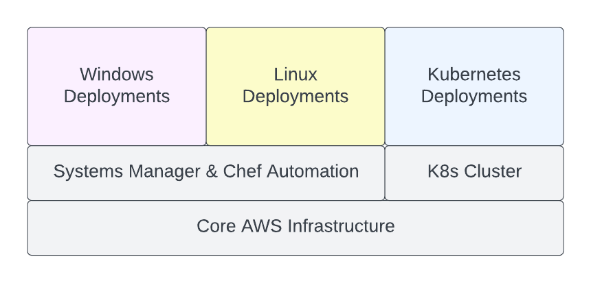

# Core AWS Resources for ArcGIS Enterprise Site

The template provides workflows for provisioning:

* Networking, storage, and identity AWS resource shared across multiple deployments of an ArcGIS Enterprise site,
* Chef Automation resources required for ArcGIS Enterprise site configuration management using [Chef Cookbooks for ArcGIS](https://esri.github.io/arcgis-cookbook/), and
* Amazon Elastic Kubernetes Service (EKS) cluster that meets ArcGIS Enterprise on Kubernetes system requirements.

Before running the template workflows, configure the GitHub repository settings as described in the general [Instructions](../README.md#instructions) section.

To enable the template's workflows, copy the .yaml files from the template's `workflows` directory to `/.github/workflows` directory in the `main` branch, commit the changes, and push the branch to GitHub.

> To prevent accidental destruction of the resources, don't enable *-destroy workflows until it is necessary.

> Refer to READMEs of the Terraform modules for descriptions of specific configuration properties.

  

## Create Core AWS Resources

GitHub Actions workflow **site-core-aws** creates core AWS resources for an ArcGIS Enterprise site.

The workflow uses [infrastructure-core](infrastructure-core/README.md) Terraform module with [infrastructure-core.tfvars.json](../../config/aws/arcgis-site-core/infrastructure-core.tfvars.json) config file.

Required IAM policies:

* TerraformBackend
* ArcGISSiteCore

Instructions:

1. (Optional) Change "availability_zones" property in the config file to the list of availability zones of the AWS region. If "availability_zones" list contains less than two elements, the first two available availability zones in the AWS region will be used. If you need to use specific availability zones or more than two availability zones, specify them in the "availability_zones" list.
2. (Optional) Update the list of interface VPC endpoints specified by "interface_vpc_endpoints" property. Remove all the endpoints if the site will not use the isolated subnets.
3. Commit the changes to the `main` branch and push the branch to GitHub.
4. Run site-core-aws workflow using the `main` branch.

## Create Chef Automation Resources

GitHub Actions workflow **site-automation-chef-aws** creates resources required for ArcGIS Enterprise deployments configuration management using Chef Cookbooks for ArcGIS.

The workflow uses [automation-chef](automation-chef/README.md) Terraform module with [automation-chef.tfvars.json](../../config/aws/arcgis-site-core/automation-chef.tfvars.json) config file.

Required IAM policies:

* TerraformBackend
* ArcGISSiteCore

Instructions:

1. (Optional) Update "images" map in the config file to specify the EC2 AMIs for the operating systems Ids that will be used by the site. Remove entries for operating systems that will not be used.
2. (Optional) Update "chef_client_paths" map in the config file. Remove entries for operating systems that will not be used.
3. Commit the changes to the `main` branch and push the branch to GitHub.
4. Run site-automation-chef-aws workflow using the `main` branch.

## Deploy K8s Cluster

GitHub Actions workflow **site-k8s-cluster-aws** deploys Amazon EKS cluster that meets ArcGIS Enterprise on Kubernetes system requirements.

The workflow uses [k8s-cluster](k8s-cluster/README.md) Terraform module with [k8s-cluster.tfvars.json](../../config/aws/arcgis-site-core/k8s-cluster.tfvars.json) config file.

Required IAM policies:

* TerraformBackend
* ArcGISSiteK8sCluster

Instructions:

1. Create an EC2 key pair in the selected AWS region and set "key_name" property in the config file to the key pair name. Save the private key in a secure location.
2. Set "eks_version" property to the required EKS version.
3. If specific subnets, or more than two subnets of each type are required for the EKS cluster, set "subnet_ids" property to the list of subnet IDs in the selected AWS region. By default, the first two subnets of each type (public, private, and isolated) specified by the SSM parameters are used.
4. Set "node_groups" property to the required node groups configuration.
5. If the AWS region does not support [ECR pull through cache](https://docs.aws.amazon.com/AmazonECR/latest/userguide/pull-through-cache.html), change "pull_through_cache" property value to `false`.
6. Commit the changes to the `main` branch and push the branch to GitHub.
7. Run site-k8s-cluster-aws workflow using the `main` branch.

To run the EKS nodes in "isolated" subnets:

* Specify the subnet IDs in the "subnet_ids" property of the node groups.
* Set "enable_waf" property to `false`.

## Destroy K8s Cluster

GitHub Actions workflow **site-k8s-cluster-aws-destroy** destroys Amazon EKS cluster created by site-k8s-cluster-aws workflow.

The workflow uses [k8s-cluster](k8s-cluster/README.md) Terraform module with [k8s-cluster.tfvars.json](../../config/aws/arcgis-site-core/k8s-cluster.tfvars.json) config file.

Required IAM policies:

* TerraformBackend
* ArcGISSiteK8sClusterDestroy

Instructions:

1. Run site-k8s-cluster-aws-destroy workflow using the `main` branch.

## Destroy Chef Automation Resources

GitHub Actions workflow **site-automation-chef-aws-destroy** destroys the AWS resources created by site-automation-chef-aws workflow.

The workflow uses [automation-chef](automation-chef/README.md) Terraform modules with [automation-chef.tfvars.json](../../config/aws/arcgis-site-core/automation-chef.tfvars.json) config file.

Required IAM policies:

* TerraformBackend
* ArcGISSiteCoreDestroy

Instructions:

1. Run site-automation-chef-aws-destroy workflow using the `main` branch.

## Destroy Core AWS Resources

GitHub Actions workflow **site-core-aws-destroy** destroys the AWS resources created by site-core-aws workflow.

The workflow uses [infrastructure-core](infrastructure-core/README.md) Terraform module with [infrastructure-core.tfvars.json](config/infrastructure-core.tfvars.json) config file.

Required IAM policies:

* TerraformBackend
* ArcGISSiteCoreDestroy

Instructions:

1. Run site-core-aws-destroy workflow using the `main` branch.

> Along with all other resources, site-core-aws-destroy workflow destroys backups of all deployments.
