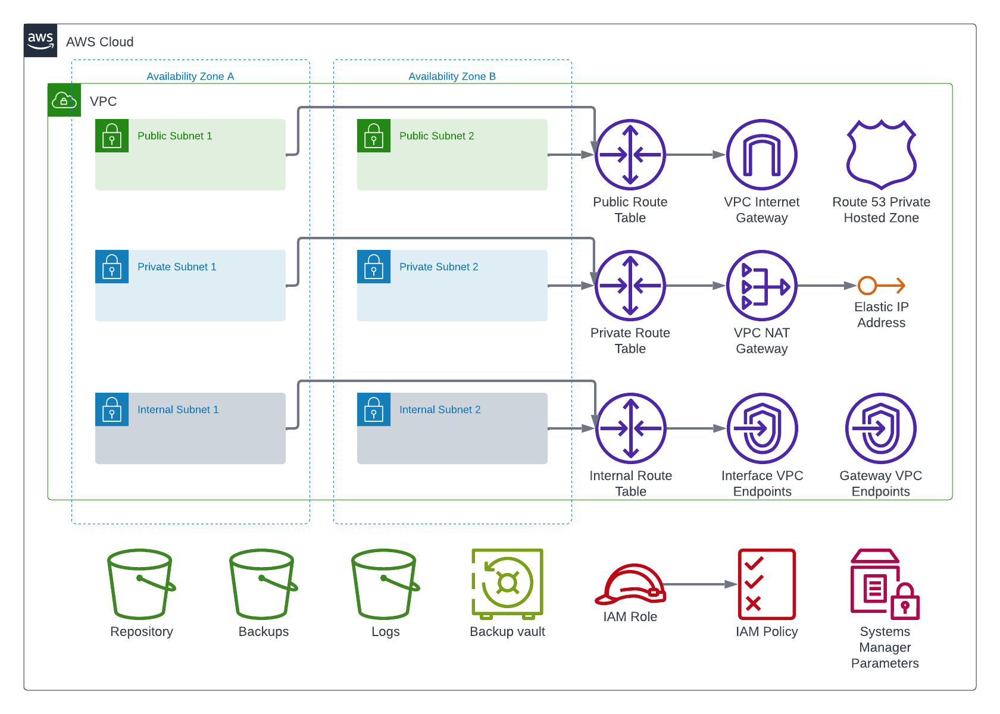

<!-- BEGIN_TF_DOCS -->
# Terraform module infrastructure-core

Terraform module creates the networking, storage, and identity AWS resources shared across multiple deployments of an ArcGIS Enterprise site.

The module also looks up the latest public AMIs for the specified operating systems and stores the AMI IDs in SSM parameters.



Public subnets are routed to the Internet gateway, private subnets to the NAT gateway, and internal subnets to the VPC endpoints.

Ids of the created AWS resources are stored in SSM parameters:

| SSM parameter name | Description |
| --- | --- |
| /arcgis/${var.site_id}/vpc/id | VPC Id of ArcGIS Enterprise site |
| /arcgis/${var.site_id}/vpc/hosted-zone-id | Private hosted zone Id of ArcGIS Enterprise site |
| /arcgis/${var.site_id}/vpc/subnets | Ids of VPC subnets |
| /arcgis/${var.site_id}/iam/instance-profile-name | Name of IAM instance profile |
| /arcgis/${var.site_id}/s3/region | S3 buckets region code |
| /arcgis/${var.site_id}/s3/repository | S3 bucket of private repository |
| /arcgis/${var.site_id}/s3/backup | S3 bucket used by deployments to store backup data |
| /arcgis/${var.site_id}/s3/logs | S3 bucket used by deployments to store logs |
| /arcgis/${var.site_id}/images/${os} | Ids of the latest AMI for the operating systems |

## Requirements

 On the machine where Terraform is executed:

* AWS credentials must be configured.
* AWS region must be specified by AWS_DEFAULT_REGION environment variable.

## Providers

| Name | Version |
|------|---------|
| aws | ~> 5.22 |

## Resources

| Name | Type |
|------|------|
| [aws_eip.nat](https://registry.terraform.io/providers/hashicorp/aws/latest/docs/resources/eip) | resource |
| [aws_iam_instance_profile.arcgis_enterprise_profile](https://registry.terraform.io/providers/hashicorp/aws/latest/docs/resources/iam_instance_profile) | resource |
| [aws_iam_role.arcgis_enterprise_role](https://registry.terraform.io/providers/hashicorp/aws/latest/docs/resources/iam_role) | resource |
| [aws_iam_role_policy_attachment.policies](https://registry.terraform.io/providers/hashicorp/aws/latest/docs/resources/iam_role_policy_attachment) | resource |
| [aws_internet_gateway.igw](https://registry.terraform.io/providers/hashicorp/aws/latest/docs/resources/internet_gateway) | resource |
| [aws_nat_gateway.nat](https://registry.terraform.io/providers/hashicorp/aws/latest/docs/resources/nat_gateway) | resource |
| [aws_route53_zone.private](https://registry.terraform.io/providers/hashicorp/aws/latest/docs/resources/route53_zone) | resource |
| [aws_route_table.rtb_internal](https://registry.terraform.io/providers/hashicorp/aws/latest/docs/resources/route_table) | resource |
| [aws_route_table.rtb_private](https://registry.terraform.io/providers/hashicorp/aws/latest/docs/resources/route_table) | resource |
| [aws_route_table.rtb_public](https://registry.terraform.io/providers/hashicorp/aws/latest/docs/resources/route_table) | resource |
| [aws_route_table_association.rta_internal_subnets](https://registry.terraform.io/providers/hashicorp/aws/latest/docs/resources/route_table_association) | resource |
| [aws_route_table_association.rta_private_subnets](https://registry.terraform.io/providers/hashicorp/aws/latest/docs/resources/route_table_association) | resource |
| [aws_route_table_association.rta_public_subnets](https://registry.terraform.io/providers/hashicorp/aws/latest/docs/resources/route_table_association) | resource |
| [aws_s3_bucket.backup](https://registry.terraform.io/providers/hashicorp/aws/latest/docs/resources/s3_bucket) | resource |
| [aws_s3_bucket.logs](https://registry.terraform.io/providers/hashicorp/aws/latest/docs/resources/s3_bucket) | resource |
| [aws_s3_bucket.repository](https://registry.terraform.io/providers/hashicorp/aws/latest/docs/resources/s3_bucket) | resource |
| [aws_security_group.vpc_endpoints_sg](https://registry.terraform.io/providers/hashicorp/aws/latest/docs/resources/security_group) | resource |
| [aws_ssm_parameter.hosted_zone_id](https://registry.terraform.io/providers/hashicorp/aws/latest/docs/resources/ssm_parameter) | resource |
| [aws_ssm_parameter.images_parameters](https://registry.terraform.io/providers/hashicorp/aws/latest/docs/resources/ssm_parameter) | resource |
| [aws_ssm_parameter.instance_profile_name](https://registry.terraform.io/providers/hashicorp/aws/latest/docs/resources/ssm_parameter) | resource |
| [aws_ssm_parameter.s3_backup](https://registry.terraform.io/providers/hashicorp/aws/latest/docs/resources/ssm_parameter) | resource |
| [aws_ssm_parameter.s3_logs](https://registry.terraform.io/providers/hashicorp/aws/latest/docs/resources/ssm_parameter) | resource |
| [aws_ssm_parameter.s3_region](https://registry.terraform.io/providers/hashicorp/aws/latest/docs/resources/ssm_parameter) | resource |
| [aws_ssm_parameter.s3_repository](https://registry.terraform.io/providers/hashicorp/aws/latest/docs/resources/ssm_parameter) | resource |
| [aws_ssm_parameter.subnets](https://registry.terraform.io/providers/hashicorp/aws/latest/docs/resources/ssm_parameter) | resource |
| [aws_ssm_parameter.vpc_id](https://registry.terraform.io/providers/hashicorp/aws/latest/docs/resources/ssm_parameter) | resource |
| [aws_subnet.internal_subnets](https://registry.terraform.io/providers/hashicorp/aws/latest/docs/resources/subnet) | resource |
| [aws_subnet.private_subnets](https://registry.terraform.io/providers/hashicorp/aws/latest/docs/resources/subnet) | resource |
| [aws_subnet.public_subnets](https://registry.terraform.io/providers/hashicorp/aws/latest/docs/resources/subnet) | resource |
| [aws_vpc.vpc](https://registry.terraform.io/providers/hashicorp/aws/latest/docs/resources/vpc) | resource |
| [aws_vpc_endpoint.gateway](https://registry.terraform.io/providers/hashicorp/aws/latest/docs/resources/vpc_endpoint) | resource |
| [aws_vpc_endpoint.interface](https://registry.terraform.io/providers/hashicorp/aws/latest/docs/resources/vpc_endpoint) | resource |
| [aws_ami.os_image](https://registry.terraform.io/providers/hashicorp/aws/latest/docs/data-sources/ami) | data source |
| [aws_availability_zones.available](https://registry.terraform.io/providers/hashicorp/aws/latest/docs/data-sources/availability_zones) | data source |
| [aws_caller_identity.current](https://registry.terraform.io/providers/hashicorp/aws/latest/docs/data-sources/caller_identity) | data source |
| [aws_region.current](https://registry.terraform.io/providers/hashicorp/aws/latest/docs/data-sources/region) | data source |

## Inputs

| Name | Description | Type | Default | Required |
|------|-------------|------|---------|:--------:|
| availability_zones | AWS availability zones (if the list contains less that two elements, the first two available availability zones in the AWS region will be used.) | `list(string)` | `[]` | no |
| aws_region | AWS region Id | `string` | n/a | yes |
| gateway_vpc_endpoints | List of gateway VPC endpoints to create | `list(string)` | ```[ "dynamodb", "s3" ]``` | no |
| iam_role_policies | IAM role policies to attach to the ArcGIS Enterprise IAM role | `list(string)` | ```[ "arn:aws:iam::aws:policy/AmazonDynamoDBFullAccess", "arn:aws:iam::aws:policy/AmazonS3FullAccess", "arn:aws:iam::aws:policy/AmazonSSMManagedInstanceCore", "arn:aws:iam::aws:policy/CloudWatchAgentServerPolicy", "arn:aws:iam::aws:policy/AmazonElasticFileSystemClientFullAccess", "arn:aws:iam::aws:policy/service-role/AmazonEFSCSIDriverPolicy" ]``` | no |
| images | AMI search filters by operating  system | `map(any)` | ```{ "rhel9": { "ami_name_filter": "RHEL-9.5.0_HVM-*-x86_64-*-Hourly2-GP3", "description": "Red Hat Enterprise Linux version 9 (HVM), EBS General Purpose (SSD) Volume Type", "owner": "309956199498" }, "ubuntu22": { "ami_name_filter": "ubuntu/images/hvm-ssd/ubuntu-*22*-amd64-server-*", "description": "Canonical, Ubuntu, 22.04 LTS, amd64 focal image", "owner": "099720109477" }, "windows2022": { "ami_name_filter": "Windows_Server-2022-English-Full-Base-*", "description": "Microsoft Windows Server 2022 Full Locale English AMI", "owner": "amazon" }, "windows2025": { "ami_name_filter": "Windows_Server-2025-English-Full-Base-*", "description": "Microsoft Windows Server 2025 Full Locale English AMI", "owner": "amazon" } }``` | no |
| interface_vpc_endpoints | List of interface VPC endpoints to create | `list(string)` | ```[ "ec2", "ec2messages", "ecr.api", "ecr.dkr", "elasticloadbalancing", "logs", "monitoring", "ssm", "ssmmessages", "sts" ]``` | no |
| internal_subnets_cidr_blocks | CIDR blocks of internal subnets | `list(string)` | ```[ "10.0.128.0/24", "10.0.129.0/24", "10.0.130.0/24" ]``` | no |
| private_subnets_cidr_blocks | CIDR blocks of private subnets | `list(string)` | ```[ "10.0.64.0/24", "10.0.65.0/24", "10.0.66.0/24" ]``` | no |
| public_subnets_cidr_blocks | CIDR blocks of public subnets | `list(string)` | ```[ "10.0.0.0/24", "10.0.1.0/24", "10.0.2.0/24" ]``` | no |
| site_id | ArcGIS Enterprise site Id | `string` | `"arcgis"` | no |
| vpc_cidr_block | CIDR block for the VPC | `string` | `"10.0.0.0/16"` | no |

## Outputs

| Name | Description |
|------|-------------|
| internal_subnets | Internal subnets |
| private_subnets | Private subnets |
| public_subnets | Public subnets |
| vpc_id | VPC Id of ArcGIS Enterprise site |
<!-- END_TF_DOCS -->