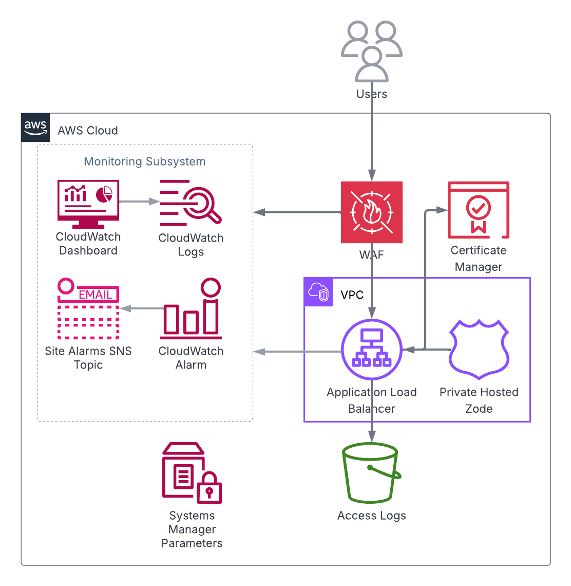

<!-- BEGIN_TF_DOCS -->
# Terraform module ingress

The module creates and configures an Application Load Balancer for ArcGIS Enterprise site.



It sets up a security group, HTTP and HTTPS listeners, and a default target group for the load balancer.
HTTP port 80 is redirected to HTTPS port 443.

The load balancer can be either internal or internet-facing.
Internet-facing load balancer is configured to use two of the public VPC subnets,
while internal load balancer uses the private subnets.

The module creates a Web Application Firewall (WAF) Web ACL and associates it with the Application Load Balancer.
The Web ACL is configured with a set of managed rules to protect the load balancer from common web exploits.
The WAF mode can be set either to "detect" (default) or "protect".
In "detect" mode, the WAF only counts and logs the requests that match the rules,
while in "protect" mode, the WAF blocks the requests.

If a Route 53 hosted zone ID is provided, an alias record is created in the hosted zone
that points the deployment's FQDN to the load balancer's DNS name. The DNS name is also stored in
"/arcgis/${var.site_id}/${var.deployment_id}/alb/dns-name" SSM parameter.

The module also creates a private Route 53 hosted zone for the deployment FQDN and an alias record
in the hosted zone for the load balancer DNS name.
This makes the deployment FQDN always addressable from the VPC subnets.

The deployment's Monitoring Subsystem consists of:

* A CloudWatch alarm that monitors the target groups and posts to the SNS topic if the number of unhealthy instances.
  in the target groups is nonzero.
* A CloudWatch log group for AWS WAF logs.
* A CloudWatch dashboard that displays the CloudWatch alerts, metrics, and logs of the deployment.

## Requirements

On the machine where Terraform is executed:

* Python 3.8 or later with [AWS SDK for Python (Boto3)](https://aws.amazon.com/sdk-for-python/) package must be installed.
* AWS credentials must be configured.

Before applying the module, an SSL certificate for the base ArcGIS Enterprise deployment FQDN
must be imported into or issued by AWS Certificate Manager service in the AWS account. The certificate's
ARN specified by "ssl_certificate_arn" input variable will be used to configure HTTPS listeners of the load balancer.

After applying the module, the deployment FQDN also must be pointed to the DNS name of the Application Load Balancer
exported by "alb_dns_name" output value of the module.

## SSM Parameters

The module reads the following SSM parameters:

| SSM parameter name | Description |
|--------------------|-------------|
| /arcgis/${var.site_id}/iam/instance-profile-name | IAM instance profile name |
| /arcgis/${var.site_id}/s3/backup | S3 bucket used by deployments to store backup data |
| /arcgis/${var.site_id}/s3/logs | S3 bucket used by deployments to store logs |
| /arcgis/${var.site_id}/s3/repository | S3 bucket of private repository |
| /arcgis/${var.site_id}/s3/region | S3 bucket region |
| /arcgis/${var.site_id}/sns-topics/site-alarms | Site alarms SNS topic ARN |
| /arcgis/${var.site_id}/vpc/hosted-zone-id | VPC hosted zone ID |
| /arcgis/${var.site_id}/vpc/id | VPC ID |
| /arcgis/${var.site_id}/vpc/subnets | IDs of VPC subnets |

The module writes the following SSM parameters:

| SSM parameter name | Description |
|--------------------|-------------|
| /arcgis/${var.site_id}/${var.deployment_id}/alb/arn | ARN of the application load balancer |
| /arcgis/${var.site_id}/${var.deployment_id}/alb/dns-name | DNS name of the application load balancer |
| /arcgis/${var.site_id}/${var.deployment_id}/alb/security-group-id | Security group ID of the application load balancer |
| /arcgis/${var.site_id}/${var.deployment_id}/deployment-fqdn | Fully qualified domain name of the site ingress |

## Providers

| Name | Version |
|------|---------|
| aws | ~> 6.10 |

## Modules

| Name | Source | Version |
|------|--------|---------|
| site_core_info | ../../modules/site_core_info | n/a |

## Resources

| Name | Type |
|------|------|
| [aws_cloudwatch_dashboard.dashboard](https://registry.terraform.io/providers/hashicorp/aws/latest/docs/resources/cloudwatch_dashboard) | resource |
| [aws_cloudwatch_log_group.waf_logs](https://registry.terraform.io/providers/hashicorp/aws/latest/docs/resources/cloudwatch_log_group) | resource |
| [aws_cloudwatch_metric_alarm.unhealthy_alb_instances](https://registry.terraform.io/providers/hashicorp/aws/latest/docs/resources/cloudwatch_metric_alarm) | resource |
| [aws_lb.alb](https://registry.terraform.io/providers/hashicorp/aws/latest/docs/resources/lb) | resource |
| [aws_lb_listener.http](https://registry.terraform.io/providers/hashicorp/aws/latest/docs/resources/lb_listener) | resource |
| [aws_lb_listener.https](https://registry.terraform.io/providers/hashicorp/aws/latest/docs/resources/lb_listener) | resource |
| [aws_lb_target_group.default](https://registry.terraform.io/providers/hashicorp/aws/latest/docs/resources/lb_target_group) | resource |
| [aws_route53_record.arcgis_enterprise](https://registry.terraform.io/providers/hashicorp/aws/latest/docs/resources/route53_record) | resource |
| [aws_route53_record.deployment_fqdn](https://registry.terraform.io/providers/hashicorp/aws/latest/docs/resources/route53_record) | resource |
| [aws_route53_zone.deployment_fqdn](https://registry.terraform.io/providers/hashicorp/aws/latest/docs/resources/route53_zone) | resource |
| [aws_security_group.arcgis_alb](https://registry.terraform.io/providers/hashicorp/aws/latest/docs/resources/security_group) | resource |
| [aws_security_group_rule.allow_http](https://registry.terraform.io/providers/hashicorp/aws/latest/docs/resources/security_group_rule) | resource |
| [aws_security_group_rule.allow_https](https://registry.terraform.io/providers/hashicorp/aws/latest/docs/resources/security_group_rule) | resource |
| [aws_ssm_parameter.alb_arn](https://registry.terraform.io/providers/hashicorp/aws/latest/docs/resources/ssm_parameter) | resource |
| [aws_ssm_parameter.alb_dns_name](https://registry.terraform.io/providers/hashicorp/aws/latest/docs/resources/ssm_parameter) | resource |
| [aws_ssm_parameter.alb_security_group_id](https://registry.terraform.io/providers/hashicorp/aws/latest/docs/resources/ssm_parameter) | resource |
| [aws_ssm_parameter.deployment_fqdn](https://registry.terraform.io/providers/hashicorp/aws/latest/docs/resources/ssm_parameter) | resource |
| [aws_wafv2_web_acl.arcgis_enterprise](https://registry.terraform.io/providers/hashicorp/aws/latest/docs/resources/wafv2_web_acl) | resource |
| [aws_wafv2_web_acl_association.alb_association](https://registry.terraform.io/providers/hashicorp/aws/latest/docs/resources/wafv2_web_acl_association) | resource |
| [aws_wafv2_web_acl_logging_configuration.waf_logs](https://registry.terraform.io/providers/hashicorp/aws/latest/docs/resources/wafv2_web_acl_logging_configuration) | resource |
| [aws_region.current](https://registry.terraform.io/providers/hashicorp/aws/latest/docs/data-sources/region) | data source |
| [aws_ssm_parameter.sns_topic](https://registry.terraform.io/providers/hashicorp/aws/latest/docs/data-sources/ssm_parameter) | data source |

## Inputs

| Name | Description | Type | Default | Required |
|------|-------------|------|---------|:--------:|
| aws_region | AWS region Id | `string` | n/a | yes |
| client_cidr_blocks | Client CIDR blocks | `list(string)` | ```[ "0.0.0.0/0" ]``` | no |
| deployment_fqdn | Fully qualified domain name of the deployment | `string` | n/a | yes |
| deployment_id | Deployment Id | `string` | `"enterprise-ingress"` | no |
| enable_access_log | Enable access logging for the load balancer | `bool` | `true` | no |
| hosted_zone_id | The Route 53 public hosted zone ID for the domain | `string` | `null` | no |
| http_ports | List of HTTP ports for the load balancer | `list(number)` | ```[ 80 ]``` | no |
| https_ports | List of HTTPS ports for the load balancer | `list(number)` | ```[ 443, 6443, 7443, 11443 ]``` | no |
| internal_load_balancer | If true, the load balancer scheme is set to 'internal' | `bool` | `false` | no |
| site_id | ArcGIS Enterprise site Id | `string` | `"arcgis"` | no |
| ssl_certificate_arn | SSL certificate ARN for HTTPS listeners of the load balancer | `string` | n/a | yes |
| ssl_policy | Security Policy that should be assigned to the ALB to control the SSL protocol and ciphers | `string` | `"ELBSecurityPolicy-TLS13-1-2-2021-06"` | no |
| waf_mode | Specifies the mode of the Web Application Firewall (WAF). Valid values are 'detect' and 'protect'. | `string` | `"detect"` | no |

## Outputs

| Name | Description |
|------|-------------|
| alb_arn | Application Load Balancer ARN |
| alb_dns_name | Application Load Balancer DNS name |
| alb_zone_id | Application Load Balancer zone ID |
| security_group_id | Application Load Balancer security group Id |
<!-- END_TF_DOCS -->