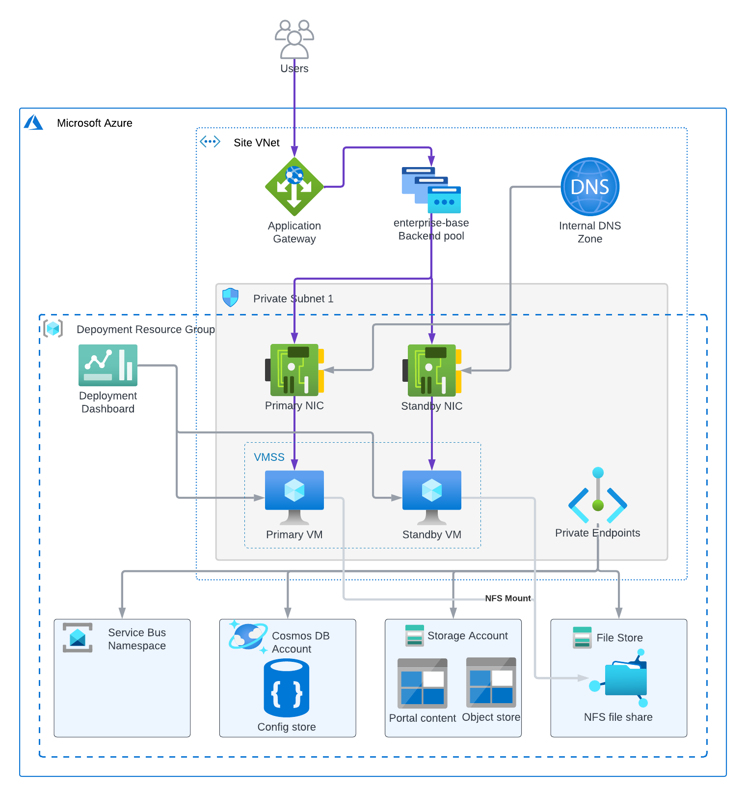

<!-- BEGIN_TF_DOCS -->
# Infrastructure Terraform Module for Base ArcGIS Enterprise on Linux

This Terraform module provisions Azure resources required for a base ArcGIS Enterprise deployment on Linux.

## Features

- Launches one or two Linux VMs (based on the "is_ha" variable) in the first private VNet subnet or a specified subnet.
- VM images are retrieved from Key Vault secrets named "vm-image-${var.deployment_id}-primary" and "vm-image-${var.deployment_id}-standby".
  These images must be built using the Packer template for ArcGIS Enterprise on Linux.
- Creates "A" records in the VNet's private hosted DNS zone, enabling permanent DNS names for the VMs.
  VMs can be addressed as primary.<deployment_id>.<site_id>.internal and standby.<deployment_id>.<site_id>.internal.
  > Note: VMs will be replaced if the module is re-applied after updating Key Vault secrets with new image builds.
- Provisions an Azure Storage Account with blob containers for portal content and object store.
  The storage account name is stored in the Key Vault secret "${var.deployment_id}-storage-account-name".
- Provisions an NFS Azure Files storage account (file_store) with a "fileserver" NFS share mounted to the VMs.
- If "is_ha" variable is true, provisions a Cosmos DB account and a Service Bus namespace for ArcGIS Server configuration store.
- Adds VM network interfaces to the "enterprise-base" backend address pool of the Application Gateway deployed by the ingress module.
- Creates an Azure Monitor dashboard for monitoring key VM metrics.
- Tags all resources with ArcGISSiteId and ArcGISDeploymentId for easy identification.

## Requirements

Before running Terraform, configure Azure credentials using "az login" CLI command.

## Key Vault Secrets

### Secrets Read by the Module
| Secret Name                                      | Description                                      |
|--------------------------------------------------|--------------------------------------------------|
| ${var.ingress_deployment_id}-backend-address-pools| Application Gateway backend address pools         |
| ${var.ingress_deployment_id}-deployment-fqdn     | Ingress deployment FQDN                          |
| storage-account-key                              | Storage account key                              |
| storage-account-name                             | Storage account name                             |
| subnets                                          | VNet subnet IDs                                  |
| vm-identity-id                                   | User-assigned VM identity object ID              |
| vm-identity-principal-id                         | User-assigned VM identity principal ID           |
| vm-image-${var.deployment_id}-primary            | Primary VM image ID                              |
| vm-image-${var.deployment_id}-standby            | Standby VM image ID                              |
| vm-image-${var.deployment_id}-os                 | Operating system ID                              |
| vnet-id                                          | VNet ID                                          |

### Secrets Written by the Module
| Secret Name                        | Description                        |
|------------------------------------|------------------------------------|
| ${var.deployment_id}-deployment-fqdn | Deployment's FQDN |
| ${var.deployment_id}-deployment-url | Portal for ArcGIS URL of the deployment |
| ${var.deployment_id}-portal-web-context | Portal for ArcGIS web context |
| ${var.deployment_id}-server-web-context | ArcGIS Server web context |
| ${var.deployment_id}-storage-account-name | Deployment's storage account name |

## Providers

| Name | Version |
|------|---------|
| azurerm | ~> 4.46 |
| random | n/a |

## Modules

| Name | Source | Version |
|------|--------|---------|
| aznfs_mount | ../../modules/aznfs_mount | n/a |
| lv_extend | ../../modules/lv_extend | n/a |
| site_core_info | ../../modules/site_core_info | n/a |

## Resources

| Name | Type |
|------|------|
| [azurerm_cosmosdb_account.deployment_cosmosdb](https://registry.terraform.io/providers/hashicorp/azurerm/latest/docs/resources/cosmosdb_account) | resource |
| [azurerm_cosmosdb_sql_database.config_store](https://registry.terraform.io/providers/hashicorp/azurerm/latest/docs/resources/cosmosdb_sql_database) | resource |
| [azurerm_cosmosdb_sql_role_assignment.cosmosdb_owner](https://registry.terraform.io/providers/hashicorp/azurerm/latest/docs/resources/cosmosdb_sql_role_assignment) | resource |
| [azurerm_cosmosdb_sql_role_assignment.cosmosdb_vm_identity](https://registry.terraform.io/providers/hashicorp/azurerm/latest/docs/resources/cosmosdb_sql_role_assignment) | resource |
| [azurerm_key_vault_secret.deployment_fqdn](https://registry.terraform.io/providers/hashicorp/azurerm/latest/docs/resources/key_vault_secret) | resource |
| [azurerm_key_vault_secret.deployment_url](https://registry.terraform.io/providers/hashicorp/azurerm/latest/docs/resources/key_vault_secret) | resource |
| [azurerm_key_vault_secret.portal_web_context](https://registry.terraform.io/providers/hashicorp/azurerm/latest/docs/resources/key_vault_secret) | resource |
| [azurerm_key_vault_secret.server_web_context](https://registry.terraform.io/providers/hashicorp/azurerm/latest/docs/resources/key_vault_secret) | resource |
| [azurerm_key_vault_secret.storage_account_name](https://registry.terraform.io/providers/hashicorp/azurerm/latest/docs/resources/key_vault_secret) | resource |
| [azurerm_linux_virtual_machine.primary](https://registry.terraform.io/providers/hashicorp/azurerm/latest/docs/resources/linux_virtual_machine) | resource |
| [azurerm_linux_virtual_machine.standby](https://registry.terraform.io/providers/hashicorp/azurerm/latest/docs/resources/linux_virtual_machine) | resource |
| [azurerm_network_interface.primary](https://registry.terraform.io/providers/hashicorp/azurerm/latest/docs/resources/network_interface) | resource |
| [azurerm_network_interface.standby](https://registry.terraform.io/providers/hashicorp/azurerm/latest/docs/resources/network_interface) | resource |
| [azurerm_network_interface_application_gateway_backend_address_pool_association.primary](https://registry.terraform.io/providers/hashicorp/azurerm/latest/docs/resources/network_interface_application_gateway_backend_address_pool_association) | resource |
| [azurerm_network_interface_application_gateway_backend_address_pool_association.standby](https://registry.terraform.io/providers/hashicorp/azurerm/latest/docs/resources/network_interface_application_gateway_backend_address_pool_association) | resource |
| [azurerm_orchestrated_virtual_machine_scale_set.vmss](https://registry.terraform.io/providers/hashicorp/azurerm/latest/docs/resources/orchestrated_virtual_machine_scale_set) | resource |
| [azurerm_portal_dashboard.deployment](https://registry.terraform.io/providers/hashicorp/azurerm/latest/docs/resources/portal_dashboard) | resource |
| [azurerm_private_dns_a_record.primary](https://registry.terraform.io/providers/hashicorp/azurerm/latest/docs/resources/private_dns_a_record) | resource |
| [azurerm_private_dns_a_record.standby](https://registry.terraform.io/providers/hashicorp/azurerm/latest/docs/resources/private_dns_a_record) | resource |
| [azurerm_private_endpoint.blob_storage_pe](https://registry.terraform.io/providers/hashicorp/azurerm/latest/docs/resources/private_endpoint) | resource |
| [azurerm_private_endpoint.cosmos_pe](https://registry.terraform.io/providers/hashicorp/azurerm/latest/docs/resources/private_endpoint) | resource |
| [azurerm_private_endpoint.file_store_pe](https://registry.terraform.io/providers/hashicorp/azurerm/latest/docs/resources/private_endpoint) | resource |
| [azurerm_private_endpoint.servicebus_pe](https://registry.terraform.io/providers/hashicorp/azurerm/latest/docs/resources/private_endpoint) | resource |
| [azurerm_resource_group.deployment_rg](https://registry.terraform.io/providers/hashicorp/azurerm/latest/docs/resources/resource_group) | resource |
| [azurerm_role_assignment.cosmosdb_owner](https://registry.terraform.io/providers/hashicorp/azurerm/latest/docs/resources/role_assignment) | resource |
| [azurerm_role_assignment.cosmosdb_vm_identity](https://registry.terraform.io/providers/hashicorp/azurerm/latest/docs/resources/role_assignment) | resource |
| [azurerm_role_assignment.servicebus_owner](https://registry.terraform.io/providers/hashicorp/azurerm/latest/docs/resources/role_assignment) | resource |
| [azurerm_role_assignment.servicebus_vm_identity](https://registry.terraform.io/providers/hashicorp/azurerm/latest/docs/resources/role_assignment) | resource |
| [azurerm_role_assignment.storage_blob_owner](https://registry.terraform.io/providers/hashicorp/azurerm/latest/docs/resources/role_assignment) | resource |
| [azurerm_role_assignment.storage_blob_vm_identity](https://registry.terraform.io/providers/hashicorp/azurerm/latest/docs/resources/role_assignment) | resource |
| [azurerm_role_assignment.storage_table_owner](https://registry.terraform.io/providers/hashicorp/azurerm/latest/docs/resources/role_assignment) | resource |
| [azurerm_role_assignment.storage_table_vm_identity](https://registry.terraform.io/providers/hashicorp/azurerm/latest/docs/resources/role_assignment) | resource |
| [azurerm_servicebus_namespace.deployment_servicebus](https://registry.terraform.io/providers/hashicorp/azurerm/latest/docs/resources/servicebus_namespace) | resource |
| [azurerm_storage_account.deployment_storage](https://registry.terraform.io/providers/hashicorp/azurerm/latest/docs/resources/storage_account) | resource |
| [azurerm_storage_account.file_store](https://registry.terraform.io/providers/hashicorp/azurerm/latest/docs/resources/storage_account) | resource |
| [azurerm_storage_container.object_store](https://registry.terraform.io/providers/hashicorp/azurerm/latest/docs/resources/storage_container) | resource |
| [azurerm_storage_container.portal_content](https://registry.terraform.io/providers/hashicorp/azurerm/latest/docs/resources/storage_container) | resource |
| [azurerm_storage_share.fileserver](https://registry.terraform.io/providers/hashicorp/azurerm/latest/docs/resources/storage_share) | resource |
| [random_id.unique_name_suffix](https://registry.terraform.io/providers/hashicorp/random/latest/docs/resources/id) | resource |
| [azurerm_client_config.current](https://registry.terraform.io/providers/hashicorp/azurerm/latest/docs/data-sources/client_config) | data source |
| [azurerm_cosmosdb_sql_role_definition.data_contributor](https://registry.terraform.io/providers/hashicorp/azurerm/latest/docs/data-sources/cosmosdb_sql_role_definition) | data source |
| [azurerm_key_vault_secret.backend_address_pools](https://registry.terraform.io/providers/hashicorp/azurerm/latest/docs/data-sources/key_vault_secret) | data source |
| [azurerm_key_vault_secret.deployment_fqdn](https://registry.terraform.io/providers/hashicorp/azurerm/latest/docs/data-sources/key_vault_secret) | data source |
| [azurerm_key_vault_secret.primary_vm_image_id](https://registry.terraform.io/providers/hashicorp/azurerm/latest/docs/data-sources/key_vault_secret) | data source |
| [azurerm_key_vault_secret.standby_vm_image_id](https://registry.terraform.io/providers/hashicorp/azurerm/latest/docs/data-sources/key_vault_secret) | data source |
| [azurerm_key_vault_secret.vm_identity_id](https://registry.terraform.io/providers/hashicorp/azurerm/latest/docs/data-sources/key_vault_secret) | data source |
| [azurerm_key_vault_secret.vm_identity_principal_id](https://registry.terraform.io/providers/hashicorp/azurerm/latest/docs/data-sources/key_vault_secret) | data source |
| [azurerm_key_vault_secret.vm_image_os](https://registry.terraform.io/providers/hashicorp/azurerm/latest/docs/data-sources/key_vault_secret) | data source |
| [azurerm_private_dns_zone.cosmos_private_dns_zone](https://registry.terraform.io/providers/hashicorp/azurerm/latest/docs/data-sources/private_dns_zone) | data source |
| [azurerm_private_dns_zone.privatelink_blob](https://registry.terraform.io/providers/hashicorp/azurerm/latest/docs/data-sources/private_dns_zone) | data source |
| [azurerm_private_dns_zone.privatelink_file](https://registry.terraform.io/providers/hashicorp/azurerm/latest/docs/data-sources/private_dns_zone) | data source |
| [azurerm_private_dns_zone.servicebus_private_dns_zone](https://registry.terraform.io/providers/hashicorp/azurerm/latest/docs/data-sources/private_dns_zone) | data source |

## Inputs

| Name | Description | Type | Default | Required |
|------|-------------|------|---------|:--------:|
| azure_region | Azure region display name | `string` | n/a | yes |
| deployment_id | ArcGIS Enterprise deployment Id | `string` | `"enterprise-base-linux"` | no |
| fileserver_size | Maximum size of the NFS file share in GB | `number` | `1024` | no |
| ingress_deployment_id | ArcGIS Enterprise ingress deployment Id | `string` | `"enterprise-ingress"` | no |
| is_ha | If true, the deployment is in high availability mode | `bool` | `true` | no |
| os_disk_size | OS disk size in GB | `number` | `256` | no |
| portal_web_context | Portal for ArcGIS web context | `string` | `"portal"` | no |
| server_web_context | ArcGIS Server web context | `string` | `"server"` | no |
| site_id | ArcGIS site Id | `string` | `"arcgis"` | no |
| storage_replication_type | The replication type of the storage accounts. Possible values are: LRS (Locally-redundant storage), ZRS (Zone-redundant storage). | `string` | `"ZRS"` | no |
| subnet_id | VMs subnet ID (by default, the first private subnet is used) | `string` | `null` | no |
| vm_admin_password | VM administrator password | `string` | `null` | no |
| vm_admin_public_ssh_key_path | VM administrator public SSH key file path. If not provided, password authentication will be used for the VMs. | `string` | `null` | no |
| vm_admin_username | VM administrator username | `string` | `"vmadmin"` | no |
| vm_size | Azure VM size | `string` | `"Standard_D8s_v5"` | no |

## Outputs

| Name | Description |
|------|-------------|
| deployment_url | Portal for ArcGIS URL |
<!-- END_TF_DOCS -->