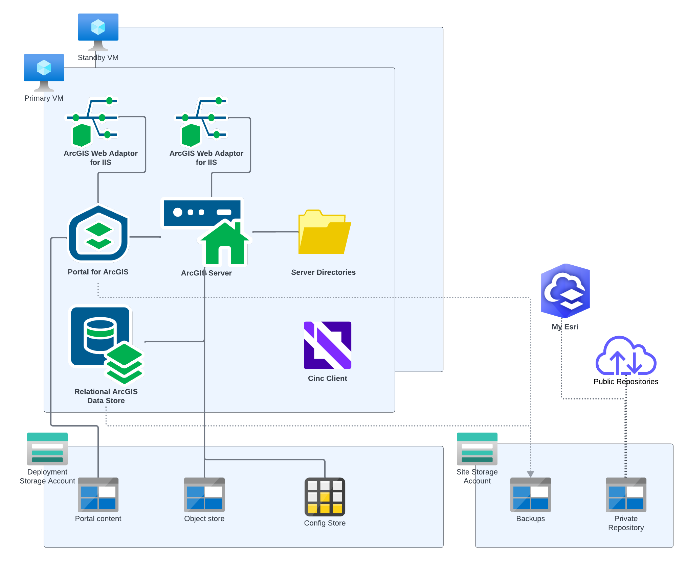

<!-- BEGIN_TF_DOCS -->
# Application Terraform Module for Base ArcGIS Enterprise on Windows

This Terraform module configures or upgrades applications of base ArcGIS Enterprise deployment on the Windows platform.

First, the module bootstraps the deployment by installing Chef Client and Chef Cookbooks for ArcGIS on all VMs of the deployment.

If "is_upgrade" input variable is set to true, the module:

* Un-registers the ArcGIS Server Web Adaptor on the standby VM
* Copies the installation media for the ArcGIS Enterprise version specified by arcgis_version input variable to the private repository blob container
* Downloads the installation media from the private repository blob container to the primary and standby VMs
* Installs or upgrades ArcGIS Enterprise software on the primary and standby VMs
* Installs software patches on the primary and standby VMs

Then the module:

* Copies the ArcGIS Server and Portal for ArcGIS authorization files to the private repository blob container
* Copies the keystore and, if specified, root certificate files to the private repository blob container
* Downloads the ArcGIS Server and Portal for ArcGIS authorization files from the private repository blob container to primary and standby VMs
* Downloads the keystore and root certificate files from the private repository blob container to the primary and standby VMs
* Creates the required network shares and directories in the primary VM
* Configures base ArcGIS Enterprise on the primary VM
* Configures base ArcGIS Enterprise on the standby VM
* Deletes the downloaded setup archives, the extracted setups, and other temporary files from the primary and standby VMs

Starting with ArcGIS Enterprise 12.0, if the config_store_type input variable is set to AZURE,
the module configures ArcGIS Server to store server directories in an Azure Blob container and
the configuration store in a Cosmos DB database, rather than on a file share.

## Requirements

The Azure resources for the deployment must be provisioned by Infrastructure terraform module for base ArcGIS Enterprise on Windows.

On the machine where Terraform is executed:

* Python 3.9 or later must be installed
* azure-identity, azure-keyvault-secrets, azure-mgmt-compute, and azure-storage-blob Azure Python SDK packages must be installed
* Path to azure/scripts directory must be added to PYTHONPATH
* Azure credentials must be configured using "az login" CLI command

My Esri user name and password must be specified either using environment variables ARCGIS_ONLINE_USERNAME and ARCGIS_ONLINE_PASSWORD or the input variables.

## Key Vault Secrets

The module reads the following Key Vault secrets:

| Key Vault secret name | Description |
|--------------------|-------------|
| subnets | VNet subnets IDs |
| vnet-id | VNet ID |
| storage-account-key | Site's storage account key |
| storage-account-name | Site's storage account name |
| ${var.deployment_id}-storage-account-name | Deployment's storage account name |
| vm-identity-client-id | VM identity client ID |

> Note that the module also uses Key Vault secrets to pass JSON attributes
  for Chef Client runs to the VMs. These secrets are deleted at the end of the runs.

## Providers

| Name | Version |
|------|---------|
| azurerm | ~> 4.46 |

## Modules

| Name | Source | Version |
|------|--------|---------|
| arcgis_enterprise_files | ../../modules/run_chef | n/a |
| arcgis_enterprise_fileserver | ../../modules/run_chef | n/a |
| arcgis_enterprise_patch | ../../modules/run_chef | n/a |
| arcgis_enterprise_primary | ../../modules/run_chef | n/a |
| arcgis_enterprise_standby | ../../modules/run_chef | n/a |
| arcgis_enterprise_upgrade | ../../modules/run_chef | n/a |
| authorization_files | ../../modules/run_chef | n/a |
| az_copy_files | ../../modules/az_copy_files | n/a |
| begin_upgrade_standby | ../../modules/run_chef | n/a |
| bootstrap_deployment | ../../modules/bootstrap | n/a |
| clean_up | ../../modules/clean_up | n/a |
| keystore | ../../modules/run_chef | n/a |
| root_cert | ../../modules/run_chef | n/a |
| site_core_info | ../../modules/site_core_info | n/a |

## Resources

| Name | Type |
|------|------|
| [azurerm_storage_blob.keystore_file](https://registry.terraform.io/providers/hashicorp/azurerm/latest/docs/resources/storage_blob) | resource |
| [azurerm_storage_blob.portal_authorization_file](https://registry.terraform.io/providers/hashicorp/azurerm/latest/docs/resources/storage_blob) | resource |
| [azurerm_storage_blob.root_cert_file](https://registry.terraform.io/providers/hashicorp/azurerm/latest/docs/resources/storage_blob) | resource |
| [azurerm_storage_blob.server_authorization_file](https://registry.terraform.io/providers/hashicorp/azurerm/latest/docs/resources/storage_blob) | resource |
| [azurerm_client_config.current](https://registry.terraform.io/providers/hashicorp/azurerm/latest/docs/data-sources/client_config) | data source |
| [azurerm_key_vault_secret.storage_account_name](https://registry.terraform.io/providers/hashicorp/azurerm/latest/docs/data-sources/key_vault_secret) | data source |
| [azurerm_key_vault_secret.vm_identity_client_id](https://registry.terraform.io/providers/hashicorp/azurerm/latest/docs/data-sources/key_vault_secret) | data source |
| [azurerm_resources.standby](https://registry.terraform.io/providers/hashicorp/azurerm/latest/docs/data-sources/resources) | data source |
| [azurerm_virtual_machine.primary](https://registry.terraform.io/providers/hashicorp/azurerm/latest/docs/data-sources/virtual_machine) | data source |

## Inputs

| Name | Description | Type | Default | Required |
|------|-------------|------|---------|:--------:|
| admin_description | Primary ArcGIS Enterprise administrator description | `string` | `"Initial account administrator"` | no |
| admin_email | Primary ArcGIS Enterprise administrator e-mail address | `string` | n/a | yes |
| admin_full_name | Primary ArcGIS Enterprise administrator full name | `string` | `"Administrator"` | no |
| admin_password | Primary ArcGIS Enterprise administrator user password | `string` | n/a | yes |
| admin_username | Primary ArcGIS Enterprise administrator user name | `string` | `"siteadmin"` | no |
| arcgis_data_store_patches | File names of ArcGIS Data Store patches to install. | `list(string)` | `[]` | no |
| arcgis_portal_patches | File names of Portal for ArcGIS patches to install. | `list(string)` | `[]` | no |
| arcgis_server_patches | File names of ArcGIS Server patches to install. | `list(string)` | `[]` | no |
| arcgis_version | ArcGIS Enterprise version | `string` | `"12.0"` | no |
| arcgis_web_adaptor_patches | File names of ArcGIS Web Adaptor patches to install. | `list(string)` | `[]` | no |
| azure_region | Azure region display name | `string` | n/a | yes |
| config_store_type | ArcGIS Server configuration store type | `string` | `"FILESYSTEM"` | no |
| deployment_fqdn | Fully qualified domain name of the ArcGIS Enterprise site | `string` | n/a | yes |
| deployment_id | Deployment Id | `string` | `"enterprise-base-windows"` | no |
| is_upgrade | Flag to indicate if this is an upgrade deployment | `bool` | `false` | no |
| keystore_file_password | Password for keystore file with SSL certificate used by HTTPS listeners | `string` | `""` | no |
| keystore_file_path | Local path of keystore file in PKCS12 format with SSL certificate used by HTTPS listeners | `string` | `null` | no |
| log_level | ArcGIS Enterprise applications log level | `string` | `"WARNING"` | no |
| os | Operating system id (windows2022\|windows2025) | `string` | `"windows2025"` | no |
| portal_authorization_file_path | Local path of Portal for ArcGIS authorization file | `string` | n/a | yes |
| portal_user_license_type_id | Portal for ArcGIS administrator user license type Id | `string` | `""` | no |
| portal_web_context | Portal for ArcGIS web context | `string` | `"portal"` | no |
| root_cert_file_path | Local path of root certificate file in PEM format used by ArcGIS Server and Portal for ArcGIS | `string` | `null` | no |
| run_as_password | Password for the account used to run ArcGIS Server, Portal for ArcGIS, and ArcGIS Data Store. | `string` | n/a | yes |
| run_as_user | User name for the account used to run ArcGIS Server, Portal for ArcGIS, and ArcGIS Data Store. | `string` | `"arcgis"` | no |
| security_question_answer | Primary ArcGIS Enterprise administrator security question answer | `string` | n/a | yes |
| security_question_index | Primary ArcGIS Enterprise administrator security question index | `number` | `1` | no |
| server_authorization_file_path | Local path of ArcGIS Server authorization file | `string` | n/a | yes |
| server_authorization_options | Additional ArcGIS Server software authorization command line options | `string` | `""` | no |
| server_web_context | ArcGIS Server web context | `string` | `"server"` | no |
| site_id | ArcGIS Enterprise site Id | `string` | `"arcgis"` | no |

## Outputs

| Name | Description |
|------|-------------|
| arcgis_portal_url | Portal for ArcGIS URL |
| arcgis_server_url | ArcGIS Server URL |
<!-- END_TF_DOCS -->