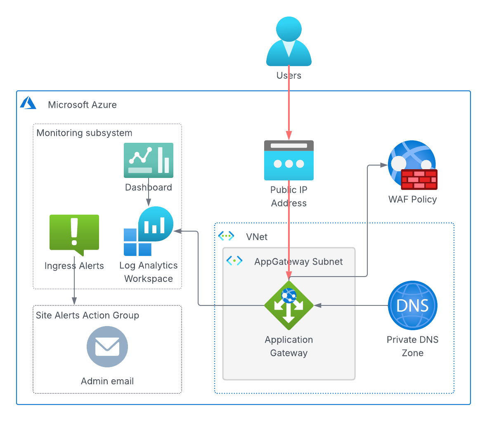

<!-- BEGIN_TF_DOCS -->
# Ingress Terraform Module

Provisions Azure Application Gateway ingress for an ArcGIS Enterprise, including
public and private listeners, rule-driven backend routing, HTTP-to-HTTPS redirection,
and backend trust configuration. The module integrates with Key Vault for certificates
and secrets, creates deployment DNS records, and enables monitoring resources for
gateway health and diagnostics.



The Application Gateway is deployed into the subnet specified by the "subnet_id" variable or,
if the variable is not set, "app-gateway-subnet-2" subnet of the enterprise's VNet.

The Application Gateway is configured with both public and private frontend IP configurations.
The public frontend configuration is assigned a public IP address, while the
private frontend configuration is assigned a static private IP address specified by
the "ingress_private_ip" variable.

The module creates a Private DNS Zone for the ingress FQDN and links it to the
virtual network, allowing internal resolution of the FQDN to the Application Gateway's
private IP address.

If "dns_zone_name" and "dns_zone_resource_group_name" variables are set, a public DNS A record
is also created in the specified DNS zone, pointing the ingress FQDN to the
public IP address of the Application Gateway.  

The Application Gateway's listeners, backend pools, health probes, and routing rules are
dynamically configured from the settings defined by the "routing_rules" variable.
By default, the routing rules route traffic to ports 6443 and 7443 on
"enterprise-base" backend pool and port 443 on "notebook-server" backend pool.

All the HTTPS listeners use the SSL certificate stored in the enterprise's Key Vault. The certificate's
secret ID must be specified by the "ssl_certificate_secret_id" variable.

The module also generates a CA root certificate, configures the Application Gateway
to use it as trusted certificate in the backend settings,
and stores the certificate and its private key in the Key Vault as secrets.

Requests to port 80 on both the public and private frontend IPs are redirected to port 443.

The Application Gateway's monitoring subsystem consists of:

* An Azure Monitor metric alert that notifies the enterprise's alert action group when
  the Application Gateway's unhealthy host count exceeds 0.
* A Log Analytics workspace that collects the Application Gateway's logs.
* An Azure Monitor dashboard "${var.enterprise_id}-${var.ingress_id}" that visualizes the key metrics and logs of the Application Gateway.

## Key Vault Secrets

### Secrets Read by the Module

| Key Vault secret name | Description |
|--------------------|-------------|
| enterprise-alerts-action-group-id | Enterprise's alert action group ID |
| storage-account-key | Enterprise's storage account key |
| storage-account-name | Enterprise's storage account name |
| subnets | VNet subnet IDs |
| vm-identity-id | VM identity ID |
| vnet-id | VNet ID |

### Secrets Written by the Module

| Secret Name | Description |
|-------------|-------------|
| ${var.ingress_id}-ingress-fqdn | Ingress FQDN |
| ${var.ingress_id}-ca-private-key | Private key of the CA root certificate |
| ${var.ingress_id}-ca-root-cert | Self-signed root certificate used by Application Gateway to validate the backend's identity |
| ${var.ingress_id}-backend-address-pools | JSON-encoded map of backend address pool names to their IDs |

## Providers

| Name | Version |
|------|---------|
| azurerm | ~> 4.58 |
| tls | ~> 4.2 |

## Modules

| Name | Source | Version |
|------|--------|---------|
| enterprise_core_info | ../../modules/enterprise_core_info | n/a |

## Resources

| Name | Type |
|------|------|
| [azurerm_application_gateway.ingress](https://registry.terraform.io/providers/hashicorp/azurerm/latest/docs/resources/application_gateway) | resource |
| [azurerm_dns_a_record.public_dns_entry](https://registry.terraform.io/providers/hashicorp/azurerm/latest/docs/resources/dns_a_record) | resource |
| [azurerm_key_vault_secret.backend_address_pools](https://registry.terraform.io/providers/hashicorp/azurerm/latest/docs/resources/key_vault_secret) | resource |
| [azurerm_key_vault_secret.ca_private_key](https://registry.terraform.io/providers/hashicorp/azurerm/latest/docs/resources/key_vault_secret) | resource |
| [azurerm_key_vault_secret.ca_root_cert](https://registry.terraform.io/providers/hashicorp/azurerm/latest/docs/resources/key_vault_secret) | resource |
| [azurerm_key_vault_secret.ingress_fqdn](https://registry.terraform.io/providers/hashicorp/azurerm/latest/docs/resources/key_vault_secret) | resource |
| [azurerm_log_analytics_workspace.ingress](https://registry.terraform.io/providers/hashicorp/azurerm/latest/docs/resources/log_analytics_workspace) | resource |
| [azurerm_monitor_diagnostic_setting.app_gateway_logs](https://registry.terraform.io/providers/hashicorp/azurerm/latest/docs/resources/monitor_diagnostic_setting) | resource |
| [azurerm_monitor_metric_alert.unhealthy_host_count](https://registry.terraform.io/providers/hashicorp/azurerm/latest/docs/resources/monitor_metric_alert) | resource |
| [azurerm_portal_dashboard.ingress](https://registry.terraform.io/providers/hashicorp/azurerm/latest/docs/resources/portal_dashboard) | resource |
| [azurerm_private_dns_a_record.ingress_fqdn](https://registry.terraform.io/providers/hashicorp/azurerm/latest/docs/resources/private_dns_a_record) | resource |
| [azurerm_private_dns_zone.ingress_fqdn](https://registry.terraform.io/providers/hashicorp/azurerm/latest/docs/resources/private_dns_zone) | resource |
| [azurerm_private_dns_zone_virtual_network_link.dns_vnet_link](https://registry.terraform.io/providers/hashicorp/azurerm/latest/docs/resources/private_dns_zone_virtual_network_link) | resource |
| [azurerm_public_ip.ingress](https://registry.terraform.io/providers/hashicorp/azurerm/latest/docs/resources/public_ip) | resource |
| [azurerm_resource_group.deployment_rg](https://registry.terraform.io/providers/hashicorp/azurerm/latest/docs/resources/resource_group) | resource |
| [azurerm_web_application_firewall_policy.arcgis_enterprise](https://registry.terraform.io/providers/hashicorp/azurerm/latest/docs/resources/web_application_firewall_policy) | resource |
| [tls_private_key.ca_private_key](https://registry.terraform.io/providers/hashicorp/tls/latest/docs/resources/private_key) | resource |
| [tls_self_signed_cert.ca_root_cert](https://registry.terraform.io/providers/hashicorp/tls/latest/docs/resources/self_signed_cert) | resource |
| [azurerm_key_vault_secret.enterprise_alerts_action_group_id](https://registry.terraform.io/providers/hashicorp/azurerm/latest/docs/data-sources/key_vault_secret) | data source |
| [azurerm_key_vault_secret.vm_identity_id](https://registry.terraform.io/providers/hashicorp/azurerm/latest/docs/data-sources/key_vault_secret) | data source |

## Inputs

| Name | Description | Type | Default | Required |
|------|-------------|------|---------|:--------:|
| azure_region | Azure region display name | `string` | n/a | yes |
| dns_zone_name | The public DNS zone name for the domain | `string` | `null` | no |
| dns_zone_resource_group_name | The resource group name of the public DNS zone | `string` | `null` | no |
| enabled_log_categories | List of log categories to enable for the Application Gateway | `list(string)` | ```[ "ApplicationGatewayAccessLog", "ApplicationGatewayFirewallLog", "ApplicationGatewayPerformanceLog" ]``` | no |
| enterprise_id | ArcGIS Enterprise ID | `string` | `"arcgis"` | no |
| ingress_fqdn | Fully qualified domain name of the ArcGIS Enterprise ingress | `string` | n/a | yes |
| ingress_id | ArcGIS Enterprise ingress ID | `string` | `"enterprise-ingress"` | no |
| ingress_private_ip | IP address of the Application Gateway private frontend configuration. The IP address must be in the Application Gateway subnet. | `string` | `"10.5.255.254"` | no |
| log_retention | Retention period in days for logs | `number` | `90` | no |
| routing_rules | List of routing rules for the Application Gateway | `list(any)` | ```[ { "frontend_port": 443, "name": "https-443", "priority": 10, "protocol": "Https", "rules": [ { "backend_path": "/arcgis/", "backend_pool": "enterprise-base", "backend_port": 6443, "name": "server", "override_host": true, "paths": [ "/server", "/server/*" ], "probe": "/arcgis/rest/info/healthcheck", "request_timeout": 600 }, { "backend_path": "/arcgis/", "backend_pool": "enterprise-base", "backend_port": 7443, "name": "portal", "override_host": true, "paths": [ "/portal", "/portal/*" ], "probe": "/arcgis/portaladmin/healthCheck", "request_timeout": 60 }, { "backend_pool": "notebook-server", "backend_port": 443, "name": "notebooks", "override_host": false, "paths": [ "/notebooks", "/notebooks/*" ], "probe": "/notebooks/rest/info/healthcheck", "request_timeout": 60 } ] } ]``` | no |
| ssl_certificate_secret_id | Key Vault secret ID of SSL certificate for the Application Gateway HTTPS listeners | `string` | n/a | yes |
| ssl_policy | Predefined SSL policy that should be assigned to the Application Gateway to control the SSL protocol and ciphers | `string` | `"AppGwSslPolicy20220101"` | no |
| subnet_id | Application Gateway subnet ID (by default, the second app gateway subnet is used) | `string` | `null` | no |
| waf_mode | Specifies the mode of the Web Application Firewall (WAF). Valid values are 'detect' and 'protect'. | `string` | `"detect"` | no |
| zones | List of availability zones for the Application Gateway | `list(string)` | ```[ "1", "2" ]``` | no |

## Outputs

| Name | Description |
|------|-------------|
| backend_address_pools | JSON-encoded map of backend address pool names to their IDs |
| private_ip_address | Private IP address of the Application Gateway |
| public_ip_address | Frontend public IP address of the Application Gateway |
<!-- END_TF_DOCS -->