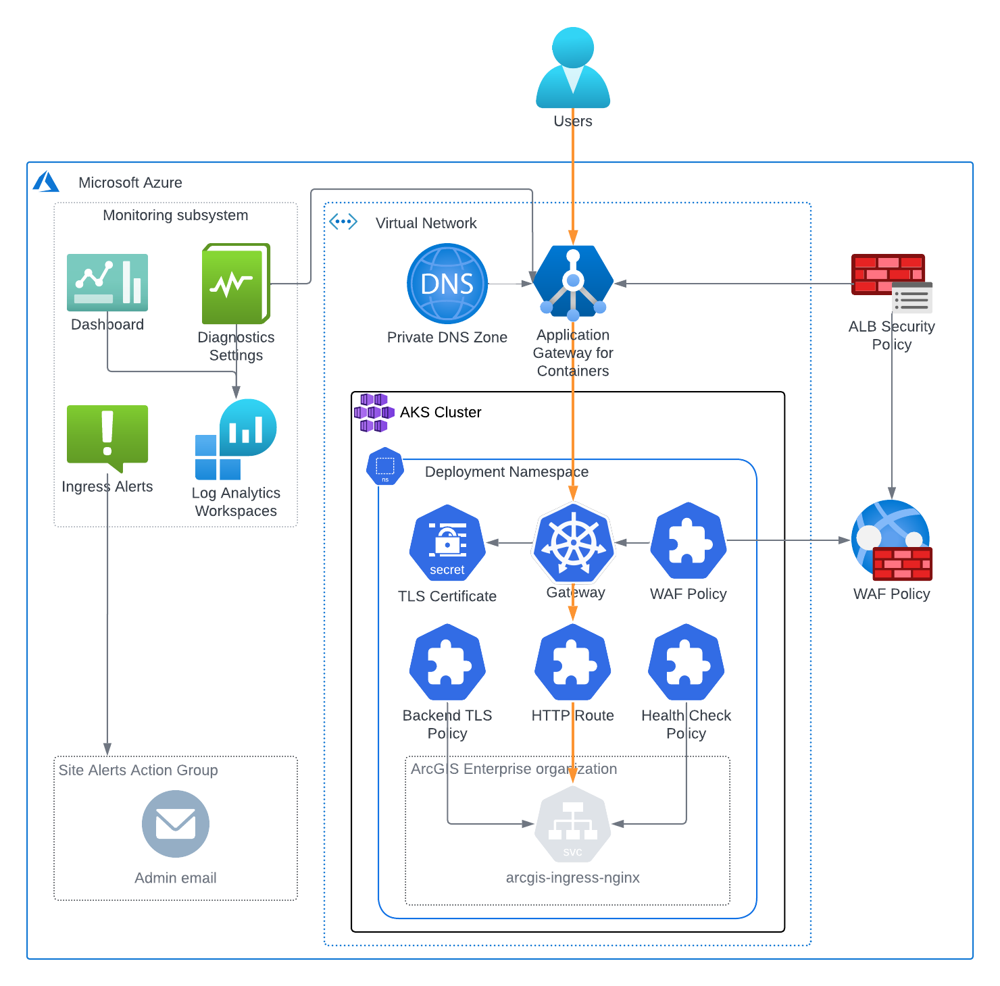

<!-- BEGIN_TF_DOCS -->
# Ingress Terraform Module for Base ArcGIS Enterprise on Kubernetes

This Terraform module creates an manages an Application Gateway for Containers (AGC) that
routes traffic to ArcGIS Enterprise on Kubernetes ingress service.

  

The module manages the following resources:
* An Application Gateway for Containers
* A frontend for the application gateway
* A Kubernetes namespace for ArcGIS Enterprise on Kubernetes deployment in the AKS cluster
* A secret with the TLS certificate for the HTTPS listener
* A secret with the CA certificate for the backend TLS policy
* A Kubernetes Gateway resource with HTTPS listener for the deployment frontend
* A Kubernetes HTTPRoute resource that routes the gateway's traffic to
  port 443 of arcgis-ingress-nginx service
* A Kubernetes BackendTLSPolicy resource required for the end-to-end HTTPS route
* A Kubernetes HealthCheckPolicy resource for the gateway
* A Web Application Firewall policy and associates it with the Application Gateway
* A policy association with the gateway Kubernetes resource
* A private DNS zone and a CNAME record that points the deployment's FQDN

If a public DNS zone name and resource group name are provided, a CNAME record in the DNS zone
that points the deployment's FQDN to the Application Gateway's frontend DNS name

The ingress monitoring subsystem consists of:

* An Azure Monitor metric alert that notifies the site's alert action group when
  the Application Gateway's healthy host count is 0
* A Log Analytics workspace that collects the Application Gateway's logs
* A shared dashboard "{var.site_id}-{var.deployment_id}-ingress" that visualizes
  the key metrics and logs of the Application Gateway for Containers

## Key Vault Secrets

### Secrets Read by the Module

| Key Vault secret name | Description |
|--------------------|-------------|
| site-alerts-action-group-id | Site's alert action group ID |
| storage-account-key | Site's storage account key |
| storage-account-name | Site's storage account name |
| subnets | VNet subnet IDs |
| vm-identity-id | VM identity ID |
| vnet-id | VNet ID |

### Secrets Written by the Module

| Secret Name | Description |
|-------------|-------------|
| ${var.deployment_id}-deployment-fqdn | Deployment's FQDN |

## Requirements

On the machine where Terraform is executed:

* Azure service principal credentials must be configured by ARM_CLIENT_ID, ARM_TENANT_ID,
  and ARM_CLIENT_SECRET environment variables.
* AKS cluster configuration information must be provided in ~/.kube/config file.

## Providers

| Name | Version |
|------|---------|
| azurerm | ~> 4.58 |
| kubernetes | ~> 2.26 |

## Modules

| Name | Source | Version |
|------|--------|---------|
| site_core_info | ../../modules/site_core_info | n/a |

## Resources

| Name | Type |
|------|------|
| [azurerm_application_load_balancer.ingress](https://registry.terraform.io/providers/hashicorp/azurerm/latest/docs/resources/application_load_balancer) | resource |
| [azurerm_application_load_balancer_frontend.public_frontend](https://registry.terraform.io/providers/hashicorp/azurerm/latest/docs/resources/application_load_balancer_frontend) | resource |
| [azurerm_application_load_balancer_security_policy.agc_security_policy](https://registry.terraform.io/providers/hashicorp/azurerm/latest/docs/resources/application_load_balancer_security_policy) | resource |
| [azurerm_application_load_balancer_subnet_association.ingress](https://registry.terraform.io/providers/hashicorp/azurerm/latest/docs/resources/application_load_balancer_subnet_association) | resource |
| [azurerm_dns_cname_record.public_cname](https://registry.terraform.io/providers/hashicorp/azurerm/latest/docs/resources/dns_cname_record) | resource |
| [azurerm_key_vault_secret.deployment_fqdn](https://registry.terraform.io/providers/hashicorp/azurerm/latest/docs/resources/key_vault_secret) | resource |
| [azurerm_log_analytics_workspace.ingress](https://registry.terraform.io/providers/hashicorp/azurerm/latest/docs/resources/log_analytics_workspace) | resource |
| [azurerm_monitor_diagnostic_setting.app_gateway_logs](https://registry.terraform.io/providers/hashicorp/azurerm/latest/docs/resources/monitor_diagnostic_setting) | resource |
| [azurerm_monitor_metric_alert.backend_healthy_targets](https://registry.terraform.io/providers/hashicorp/azurerm/latest/docs/resources/monitor_metric_alert) | resource |
| [azurerm_portal_dashboard.ingress](https://registry.terraform.io/providers/hashicorp/azurerm/latest/docs/resources/portal_dashboard) | resource |
| [azurerm_private_dns_cname_record.private_cname](https://registry.terraform.io/providers/hashicorp/azurerm/latest/docs/resources/private_dns_cname_record) | resource |
| [azurerm_private_dns_zone.deployment_fqdn](https://registry.terraform.io/providers/hashicorp/azurerm/latest/docs/resources/private_dns_zone) | resource |
| [azurerm_private_dns_zone_virtual_network_link.dns_vnet_link](https://registry.terraform.io/providers/hashicorp/azurerm/latest/docs/resources/private_dns_zone_virtual_network_link) | resource |
| [azurerm_resource_group.deployment_rg](https://registry.terraform.io/providers/hashicorp/azurerm/latest/docs/resources/resource_group) | resource |
| [azurerm_web_application_firewall_policy.arcgis_enterprise](https://registry.terraform.io/providers/hashicorp/azurerm/latest/docs/resources/web_application_firewall_policy) | resource |
| [kubernetes_manifest.gateway](https://registry.terraform.io/providers/hashicorp/kubernetes/latest/docs/resources/manifest) | resource |
| [kubernetes_manifest.health_check_policy](https://registry.terraform.io/providers/hashicorp/kubernetes/latest/docs/resources/manifest) | resource |
| [kubernetes_manifest.http_route](https://registry.terraform.io/providers/hashicorp/kubernetes/latest/docs/resources/manifest) | resource |
| [kubernetes_manifest.tls_policy](https://registry.terraform.io/providers/hashicorp/kubernetes/latest/docs/resources/manifest) | resource |
| [kubernetes_manifest.waf_policy](https://registry.terraform.io/providers/hashicorp/kubernetes/latest/docs/resources/manifest) | resource |
| [kubernetes_namespace.arcgis_enterprise](https://registry.terraform.io/providers/hashicorp/kubernetes/latest/docs/resources/namespace) | resource |
| [kubernetes_secret.ca_bundle_secret](https://registry.terraform.io/providers/hashicorp/kubernetes/latest/docs/resources/secret) | resource |
| [kubernetes_secret.listener_tls_secret](https://registry.terraform.io/providers/hashicorp/kubernetes/latest/docs/resources/secret) | resource |
| [azurerm_key_vault_secret.site_alerts_action_group_id](https://registry.terraform.io/providers/hashicorp/azurerm/latest/docs/data-sources/key_vault_secret) | data source |

## Inputs

| Name | Description | Type | Default | Required |
|------|-------------|------|---------|:--------:|
| arcgis_enterprise_context | Context path to be used in the URL for ArcGIS Enterprise on Kubernetes | `string` | `"arcgis"` | no |
| azure_region | Azure region display name | `string` | n/a | yes |
| ca_certificate_path | File path to the CA certificate used to validate the backend TLS certificate | `string` | n/a | yes |
| deployment_fqdn | Fully qualified domain name (FQDN) to access ArcGIS Enterprise on Kubernetes | `string` | n/a | yes |
| deployment_id | ArcGIS Enterprise on Kubernetes deployment Id | `string` | `"enterprise-k8s"` | no |
| dns_zone_name | The public DNS zone name for the domain | `string` | `null` | no |
| dns_zone_resource_group_name | The resource group name of the public DNS zone | `string` | `null` | no |
| enabled_log_categories | List of log categories to enable for the Application Gateway for Containers | `list(string)` | ```[ "TrafficControllerAccessLog", "TrafficControllerFirewallLog" ]``` | no |
| log_retention | Retention period in days for logs | `number` | `90` | no |
| site_id | ArcGIS Enterprise site Id | `string` | `"arcgis"` | no |
| tls_certificate_path | File path to the TLS certificate for the HTTPS listener | `string` | n/a | yes |
| tls_private_key_path | File path to the TLS certificate's private key for the HTTPS listener | `string` | n/a | yes |
| waf_mode | Specifies the mode of the Web Application Firewall (WAF). Valid values are 'detect' and 'protect'. | `string` | `"detect"` | no |

## Outputs

| Name | Description |
|------|-------------|
| deployment_url | URL of the ArcGIS Enterprise on Kubernetes deployment |
| public_frontend_fqdn | FQDN of the Application Gateway frontend |
<!-- END_TF_DOCS -->