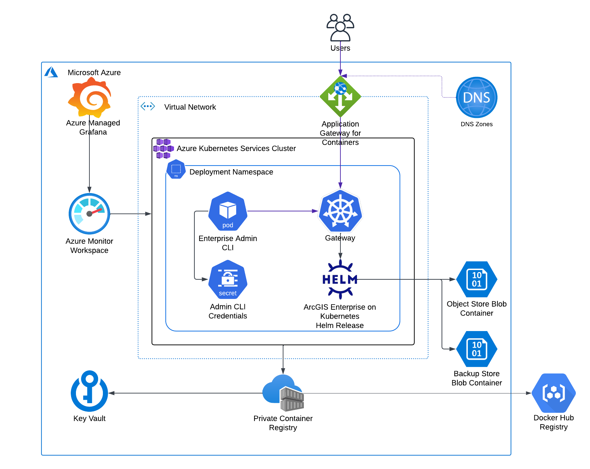

<!-- BEGIN_TF_DOCS -->
# Organization Terraform Module for ArcGIS Enterprise on Kubernetes

The module deploys ArcGIS Enterprise on Kubernetes in an Azure AKS cluster and creates an ArcGIS Enterprise organization.

  

The module uses the Helm Charts for ArcGIS Enterprise on Kubernetes.
The Helm charts package for the ArcGIS Enterprise version used by the deployment
is downloaded from My Esri and extracted in the module's `helm-charts/arcgis-enterprise/<Helm charts version>` directory.

The module:

* Creates a Kubernetes pod to execute Enterprise Admin CLI commands
* Creates an Azure storage account with private endpoint for the blob store and a blob container for the organization object store
* Installs Helm Charts for ArcGIS Enterprise on Kubernetes
* Copies ArcGIS Enterprise license file and cloud-config.json file to the Helm chart's user-inputs directory
* Create a Helm release to deploy ArcGIS Enterprise on Kubernetes
* Updates the DR settings to use the specified storage class and size for staging volume
* Registers backup store using blob container in Azure storage account specified by "storage-account-name" Key Vault secret

The module retrieves the following secrets from the site's Key Vault:

| Secret Name | Description |
| --- | --- |
| deployment-fqdn | Fully qualified domain name used for the ArcGIS Enterprise deployment |
| acr-login-server | Azure Container Registry login server |
| aks-identity-principal-id | AKS cluster managed identity principal ID |
| aks-identity-client-id | AKS cluster managed identity client ID |
| storage-account-name | Azure storage account name |

## Requirements

On the machine where Terraform is executed:

* Azure service principal credentials must be configured by ARM_CLIENT_ID, ARM_TENANT_ID,
  and ARM_CLIENT_SECRET environment variables.
* ArcGIS Online credentials must be set by ARCGIS_ONLINE_PASSWORD and ARCGIS_ONLINE_USERNAME environment variables.
* AKS cluster configuration information must be provided in ~/.kube/config file.
* Path to azure/scripts directory must be added to PYTHONPATH.

## Providers

| Name | Version |
|------|---------|
| azurerm | ~> 4.58 |
| helm | ~> 2.12 |
| kubernetes | ~> 2.26 |
| local | n/a |

## Modules

| Name | Source | Version |
|------|--------|---------|
| azure_storage | ./modules/storage | n/a |
| helm_charts | ./modules/helm-charts | n/a |
| register_azure_backup_store | ./modules/cli-command | n/a |
| site_core_info | ../../modules/site_core_info | n/a |
| update_dr_settings | ./modules/cli-command | n/a |

## Resources

| Name | Type |
|------|------|
| [helm_release.arcgis_enterprise](https://registry.terraform.io/providers/hashicorp/helm/latest/docs/resources/release) | resource |
| [kubernetes_pod.enterprise_admin_cli](https://registry.terraform.io/providers/hashicorp/kubernetes/latest/docs/resources/pod) | resource |
| [kubernetes_secret.admin_cli_credentials](https://registry.terraform.io/providers/hashicorp/kubernetes/latest/docs/resources/secret) | resource |
| [local_sensitive_file.cloud_config_json_file](https://registry.terraform.io/providers/hashicorp/local/latest/docs/resources/sensitive_file) | resource |
| [local_sensitive_file.license_file](https://registry.terraform.io/providers/hashicorp/local/latest/docs/resources/sensitive_file) | resource |
| [azurerm_client_config.current](https://registry.terraform.io/providers/hashicorp/azurerm/latest/docs/data-sources/client_config) | data source |
| [azurerm_key_vault_secret.acr_login_server](https://registry.terraform.io/providers/hashicorp/azurerm/latest/docs/data-sources/key_vault_secret) | data source |
| [azurerm_key_vault_secret.aks_identity_client_id](https://registry.terraform.io/providers/hashicorp/azurerm/latest/docs/data-sources/key_vault_secret) | data source |
| [azurerm_key_vault_secret.aks_identity_principal_id](https://registry.terraform.io/providers/hashicorp/azurerm/latest/docs/data-sources/key_vault_secret) | data source |
| [azurerm_key_vault_secret.deployment_fqdn](https://registry.terraform.io/providers/hashicorp/azurerm/latest/docs/data-sources/key_vault_secret) | data source |
| [azurerm_storage_account.site_storage](https://registry.terraform.io/providers/hashicorp/azurerm/latest/docs/data-sources/storage_account) | data source |

## Inputs

| Name | Description | Type | Default | Required |
|------|-------------|------|---------|:--------:|
| admin_email | ArcGIS Enterprise on Kubernetes organization administrator account email | `string` | n/a | yes |
| admin_first_name | ArcGIS Enterprise on Kubernetes organization administrator account first name | `string` | n/a | yes |
| admin_last_name | ArcGIS Enterprise on Kubernetes organization administrator account last name | `string` | n/a | yes |
| admin_password | ArcGIS Enterprise on Kubernetes organization administrator account password | `string` | n/a | yes |
| admin_username | ArcGIS Enterprise on Kubernetes organization administrator account username | `string` | `"siteadmin"` | no |
| arcgis_enterprise_context | Context path to be used in the URL for ArcGIS Enterprise on Kubernetes | `string` | `"arcgis"` | no |
| arcgis_version | ArcGIS Enterprise version | `string` | `"12.0"` | no |
| authorization_file_path | ArcGIS Enterprise on Kubernetes authorization file path | `string` | n/a | yes |
| azure_region | Azure region display name | `string` | n/a | yes |
| backup_job_timeout | Backup job timeout in seconds | `number` | `7200` | no |
| cloud_config_json_file_path | ArcGIS Enterprise on Kubernetes cloud configuration JSON file path | `string` | `null` | no |
| common_verbose | Enable verbose install logging | `bool` | `false` | no |
| configure_enterprise_org | Configure ArcGIS Enterprise on Kubernetes organization | `bool` | `true` | no |
| configure_wait_time_min | Organization admin URL validation timeout in minutes | `number` | `15` | no |
| deployment_id | ArcGIS Enterprise deployment Id | `string` | `"enterprise-k8s"` | no |
| enterprise_admin_cli_version | ArcGIS Enterprise Admin CLI image tag | `string` | `"0.5.0"` | no |
| image_repository_prefix | Prefix of images in ACR repositories | `string` | `"docker-hub/esridocker"` | no |
| k8s_cluster_domain | Kubernetes cluster domain | `string` | `"cluster.local"` | no |
| license_type_id | User type ID for the primary administrator account | `string` | `"creatorUT"` | no |
| log_retention_max_days | Number of days logs will be retained by the organization | `number` | `60` | no |
| log_setting | ArcGIS Enterprise on Kubernetes log level | `string` | `"INFO"` | no |
| mandatory_update_target_id | Patch ID of required update | `string` | `""` | no |
| security_question_answer | ArcGIS Enterprise on Kubernetes organization administrator account security question answer | `string` | n/a | yes |
| security_question_index | ArcGIS Enterprise on Kubernetes organization administrator account security question index | `number` | `1` | no |
| site_id | ArcGIS Enterprise site Id | `string` | `"arcgis"` | no |
| staging_volume_class | Staging volume storage class | `string` | `"managed-premium"` | no |
| staging_volume_size | Staging volume size | `string` | `"64Gi"` | no |
| storage | Storage properties for the data stores | ```map(object({ type = string size = string class = string label1 = string label2 = string }))``` | ```{ "indexer": { "class": "managed-premium", "label1": "", "label2": "", "size": "16Gi", "type": "DYNAMIC" }, "memory": { "class": "managed-premium", "label1": "", "label2": "", "size": "16Gi", "type": "DYNAMIC" }, "object": { "class": "managed-premium", "label1": "", "label2": "", "size": "32Gi", "type": "DYNAMIC" }, "prometheus": { "class": "managed-premium", "label1": "", "label2": "", "size": "30Gi", "type": "DYNAMIC" }, "queue": { "class": "managed-premium", "label1": "", "label2": "", "size": "16Gi", "type": "DYNAMIC" }, "relational": { "class": "managed-premium", "label1": "", "label2": "", "size": "16Gi", "type": "DYNAMIC" }, "sharing": { "class": "managed-premium", "label1": "", "label2": "", "size": "16Gi", "type": "DYNAMIC" } }``` | no |
| system_arch_profile | ArcGIS Enterprise on Kubernetes architecture profile | `string` | `"standard-availability"` | no |
| upgrade_token | ArcGIS Enterprise organization administrator account token | `string` | `"add_token_here"` | no |

## Outputs

| Name | Description |
|------|-------------|
| arcgis_enterprise_manager_url | ArcGIS Enterprise Manager URL |
| arcgis_enterprise_portal_url | ArcGIS Enterprise Portal URL |
<!-- END_TF_DOCS -->