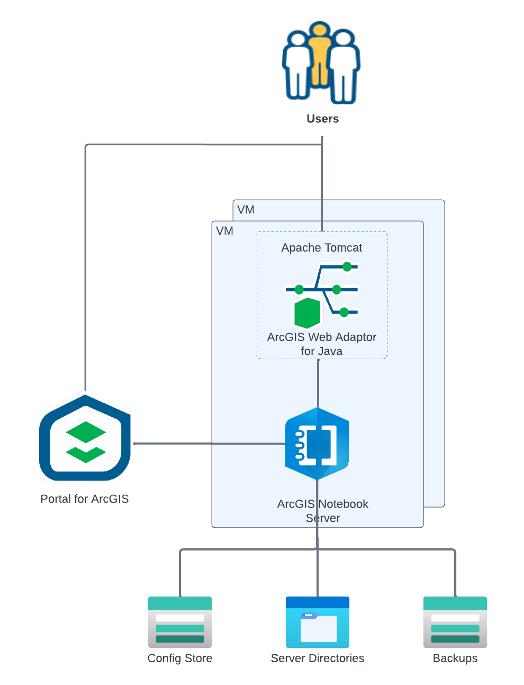

<!-- BEGIN_TF_DOCS -->
# Application Terraform Module for ArcGIS Notebook Server on Linux

The Terraform module configures or upgrades applications of highly available ArcGIS Notebook Server deployment on Linux platform.

First, the module bootstraps the deployment by installing Chef Client and Chef Cookbooks for ArcGIS on all VMs of the deployment.

If "is_upgrade" input variable is set to `true`, the module:

* Copies the installation media for the ArcGIS Enterprise version specified by arcgis_version input variable to the private repository blob container
* Downloads the installation media from the private repository blob container to primary and node VMs
* Installs/upgrades ArcGIS Enterprise software on primary and node VMs
* Installs the software patches on primary and node VMs

Then the module:

* Copies the ArcGIS Notebook Server authorization file to the private repository blob container
* If specified, copies keystore and root certificate files to the private repository blob container
* Downloads the ArcGIS Notebook Server authorization file from the private repository blob container to primary and node VMs
* If specified, downloads the keystore and root certificate files from the private repository blob container to primary and node VMs
* Creates the required directories in the NFS mount
* Configures ArcGIS Notebook Server on primary VMs
* Configures ArcGIS Notebook Server on node VMs if any
* Federates ArcGIS Notebook Server with Portal for ArcGIS
* If config_store_type input variable is set to "AZURE", configures system-level backups of the config store using Azure Backup service
* Deletes the downloaded setup archives, the extracted setups, and other temporary files from primary and node VMs

## Requirements

The Azure resources for the deployment must be provisioned by Infrastructure terraform module for ArcGIS Notebook Server on Linux.

On the machine where Terraform is executed:

* Python 3.9 or later with [Azure SDK for Python](https://pypi.org/project/azure/) package must be installed
* Path to azure/scripts directory must be added to PYTHONPATH
* The working directory must be set to the arcgis-notebook-server-linux/application module path
* Azure credentials must be configured

My Esri user name and password must be specified either using environment variables ARCGIS_ONLINE_USERNAME and ARCGIS_ONLINE_PASSWORD or the input variables.

## Key Vault Secrets

The module reads the following Key Vault secrets:

| Secret Name                                      | Description |
|--------------------------------------------------|-------------|
| ${var.deployment_id}-deployment-fqdn             | Fully qualified domain name of the deployment |
| ${var.deployment_id}-notebook-server-web-context | ArcGIS Notebook Server web context |
| ${var.deployment_id}-os                          | Operating system ID |
| ${var.deployment_id}-portal-url                  | Portal for ArcGIS URL |
| ${var.deployment_id}-storage-account-name        | Config store storage account name |
| chef-client-url-${os}                            | Chef Client URL      |
| cookbooks-url                                    | Chef cookbooks URL |
| storage-account-key                              | Site storage account key |
| storage-account-name                             | Site storage account name |
| subnets                                          | VNet subnet IDs |
| vm-identity-client-id                            | VM identity client ID |
| vnet-id                                          | VNet ID |

> The module also writes multiple “attributes” Key Vault secrets used to run Chef.

## Providers

| Name | Version |
|------|---------|
| azurerm | ~> 4.46 |

## Modules

| Name | Source | Version |
|------|--------|---------|
| arcgis_notebook_server_federation | ../../modules/run_chef | n/a |
| arcgis_notebook_server_files | ../../modules/run_chef | n/a |
| arcgis_notebook_server_fileserver | ../../modules/run_chef | n/a |
| arcgis_notebook_server_node | ../../modules/run_chef | n/a |
| arcgis_notebook_server_patch | ../../modules/run_chef | n/a |
| arcgis_notebook_server_primary | ../../modules/run_chef | n/a |
| arcgis_notebook_server_upgrade | ../../modules/run_chef | n/a |
| authorization_files | ../../modules/run_chef | n/a |
| az_copy_files | ../../modules/az_copy_files | n/a |
| bootstrap_deployment | ../../modules/bootstrap | n/a |
| clean_up | ../../modules/clean_up | n/a |
| keystore_file | ../../modules/run_chef | n/a |
| root_cert | ../../modules/run_chef | n/a |
| site_core_info | ../../modules/site_core_info | n/a |

## Resources

| Name | Type |
|------|------|
| [azurerm_storage_blob.keystore_file](https://registry.terraform.io/providers/hashicorp/azurerm/latest/docs/resources/storage_blob) | resource |
| [azurerm_storage_blob.root_cert_file](https://registry.terraform.io/providers/hashicorp/azurerm/latest/docs/resources/storage_blob) | resource |
| [azurerm_storage_blob.server_authorization_file](https://registry.terraform.io/providers/hashicorp/azurerm/latest/docs/resources/storage_blob) | resource |
| [azurerm_client_config.current](https://registry.terraform.io/providers/hashicorp/azurerm/latest/docs/data-sources/client_config) | data source |
| [azurerm_key_vault_secret.deployment_fqdn](https://registry.terraform.io/providers/hashicorp/azurerm/latest/docs/data-sources/key_vault_secret) | data source |
| [azurerm_key_vault_secret.notebook_server_web_context](https://registry.terraform.io/providers/hashicorp/azurerm/latest/docs/data-sources/key_vault_secret) | data source |
| [azurerm_key_vault_secret.portal_url](https://registry.terraform.io/providers/hashicorp/azurerm/latest/docs/data-sources/key_vault_secret) | data source |
| [azurerm_key_vault_secret.storage_account_name](https://registry.terraform.io/providers/hashicorp/azurerm/latest/docs/data-sources/key_vault_secret) | data source |
| [azurerm_key_vault_secret.vm_identity_client_id](https://registry.terraform.io/providers/hashicorp/azurerm/latest/docs/data-sources/key_vault_secret) | data source |
| [azurerm_key_vault_secret.vm_image_os](https://registry.terraform.io/providers/hashicorp/azurerm/latest/docs/data-sources/key_vault_secret) | data source |
| [azurerm_resources.nodes](https://registry.terraform.io/providers/hashicorp/azurerm/latest/docs/data-sources/resources) | data source |
| [azurerm_virtual_machine.primary](https://registry.terraform.io/providers/hashicorp/azurerm/latest/docs/data-sources/virtual_machine) | data source |

## Inputs

| Name | Description | Type | Default | Required |
|------|-------------|------|---------|:--------:|
| admin_password | Primary ArcGIS Notebook Server administrator user password | `string` | n/a | yes |
| admin_username | Primary ArcGIS Notebook Server administrator user name | `string` | `"siteadmin"` | no |
| arcgis_notebook_server_patches | File names of ArcGIS Server patches to install. | `list(string)` | `[]` | no |
| arcgis_version | ArcGIS Notebook Server version | `string` | `"12.0"` | no |
| arcgis_web_adaptor_patches | File names of ArcGIS Web Adaptor patches to install. | `list(string)` | `[]` | no |
| azure_region | Azure region display name | `string` | n/a | yes |
| config_store_type | ArcGIS Server configuration store type | `string` | `"FILESYSTEM"` | no |
| deployment_id | Deployment Id | `string` | `"notebook-server-linux"` | no |
| is_upgrade | Flag to indicate if this is an upgrade deployment | `bool` | `false` | no |
| keystore_file_password | Password for keystore file with SSL certificate used by HTTPS listeners | `string` | n/a | yes |
| keystore_file_path | Local path of keystore file in PKCS12 format with SSL certificate used by HTTPS listeners | `string` | n/a | yes |
| license_level | ArcGIS Notebook Server license level | `string` | `"standard"` | no |
| log_level | ArcGIS Notebook Server log level | `string` | `"WARNING"` | no |
| notebook_server_authorization_file_path | Local path of ArcGIS Notebook Server authorization file | `string` | n/a | yes |
| notebook_server_authorization_options | Additional ArcGIS Notebook Server software authorization command line options | `string` | `""` | no |
| portal_org_id | ArcGIS Enterprise organization Id | `string` | `null` | no |
| portal_password | Portal for ArcGIS user password | `string` | n/a | yes |
| portal_username | Portal for ArcGIS user name | `string` | n/a | yes |
| root_cert_file_path | Local path of root certificate file in PEM format used by ArcGIS Server and Portal for ArcGIS | `string` | `null` | no |
| run_as_user | User name for the account used to run ArcGIS Server, Portal for ArcGIS, and ArcGIS Data Store. | `string` | `"arcgis"` | no |
| site_id | ArcGIS Enterprise site Id | `string` | `"arcgis"` | no |

## Outputs

| Name | Description |
|------|-------------|
| arcgis_notebook_server_private_url | ArcGIS Notebook Server URL |
| arcgis_notebook_server_url | ArcGIS Notebook Server URL |
<!-- END_TF_DOCS -->