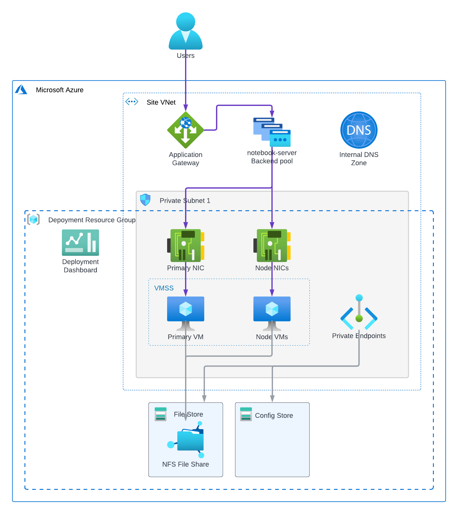

<!-- BEGIN_TF_DOCS -->
# Infrastructure Terraform Module for ArcGIS Notebook Server on Linux

The Terraform module provisions Azure resources for ArcGIS Notebook Server deployment on Linux platform.

  

The module creates network interfaces in the first private subnet or the subnet specified by subnet_id input variable and
launches one primary and N node VMs (configurable via node_count) in different zones of the specified Azure region.
The VMs are launched from images retrieved from "vm-image-${var.deployment_id}-primary" and "vm-image-${var.deployment_id}-node" secrets of the site's Key Vault.
The images must be created by the Packer Template for ArcGIS Notebook Server on Linux.

The network interfaces are associated with the backend address pool "notebook-server" of the Application Gateway created by the ingress
terraform module to make the VMs accessible from the Application Gateway.

For the VMs the module creates "A" records in the internal private DNS zone to make them addressable using the permanent DNS names.

> Note that the VMs will be terminated and recreated if the infrastructure terraform module
  is applied again after the image IDs in the Key Vault secrets were modified by a new image build.

The module creates two storage accounts: one for ArcGIS Notebook Server config store and another for file store with "fileserver" NFS file share.
The config store storage account is secured with private endpoints and only accessible from the VMs.
The VM identity is granted access to the config store storage account.
The file share is mounted to all the VMs.

The deployment's Monitoring Subsystem consists of a shared dashboard in Azure Monitor that displays
the key metrics of the deployment's VMs and storage infrastructure.

All the created Azure resources are tagged with ArcGISSiteId and ArcGISDeploymentId tags.

## Requirements

On the machine where Terraform is executed:

* Python 3.9 or later must be installed
* azure-identity, azure-keyvault-secrets, azure-mgmt-compute, and azure-storage-blob Azure Python SDK packages must be installed
* Path to azure/scripts directory must be added to PYTHONPATH
* Azure credentials must be configured using "az login" CLI command

## Key Vault Secrets

### Secrets Read by the Module

| Secret Name                                        | Description |
|----------------------------------------------------|-------------|
| ${var.ingress_deployment_id}-backend-address-pools | Application Gateway backend address pools |
| ${var.ingress_deployment_id}-deployment-fqdn       | Ingress deployment FQDN |
| ${var.portal_deployment_id}-deployment-url         | Portal deployment URL |
| storage-account-key                                | Storage account key |
| storage-account-name                               | Storage account name |
| subnets                                            | VNet subnet IDs |
| vm-identity-id                                     | User-assigned VM identity object ID |
| vm-identity-principal-id                           | User-assigned VM identity principal ID |
| vm-image-${var.deployment_id}-primary              | Primary VM image ID |
| vm-image-${var.deployment_id}-node                 | Node VM image ID |
| vm-image-${var.deployment_id}-os                   | Operating system ID |
| vnet-id                                            | VNet ID |

### Secrets Written by the Module

| Secret Name | Description |
|-------------|-------------|
| ${var.deployment_id}-deployment-fqdn | Deployment's FQDN |
| ${var.deployment_id}-notebook-server-web-context | Web context for the notebook server |
| ${var.deployment_id}-deployment-url | Deployment URL |
| ${var.deployment_id}-portal-url | Portal URL |
| ${var.deployment_id}-storage-account-name | Config Store's storage account name |

## Providers

| Name | Version |
|------|---------|
| azurerm | ~> 4.46 |
| random | n/a |

## Modules

| Name | Source | Version |
|------|--------|---------|
| aznfs_mount | ../../modules/aznfs_mount | n/a |
| lv_extend | ../../modules/lv_extend | n/a |
| site_core_info | ../../modules/site_core_info | n/a |

## Resources

| Name | Type |
|------|------|
| [azurerm_key_vault_secret.deployment_fqdn](https://registry.terraform.io/providers/hashicorp/azurerm/latest/docs/resources/key_vault_secret) | resource |
| [azurerm_key_vault_secret.deployment_url](https://registry.terraform.io/providers/hashicorp/azurerm/latest/docs/resources/key_vault_secret) | resource |
| [azurerm_key_vault_secret.notebook_server_web_context](https://registry.terraform.io/providers/hashicorp/azurerm/latest/docs/resources/key_vault_secret) | resource |
| [azurerm_key_vault_secret.portal_url](https://registry.terraform.io/providers/hashicorp/azurerm/latest/docs/resources/key_vault_secret) | resource |
| [azurerm_key_vault_secret.storage_account_name](https://registry.terraform.io/providers/hashicorp/azurerm/latest/docs/resources/key_vault_secret) | resource |
| [azurerm_linux_virtual_machine.nodes](https://registry.terraform.io/providers/hashicorp/azurerm/latest/docs/resources/linux_virtual_machine) | resource |
| [azurerm_linux_virtual_machine.primary](https://registry.terraform.io/providers/hashicorp/azurerm/latest/docs/resources/linux_virtual_machine) | resource |
| [azurerm_network_interface.nodes](https://registry.terraform.io/providers/hashicorp/azurerm/latest/docs/resources/network_interface) | resource |
| [azurerm_network_interface.primary](https://registry.terraform.io/providers/hashicorp/azurerm/latest/docs/resources/network_interface) | resource |
| [azurerm_network_interface_application_gateway_backend_address_pool_association.nodes](https://registry.terraform.io/providers/hashicorp/azurerm/latest/docs/resources/network_interface_application_gateway_backend_address_pool_association) | resource |
| [azurerm_network_interface_application_gateway_backend_address_pool_association.primary](https://registry.terraform.io/providers/hashicorp/azurerm/latest/docs/resources/network_interface_application_gateway_backend_address_pool_association) | resource |
| [azurerm_orchestrated_virtual_machine_scale_set.vmss](https://registry.terraform.io/providers/hashicorp/azurerm/latest/docs/resources/orchestrated_virtual_machine_scale_set) | resource |
| [azurerm_portal_dashboard.deployment](https://registry.terraform.io/providers/hashicorp/azurerm/latest/docs/resources/portal_dashboard) | resource |
| [azurerm_private_dns_a_record.nodes](https://registry.terraform.io/providers/hashicorp/azurerm/latest/docs/resources/private_dns_a_record) | resource |
| [azurerm_private_dns_a_record.primary](https://registry.terraform.io/providers/hashicorp/azurerm/latest/docs/resources/private_dns_a_record) | resource |
| [azurerm_private_endpoint.config_store_blob_pe](https://registry.terraform.io/providers/hashicorp/azurerm/latest/docs/resources/private_endpoint) | resource |
| [azurerm_private_endpoint.config_store_table_pe](https://registry.terraform.io/providers/hashicorp/azurerm/latest/docs/resources/private_endpoint) | resource |
| [azurerm_private_endpoint.file_store_pe](https://registry.terraform.io/providers/hashicorp/azurerm/latest/docs/resources/private_endpoint) | resource |
| [azurerm_resource_group.deployment_rg](https://registry.terraform.io/providers/hashicorp/azurerm/latest/docs/resources/resource_group) | resource |
| [azurerm_role_assignment.blob_store](https://registry.terraform.io/providers/hashicorp/azurerm/latest/docs/resources/role_assignment) | resource |
| [azurerm_role_assignment.table_store](https://registry.terraform.io/providers/hashicorp/azurerm/latest/docs/resources/role_assignment) | resource |
| [azurerm_storage_account.config_store](https://registry.terraform.io/providers/hashicorp/azurerm/latest/docs/resources/storage_account) | resource |
| [azurerm_storage_account.file_store](https://registry.terraform.io/providers/hashicorp/azurerm/latest/docs/resources/storage_account) | resource |
| [azurerm_storage_share.fileserver](https://registry.terraform.io/providers/hashicorp/azurerm/latest/docs/resources/storage_share) | resource |
| [random_id.unique_name_suffix](https://registry.terraform.io/providers/hashicorp/random/latest/docs/resources/id) | resource |
| [azurerm_client_config.current](https://registry.terraform.io/providers/hashicorp/azurerm/latest/docs/data-sources/client_config) | data source |
| [azurerm_key_vault_secret.backend_address_pools](https://registry.terraform.io/providers/hashicorp/azurerm/latest/docs/data-sources/key_vault_secret) | data source |
| [azurerm_key_vault_secret.deployment_fqdn](https://registry.terraform.io/providers/hashicorp/azurerm/latest/docs/data-sources/key_vault_secret) | data source |
| [azurerm_key_vault_secret.node_vm_image_id](https://registry.terraform.io/providers/hashicorp/azurerm/latest/docs/data-sources/key_vault_secret) | data source |
| [azurerm_key_vault_secret.portal_deployment_url](https://registry.terraform.io/providers/hashicorp/azurerm/latest/docs/data-sources/key_vault_secret) | data source |
| [azurerm_key_vault_secret.primary_vm_image_id](https://registry.terraform.io/providers/hashicorp/azurerm/latest/docs/data-sources/key_vault_secret) | data source |
| [azurerm_key_vault_secret.vm_identity_id](https://registry.terraform.io/providers/hashicorp/azurerm/latest/docs/data-sources/key_vault_secret) | data source |
| [azurerm_key_vault_secret.vm_identity_principal_id](https://registry.terraform.io/providers/hashicorp/azurerm/latest/docs/data-sources/key_vault_secret) | data source |
| [azurerm_key_vault_secret.vm_image_os](https://registry.terraform.io/providers/hashicorp/azurerm/latest/docs/data-sources/key_vault_secret) | data source |
| [azurerm_private_dns_zone.privatelink_blob](https://registry.terraform.io/providers/hashicorp/azurerm/latest/docs/data-sources/private_dns_zone) | data source |
| [azurerm_private_dns_zone.privatelink_file](https://registry.terraform.io/providers/hashicorp/azurerm/latest/docs/data-sources/private_dns_zone) | data source |
| [azurerm_private_dns_zone.privatelink_table](https://registry.terraform.io/providers/hashicorp/azurerm/latest/docs/data-sources/private_dns_zone) | data source |

## Inputs

| Name | Description | Type | Default | Required |
|------|-------------|------|---------|:--------:|
| azure_region | Azure region display name | `string` | n/a | yes |
| deployment_id | ArcGIS Notebook Server deployment Id | `string` | `"notebook-server-linux"` | no |
| fileserver_size | Maximum size of the NFS file share in GB | `number` | `1024` | no |
| ingress_deployment_id | ArcGIS Enterprise ingress deployment Id | `string` | `"enterprise-ingress"` | no |
| node_count | Number of node VMs | `number` | `1` | no |
| notebook_server_web_context | ArcGIS Notebook Server web context | `string` | `"notebooks"` | no |
| os_disk_size | OS disk size in GB | `number` | `256` | no |
| portal_deployment_id | Portal for ArcGIS deployment Id | `string` | `"enterprise-base-windows"` | no |
| site_id | ArcGIS Enterprise site Id | `string` | `"arcgis"` | no |
| storage_replication_type | The replication type of the storage accounts. Possible values are: LRS (Locally-redundant storage), ZRS (Zone-redundant storage) . | `string` | `"ZRS"` | no |
| subnet_id | VMs subnet ID (by default, the first private subnet is used) | `string` | `null` | no |
| vm_admin_password | VM administrator password | `string` | `null` | no |
| vm_admin_public_ssh_key_path | VM administrator public SSH key file path. If not provided, password authentication will be used for the VMs. | `string` | `null` | no |
| vm_admin_username | VM administrator username | `string` | `"vmadmin"` | no |
| vm_size | Azure VM size | `string` | `"Standard_D8s_v5"` | no |

## Outputs

| Name | Description |
|------|-------------|
| deployment_url | ArcGIS Notebook Server URL |
<!-- END_TF_DOCS -->