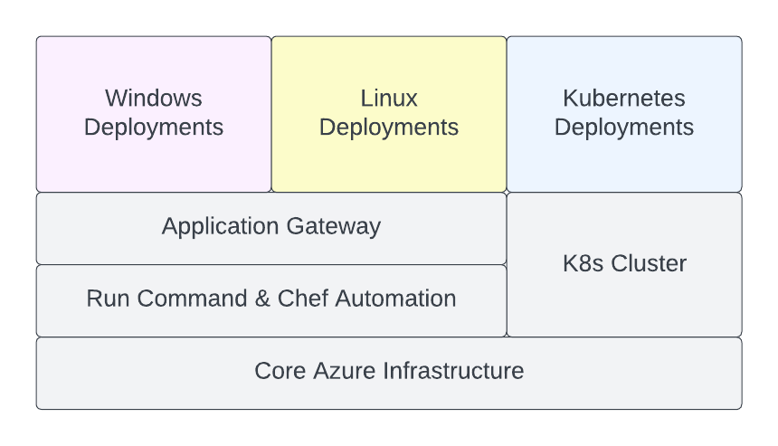

# Core Azure Resources for ArcGIS Enterprise Site

This template provides workflows for provisioning:

* Networking and storage Azure resources shared across multiple deployments of an ArcGIS Enterprise site,
* Azure Kubernetes Service (AKS) cluster that meets ArcGIS Enterprise on Kubernetes system requirements.

Before running the template workflows, configure the GitHub repository settings as described in the general [Instructions](../README.md#instructions) section.

To enable the template's workflows, copy the .yaml files from the template's `workflows` directory to `/.github/workflows` directory in the `main` branch, commit the changes, and push the branch to GitHub.

> To prevent accidental destruction of the resources, don't enable *-destroy workflows until needed.

> Refer to READMEs of the Terraform modules for descriptions of specific configuration properties.

  

## Create Core Azure Resources

GitHub Actions workflow **site-core-azure** creates core Azure resources for an ArcGIS Enterprise site.

The workflow uses [infrastructure-core](infrastructure-core/README.md) Terraform module with [infrastructure-core.tfvars.json](../../config/azure/arcgis-site-core/infrastructure-core.tfvars.json) config file.

Required service principal roles:

* Owner role at the subscription scope

Instructions:

1. (Optional) Update CIDR blocks of the subnets to match the required network topology.
2. Commit the changes to the `main` branch and push the branch to GitHub.
3. Run site-core-azure workflow using the `main` branch.

## Create Chef Automation Resources

GitHub Actions workflow **site-automation-chef-azure** creates resources required for ArcGIS Enterprise deployments configuration management using Chef Cookbooks for ArcGIS.

The workflow uses [automation-chef](automation-chef/README.md) Terraform module with [automation-chef.tfvars.json](../../config/azure/arcgis-site-core/automation-chef.tfvars.json) config file.

Required service principal roles:

* Owner role at the subscription scope

Instructions:

1. (Optional) Update "chef_client_paths" map in the config file. Remove entries for operating systems that will not be used.
2. Commit the changes to the `main` branch and push the branch to GitHub.
3. Run site-automation-chef-azure workflow using the `main` branch.

## Create Application Gateway for Windows and Linux Deployments

GitHub Actions workflow **site-ingress-azure** creates an Application Gateway for Windows and Linux ArcGIS Enterprise deployments.

The workflow uses [ingress](ingress/README.md) Terraform module with [ingress.tfvars.json](../../config/azure/arcgis-site-core/ingress.tfvars.json) config file.

Required service principal roles:

* Owner role at the subscription scope

Instructions:

1. Import in PKCS12 (.pfx) format or generate an SSL certificate for the ArcGIS Enterprise site domain name in the site's Key Vault. Note the "Secret Identifier" in the certificate's properties.
2. Set "ssl_certificate_secret_id" property in the config file to the Key Vault secret ID of the SSL certificate.
    > It is recommended to use a secret identifier that does not specify a version, enabling automatic certificate rotation by Application Gateway when a newer version is available in Key Vault.
3. Set "deployment_fqdn" property to the ArcGIS Enterprise site domain name.
4. (Optional) Update "routing_rules" array in the config file to specify routing rules required for the site. Remove rules that are not required.
5. Commit the changes to the `main` branch and push the branch to GitHub.
6. Run site-ingress-azure workflow using the `main` branch.
7. Create DNS A record for the site domain name pointing to the Application Gateway public IP address.

## Deploy K8s Cluster

GitHub Actions workflow **site-k8s-cluster-azure** deploys an AKS cluster that meets the ArcGIS Enterprise on Kubernetes system requirements.

The workflow uses [k8s-cluster](k8s-cluster/README.md) Terraform module with [k8s-cluster.tfvars.json](../../config/azure/arcgis-site-core/k8s-cluster.tfvars.json) config file.

Required service principal roles:

* Owner role at the subscription scope

Required Azure providers:

* Microsoft.Monitor
* Microsoft.Dashboard
* Microsoft.NetworkFunction
* Microsoft.ServiceNetworking

Instructions:

1. (Optional) Set "default_node_pool" properties to the required node pool configuration.
2. (Optional) Set "subnet_id" property to the subnet ID from the site's VNet. By default, the first private subnet is used.
3. Commit the changes to the `main` branch and push the branch to GitHub.
4. Run site-k8s-cluster-azure workflow using the `main` branch.

## Destroy K8s Cluster

GitHub Actions workflow **site-k8s-cluster-azure-destroy** destroys the AKS cluster and other Azure resources created by site-k8s-cluster-azure workflow.

The workflow uses [k8s-cluster](k8s-cluster/README.md) Terraform module with [k8s-cluster.tfvars.json](../../config/azure/arcgis-site-core/k8s-cluster.tfvars.json) config file.

Required service principal roles:

* Owner role at the subscription scope

Instructions:

1. Run site-k8s-cluster-azure-destroy workflow using the `main` branch.

## Destroy Application Gateway for Windows and Linux Deployments

GitHub Actions workflow **site-ingress-azure-destroy** destroys the Application Gateway created by site-ingress-azure workflow.

The workflow uses [ingress](ingress/README.md) Terraform module with [ingress.tfvars.json](../../config/azure/arcgis-site-core/ingress.tfvars.json) config file.

Required service principal roles:

* Owner role at the subscription scope

Instructions:

1. Run site-ingress-azure-destroy workflow using the `main` branch.

## Destroy Chef Automation Resources

GitHub Actions workflow **site-automation-chef-azure-destroy** destroys the Azure resources created by site-automation-chef-azure workflow.

The workflow uses [automation-chef](automation-chef/README.md) Terraform modules with [automation-chef.tfvars.json](../../config/azure/arcgis-site-core/automation-chef.tfvars.json) config file.

Required service principal roles:

* Owner role at the subscription scope

Instructions:

1. Run site-automation-chef-azure-destroy workflow using the `main` branch.

## Destroy Core Azure Resources

GitHub Actions workflow **site-core-azure-destroy** destroys the Azure resources created by site-core-azure workflow.

The workflow uses [infrastructure-core](infrastructure-core/README.md) Terraform module with [infrastructure-core.tfvars.json](../../config/azure/arcgis-site-core/infrastructure-core.tfvars.json) config file.

Required service principal roles:

* Owner role at the subscription scope

Instructions:

1. Run site-core-azure-destroy workflow using the `main` branch.

> Along with all other resources, site-core-azure-destroy workflow destroys backups of all deployments.
