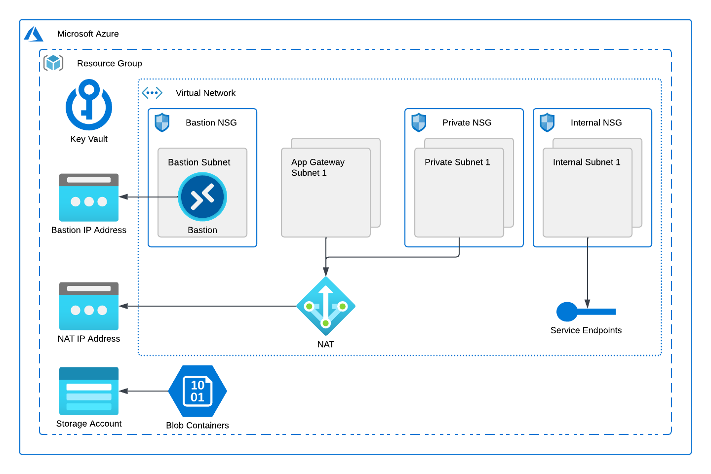

<!-- BEGIN_TF_DOCS -->
# Terraform module infrastructure-core

Terraform module creates networking and storage Azure resources shared across
multiple deployments of an ArcGIS Enterprise site.



The module creates a virtual network with app gateway, private and internal subnets.
The app gateway and private subnets are routed to a NAT Gateway to allow outbound access to the Internet.
Internal subnets allow access only to specific service endpoints.
For private and internal subnets, the module creates network security groups with default rules.

Optionally, the module creates and configures an Azure Bastion host in a dedicated
AzureBastionSubnet subnet to allow secure RDP/SSH connections to virtual machines of the site.

The module creates a storage account for the site with blob containers
for repository, logs, and backups.

The module also creates an Azure Monitor action group for site alerts and
subscribes the site administrator email to the action group's notifications.

Attributes of the resources are stored as secrets in the Azure Key Vault created by the module.

| Key vault secret name | Description |
| --- | --- |
| vnet-id | ArcGIS Enterprise site VNet ID |
| app-gateway-subnet-N | ID of Application Gateway subnet N |
| internal-subnet-N | ID of internal subnet N |
| private-subnet-N | ID of private subnet N |
| storage-account-name | Storage account name |
| site-alerts-action-group-id | Monitor action group ID for site alerts |

## Requirements

 On the machine where Terraform is executed:

* Azure subscription Id must be specified by ARM_SUBSCRIPTION_ID environment variable.
* Azure service principal credentials must be configured by ARM_CLIENT_ID, ARM_TENANT_ID, and ARM_CLIENT_SECRET environment variables.

## Providers

| Name | Version |
|------|---------|
| azurerm | ~> 4.58 |
| random | n/a |
| time | n/a |

## Resources

| Name | Type |
|------|------|
| [azurerm_bastion_host.bastion](https://registry.terraform.io/providers/hashicorp/azurerm/latest/docs/resources/bastion_host) | resource |
| [azurerm_key_vault.site_vault](https://registry.terraform.io/providers/hashicorp/azurerm/latest/docs/resources/key_vault) | resource |
| [azurerm_key_vault_secret.images](https://registry.terraform.io/providers/hashicorp/azurerm/latest/docs/resources/key_vault_secret) | resource |
| [azurerm_key_vault_secret.site_alerts_action_group_id](https://registry.terraform.io/providers/hashicorp/azurerm/latest/docs/resources/key_vault_secret) | resource |
| [azurerm_key_vault_secret.storage_account_key](https://registry.terraform.io/providers/hashicorp/azurerm/latest/docs/resources/key_vault_secret) | resource |
| [azurerm_key_vault_secret.storage_account_name](https://registry.terraform.io/providers/hashicorp/azurerm/latest/docs/resources/key_vault_secret) | resource |
| [azurerm_key_vault_secret.subnets](https://registry.terraform.io/providers/hashicorp/azurerm/latest/docs/resources/key_vault_secret) | resource |
| [azurerm_key_vault_secret.vm_identity_client_id](https://registry.terraform.io/providers/hashicorp/azurerm/latest/docs/resources/key_vault_secret) | resource |
| [azurerm_key_vault_secret.vm_identity_id](https://registry.terraform.io/providers/hashicorp/azurerm/latest/docs/resources/key_vault_secret) | resource |
| [azurerm_key_vault_secret.vm_identity_principal_id](https://registry.terraform.io/providers/hashicorp/azurerm/latest/docs/resources/key_vault_secret) | resource |
| [azurerm_key_vault_secret.vnet](https://registry.terraform.io/providers/hashicorp/azurerm/latest/docs/resources/key_vault_secret) | resource |
| [azurerm_monitor_action_group.site_alerts](https://registry.terraform.io/providers/hashicorp/azurerm/latest/docs/resources/monitor_action_group) | resource |
| [azurerm_nat_gateway.nat](https://registry.terraform.io/providers/hashicorp/azurerm/latest/docs/resources/nat_gateway) | resource |
| [azurerm_nat_gateway_public_ip_association.nat](https://registry.terraform.io/providers/hashicorp/azurerm/latest/docs/resources/nat_gateway_public_ip_association) | resource |
| [azurerm_network_security_group.bastion_nsg](https://registry.terraform.io/providers/hashicorp/azurerm/latest/docs/resources/network_security_group) | resource |
| [azurerm_network_security_group.internal_nsg](https://registry.terraform.io/providers/hashicorp/azurerm/latest/docs/resources/network_security_group) | resource |
| [azurerm_network_security_group.private_nsg](https://registry.terraform.io/providers/hashicorp/azurerm/latest/docs/resources/network_security_group) | resource |
| [azurerm_network_security_rule.allow_azure_cloud_outbound](https://registry.terraform.io/providers/hashicorp/azurerm/latest/docs/resources/network_security_rule) | resource |
| [azurerm_network_security_rule.allow_azure_load_balancer_inbound](https://registry.terraform.io/providers/hashicorp/azurerm/latest/docs/resources/network_security_rule) | resource |
| [azurerm_network_security_rule.allow_bastion_communications_outbound](https://registry.terraform.io/providers/hashicorp/azurerm/latest/docs/resources/network_security_rule) | resource |
| [azurerm_network_security_rule.allow_bastion_host_communication_inbound](https://registry.terraform.io/providers/hashicorp/azurerm/latest/docs/resources/network_security_rule) | resource |
| [azurerm_network_security_rule.allow_gateway_manager_inbound](https://registry.terraform.io/providers/hashicorp/azurerm/latest/docs/resources/network_security_rule) | resource |
| [azurerm_network_security_rule.allow_http_outbound](https://registry.terraform.io/providers/hashicorp/azurerm/latest/docs/resources/network_security_rule) | resource |
| [azurerm_network_security_rule.allow_https_inbound](https://registry.terraform.io/providers/hashicorp/azurerm/latest/docs/resources/network_security_rule) | resource |
| [azurerm_network_security_rule.allow_ssh_rdp_outbound](https://registry.terraform.io/providers/hashicorp/azurerm/latest/docs/resources/network_security_rule) | resource |
| [azurerm_private_dns_zone.blob_private_dns_zone](https://registry.terraform.io/providers/hashicorp/azurerm/latest/docs/resources/private_dns_zone) | resource |
| [azurerm_private_dns_zone.internal](https://registry.terraform.io/providers/hashicorp/azurerm/latest/docs/resources/private_dns_zone) | resource |
| [azurerm_private_dns_zone_virtual_network_link.blob_private_dns_zone_virtual_network_link](https://registry.terraform.io/providers/hashicorp/azurerm/latest/docs/resources/private_dns_zone_virtual_network_link) | resource |
| [azurerm_private_dns_zone_virtual_network_link.internal](https://registry.terraform.io/providers/hashicorp/azurerm/latest/docs/resources/private_dns_zone_virtual_network_link) | resource |
| [azurerm_private_endpoint.site_store_private_endpoint](https://registry.terraform.io/providers/hashicorp/azurerm/latest/docs/resources/private_endpoint) | resource |
| [azurerm_public_ip.bastion](https://registry.terraform.io/providers/hashicorp/azurerm/latest/docs/resources/public_ip) | resource |
| [azurerm_public_ip.nat](https://registry.terraform.io/providers/hashicorp/azurerm/latest/docs/resources/public_ip) | resource |
| [azurerm_resource_group.site_rg](https://registry.terraform.io/providers/hashicorp/azurerm/latest/docs/resources/resource_group) | resource |
| [azurerm_role_assignment.key_vault_current_user](https://registry.terraform.io/providers/hashicorp/azurerm/latest/docs/resources/role_assignment) | resource |
| [azurerm_role_assignment.key_vault_vm_identity](https://registry.terraform.io/providers/hashicorp/azurerm/latest/docs/resources/role_assignment) | resource |
| [azurerm_role_assignment.storage_account_owner](https://registry.terraform.io/providers/hashicorp/azurerm/latest/docs/resources/role_assignment) | resource |
| [azurerm_role_assignment.storage_account_vm_identity](https://registry.terraform.io/providers/hashicorp/azurerm/latest/docs/resources/role_assignment) | resource |
| [azurerm_storage_account.site_storage](https://registry.terraform.io/providers/hashicorp/azurerm/latest/docs/resources/storage_account) | resource |
| [azurerm_storage_container.content_backups](https://registry.terraform.io/providers/hashicorp/azurerm/latest/docs/resources/storage_container) | resource |
| [azurerm_storage_container.datastore_backups](https://registry.terraform.io/providers/hashicorp/azurerm/latest/docs/resources/storage_container) | resource |
| [azurerm_storage_container.k8s_backups](https://registry.terraform.io/providers/hashicorp/azurerm/latest/docs/resources/storage_container) | resource |
| [azurerm_storage_container.logs](https://registry.terraform.io/providers/hashicorp/azurerm/latest/docs/resources/storage_container) | resource |
| [azurerm_storage_container.repository](https://registry.terraform.io/providers/hashicorp/azurerm/latest/docs/resources/storage_container) | resource |
| [azurerm_storage_container.webgisdr_backups](https://registry.terraform.io/providers/hashicorp/azurerm/latest/docs/resources/storage_container) | resource |
| [azurerm_subnet.app_gateway_subnets](https://registry.terraform.io/providers/hashicorp/azurerm/latest/docs/resources/subnet) | resource |
| [azurerm_subnet.bastion_subnet](https://registry.terraform.io/providers/hashicorp/azurerm/latest/docs/resources/subnet) | resource |
| [azurerm_subnet.internal_subnets](https://registry.terraform.io/providers/hashicorp/azurerm/latest/docs/resources/subnet) | resource |
| [azurerm_subnet.private_subnets](https://registry.terraform.io/providers/hashicorp/azurerm/latest/docs/resources/subnet) | resource |
| [azurerm_subnet_nat_gateway_association.app_gateway](https://registry.terraform.io/providers/hashicorp/azurerm/latest/docs/resources/subnet_nat_gateway_association) | resource |
| [azurerm_subnet_nat_gateway_association.private](https://registry.terraform.io/providers/hashicorp/azurerm/latest/docs/resources/subnet_nat_gateway_association) | resource |
| [azurerm_subnet_network_security_group_association.bastion_subnet](https://registry.terraform.io/providers/hashicorp/azurerm/latest/docs/resources/subnet_network_security_group_association) | resource |
| [azurerm_subnet_network_security_group_association.internal_subnets](https://registry.terraform.io/providers/hashicorp/azurerm/latest/docs/resources/subnet_network_security_group_association) | resource |
| [azurerm_subnet_network_security_group_association.private_subnets](https://registry.terraform.io/providers/hashicorp/azurerm/latest/docs/resources/subnet_network_security_group_association) | resource |
| [azurerm_user_assigned_identity.vm_identity](https://registry.terraform.io/providers/hashicorp/azurerm/latest/docs/resources/user_assigned_identity) | resource |
| [azurerm_virtual_network.site_vnet](https://registry.terraform.io/providers/hashicorp/azurerm/latest/docs/resources/virtual_network) | resource |
| [random_id.unique_name_suffix](https://registry.terraform.io/providers/hashicorp/random/latest/docs/resources/id) | resource |
| [random_string.name](https://registry.terraform.io/providers/hashicorp/random/latest/docs/resources/string) | resource |
| [time_sleep.key_vault_ready](https://registry.terraform.io/providers/hashicorp/time/latest/docs/resources/sleep) | resource |
| [azurerm_client_config.current](https://registry.terraform.io/providers/hashicorp/azurerm/latest/docs/data-sources/client_config) | data source |
| [azurerm_platform_image.images](https://registry.terraform.io/providers/hashicorp/azurerm/latest/docs/data-sources/platform_image) | data source |

## Inputs

| Name | Description | Type | Default | Required |
|------|-------------|------|---------|:--------:|
| admin_email | ArcGIS Enterprise site administrator e-mail address | `string` | n/a | yes |
| app_gateway_subnets | CIDR blocks of Application Gateway subnets | `list(any)` | ```[ { "cidr_block": "10.4.0.0/16", "delegations": [ "Microsoft.ServiceNetworking/trafficControllers" ] }, { "cidr_block": "10.5.0.0/16", "delegations": [ "Microsoft.Network/applicationGateways" ] } ]``` | no |
| azure_region | Azure region display name | `string` | n/a | yes |
| bastion_enabled | Enable Azure Bastion host | `bool` | `true` | no |
| bastion_source_cidr_blocks | CIDR blocks of bastion source traffic | `list(string)` | ```[ "0.0.0.0/0" ]``` | no |
| bastion_subnet_cidr_block | CIDR block of bastion subnet | `string` | `"10.1.0.0/24"` | no |
| images | Azure VM images | `map(any)` | ```{ "rhel9": { "offer": "RHEL", "publisher": "RedHat", "sku": "9_5", "version": null }, "ubuntu24": { "offer": "ubuntu-24_04-lts", "publisher": "Canonical", "sku": "server", "version": null }, "windows2022": { "offer": "WindowsServer", "publisher": "MicrosoftWindowsServer", "sku": "2022-datacenter-g2", "version": null }, "windows2025": { "offer": "WindowsServer", "publisher": "MicrosoftWindowsServer", "sku": "2025-datacenter-azure-edition", "version": null } }``` | no |
| internal_subnets_cidr_blocks | CIDR blocks of internal subnets | `list(string)` | ```[ "10.2.0.0/16" ]``` | no |
| private_subnets_cidr_blocks | CIDR blocks of private subnets | `list(string)` | ```[ "10.3.0.0/16" ]``` | no |
| service_endpoints | Service endpoints of internal subnets | `list(string)` | `[]` | no |
| site_id | ArcGIS Enterprise site Id | `string` | `"arcgis"` | no |
| vnet_cidr_block | CIDR block for the site's virtual network | `string` | `"10.0.0.0/8"` | no |

## Outputs

| Name | Description |
|------|-------------|
| app_gateway_subnets | Application Gateway subnets Ids |
| internal_subnets | Internal subnets Ids |
| key_vault_id | Key Vault Id |
| private_subnets | Private subnets Ids |
| storage_account_id | Storage account Id |
| vnet_id | ArcGIS Enterprise site virtual network Id |
<!-- END_TF_DOCS -->