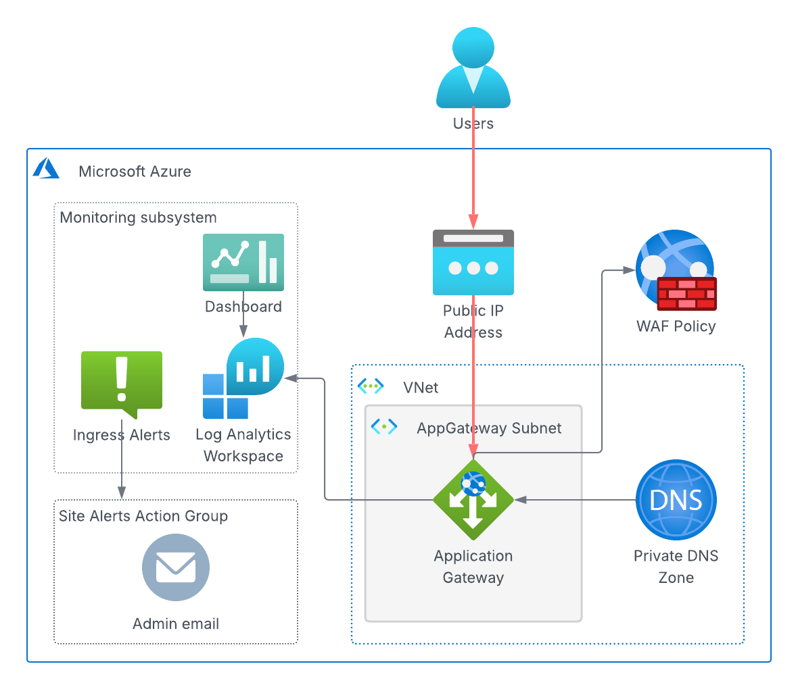

<!-- BEGIN_TF_DOCS -->
# Ingress Terraform Module

This module deploys an Azure Application Gateway for ArcGIS Enterprise site.



The Application Gateway is deployed into subnet specified by the "subnet_id" variable or,
if the variable is not set, "app-gateway-subnet-2" subnet of the site's VNet.

The Application Gateway is configured with both public and private frontend IP configurations.
The public frontend configuration is assigned a public IP address, while the
private frontend configuration is assigned a static private IP address specified by
the "ingress_private_ip" variable.

The module creates a Private DNS Zone for the deployment's FQDN and links it to the
virtual network, allowing internal resolution of the FQDN to the Application Gateway's
private IP address

The Application Gateway's listeners, backend pools, health probes, and routing rules are
dynamically configured from the settings defined by the "routing_rules" variable.
By default the routing rules are set to route traffic to ports 443, 6443, and 7443 of
"enterprise-base" backend pool.

All the HTTPS listeners use the SSL certificate stored in the site's Key Vault. The certificate's
secret ID must be specified by "ssl_certificate_secret_id" variable.

Requests to port 80 on both the public and private frontend IPs are redirected to port 443.

The Application Gateway's monitoring subsystem consists of:

* A Log Analytics workspace "{var.site_id}-{var.deployment_id}" that collects the access logs.
* An Azure Monitor dashboard "{var.site_id}-{var.deployment_id}" that visualizes key metrics of the Application Gateway.

## Key Vault Secrets

### Secrets Read by the Module

| Key Vault secret name | Description |
|--------------------|-------------|
| subnets | VNet subnets IDs |
| vnet-id | VNet ID |
| storage-account-key | Site's storage account key |
| storage-account-name | Site's storage account name |
| vm-identity-id | VM identity ID |

### Secrets Written by the Module

| Secret Name | Description |
|-------------|-------------|
| ${var.deployment_id}-deployment-fqdn | Deployment's FQDN |
| ${var.deployment_id}-backend-address-pools | JSON-encoded map of backend address pool names to their IDs |

## Providers

| Name | Version |
|------|---------|
| azurerm | ~> 4.46 |

## Modules

| Name | Source | Version |
|------|--------|---------|
| site_core_info | ../../modules/site_core_info | n/a |

## Resources

| Name | Type |
|------|------|
| [azurerm_application_gateway.ingress](https://registry.terraform.io/providers/hashicorp/azurerm/latest/docs/resources/application_gateway) | resource |
| [azurerm_key_vault_secret.backend_address_pools](https://registry.terraform.io/providers/hashicorp/azurerm/latest/docs/resources/key_vault_secret) | resource |
| [azurerm_key_vault_secret.deployment_fqdn](https://registry.terraform.io/providers/hashicorp/azurerm/latest/docs/resources/key_vault_secret) | resource |
| [azurerm_log_analytics_workspace.ingress](https://registry.terraform.io/providers/hashicorp/azurerm/latest/docs/resources/log_analytics_workspace) | resource |
| [azurerm_monitor_diagnostic_setting.app_gateway_logs](https://registry.terraform.io/providers/hashicorp/azurerm/latest/docs/resources/monitor_diagnostic_setting) | resource |
| [azurerm_portal_dashboard.ingress](https://registry.terraform.io/providers/hashicorp/azurerm/latest/docs/resources/portal_dashboard) | resource |
| [azurerm_private_dns_a_record.deployment_fqdn](https://registry.terraform.io/providers/hashicorp/azurerm/latest/docs/resources/private_dns_a_record) | resource |
| [azurerm_private_dns_zone.deployment_fqdn](https://registry.terraform.io/providers/hashicorp/azurerm/latest/docs/resources/private_dns_zone) | resource |
| [azurerm_private_dns_zone_virtual_network_link.dns_vnet_link](https://registry.terraform.io/providers/hashicorp/azurerm/latest/docs/resources/private_dns_zone_virtual_network_link) | resource |
| [azurerm_public_ip.ingress](https://registry.terraform.io/providers/hashicorp/azurerm/latest/docs/resources/public_ip) | resource |
| [azurerm_resource_group.deployment_rg](https://registry.terraform.io/providers/hashicorp/azurerm/latest/docs/resources/resource_group) | resource |
| [azurerm_key_vault_secret.vm_identity_id](https://registry.terraform.io/providers/hashicorp/azurerm/latest/docs/data-sources/key_vault_secret) | data source |

## Inputs

| Name | Description | Type | Default | Required |
|------|-------------|------|---------|:--------:|
| app_gateway_sku | SKU of the Application Gateway | `string` | `"Standard_v2"` | no |
| azure_region | Azure region display name | `string` | n/a | yes |
| deployment_fqdn | Fully qualified domain name of the ArcGIS Enterprise site | `string` | n/a | yes |
| deployment_id | ArcGIS Enterprise site ingress deployment Id | `string` | `"enterprise-ingress"` | no |
| ingress_private_ip | IP address of the Application Gateway private frontend configuration. The IP address must be in the Application Gateway subnet. | `string` | `"10.5.255.254"` | no |
| log_retention | Retention period in days for logs | `number` | `90` | no |
| request_timeout | Request timeout in seconds for the Application Gateway | `number` | `60` | no |
| routing_rules | List of routing rules for the Application Gateway | `list(any)` | ```[ { "backend_port": 443, "frontend_port": 443, "name": "web-adaptor", "priority": 10, "protocol": "Https", "rules": [ { "name": "server", "paths": [ "/server/*" ], "pool": "enterprise-base", "probe": "/server/rest/info/healthcheck" }, { "name": "portal", "paths": [ "/portal/*" ], "pool": "enterprise-base", "probe": "/portal/portaladmin/healthCheck" } ] }, { "backend_port": 6443, "frontend_port": 6443, "name": "server", "priority": 11, "protocol": "Https", "rules": [ { "name": "arcgis-6443", "paths": [ "/arcgis/*" ], "pool": "enterprise-base", "probe": "/arcgis/rest/info/healthcheck" } ] }, { "backend_port": 7443, "frontend_port": 7443, "name": "portal", "priority": 12, "protocol": "Https", "rules": [ { "name": "arcgis-7443", "paths": [ "/arcgis/*" ], "pool": "enterprise-base", "probe": "/arcgis/portaladmin/healthCheck" } ] } ]``` | no |
| site_id | ArcGIS site Id | `string` | `"arcgis"` | no |
| ssl_certificate_secret_id | Key Vault secret ID of SSL certificate for the Application Gateway HTTPS listeners | `string` | n/a | yes |
| ssl_policy | Predefined SSL policy that should be assigned to the Application Gateway to control the SSL protocol and ciphers | `string` | `"AppGwSslPolicy20220101"` | no |
| subnet_id | Application Gateway subnet ID (by default, the second app gateway subnet is used) | `string` | `null` | no |
| zones | List of availability zones for the Application Gateway | `list(string)` | ```[ "1", "2" ]``` | no |

## Outputs

| Name | Description |
|------|-------------|
| backend_address_pools | JSON-encoded map of backend address pool names to their IDs |
| private_ip_address | Private IP address of the Application Gateway |
| public_ip_address | Frontend public IP address of the Application Gateway |
<!-- END_TF_DOCS -->